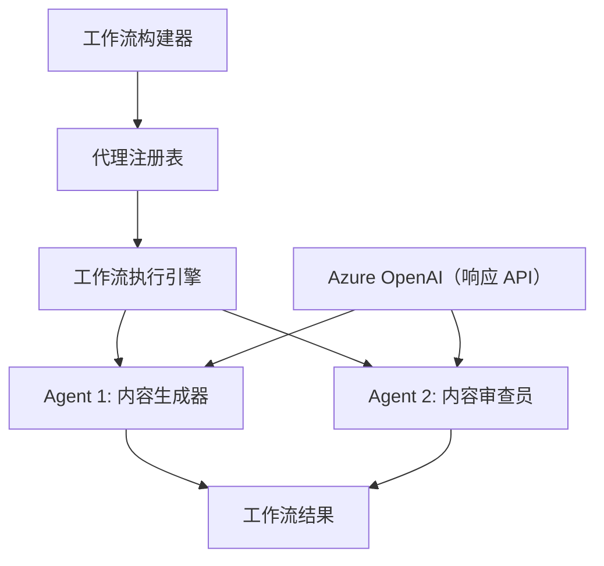

# 08 · 01.dotnet-agent-framework-workflow-ghmodel-basic

[返回：多 Agent 协作](/lessons/multi-agent.md) · [不可变原始文件](https://github.com/microsoft/ai-agents-for-beginners/blob/25b7985f3b2dc37a84f4a7387ccd3c9f0e5b1595/08-multi-agent/code_samples/workflows-agent-framework/dotNET/01.dotnet-agent-framework-workflow-ghmodel-basic.ipynb)

::: warning 原课程完整 Notebook · 静态阅读与代码解析
代码按英文源文件顺序保留，中文说明以同版本译本为基础。原始安装单元格可能含无版本上限的 `-U`；请跳过它们，先按[准备篇](/lessons/setup.md)固定依赖。云端服务、模型权限、网站布局和部分 SDK 接口需在你自己的环境验证。本站没有执行云端请求；第 18 章的离线验证状态单独记录在[检查报告](/guide/verification.md)。
:::

## 运行准备

Python 3.12+；在独立虚拟环境安装源仓库依赖与本页中声明的额外依赖。原文件路径：`upstream/08-multi-agent/code_samples/workflows-agent-framework/dotNET/01.dotnet-agent-framework-workflow-ghmodel-basic.ipynb`。以原仓库根目录为工作目录，在 Jupyter 中按顺序执行；身份与环境变量见准备篇。

```bash
cd upstream
python -m jupyterlab
```

[下载原始 Notebook](/notebooks/08-multi-agent/code_samples/workflows-agent-framework/dotNET/01.dotnet-agent-framework-workflow-ghmodel-basic.ipynb)。输出为上游文件保存的历史结果，不能用作本站实测证明。

## 🔄 使用 Azure OpenAI（Responses API）构建基础 Agent 工作流（.NET）

## 📋 工作流编排教程

本笔记本演示如何使用 Microsoft Agent Framework for .NET 和 Azure OpenAI（Responses API）构建复杂的 **Agent 工作流** 。你将学习创建多步业务流程，AI Agent 通过结构化的编排模式协作完成复杂任务。

## 🎯 学习目标

### 🏗️ **工作流架构基础** 
- **工作流构建器** ：设计和编排复杂多步骤的 AI 流程
- **Agent 协调** ：在工作流中协调多个专业 Agent
- **Azure OpenAI（Responses API）** ：在工作流中利用 Azure OpenAI Responses API
- **可视化工作流设计** ：创建并可视化工作流结构以增强理解

### 🔄 **流程编排模式** 
- **顺序处理** ：按逻辑顺序链接多个 Agent 任务
- **状态管理** ：维护工作流各阶段的上下文和数据流
- **错误处理** ：实现稳健的错误恢复和工作流弹性
- **性能优化** ：设计适用于企业级操作的高效工作流

### 🏢 **企业工作流应用** 
- **业务流程自动化** ：自动化复杂的组织工作流
- **内容生产流水线** ：包含审核和批准阶段的编辑工作流
- **客户服务自动化** ：多步骤客户咨询解决流程
- **数据处理工作流** ：带有 AI 驱动转化的 ETL 工作流

## ⚙️ 前提条件与设置

### 📦 **必需的 NuGet 包** 

本工作流演示使用若干关键的 .NET 包：

```xml

<PackageReference Include="Microsoft.Extensions.AI" Version="9.9.0" />


<PackageReference Include="Azure.AI.OpenAI" Version="2.1.0" />
<PackageReference Include="Azure.Identity" Version="1.13.1" />


<PackageReference Include="DotNetEnv" Version="3.1.1" />
```

### 🔑 **Azure OpenAI 配置** 

 **环境设置（.env 文件）：** 
```text
AZURE_OPENAI_ENDPOINT=https://<your-resource>.openai.azure.com
AZURE_OPENAI_DEPLOYMENT=gpt-5-mini
```

 **Azure OpenAI 访问：** 
1. 在 Azure 门户创建 Azure OpenAI 资源
2. 部署一个模型（例如 `gpt-5-mini`）并记下部署名称
3. 使用 `az login` 登录并按上方示例配置环境变量

### 🏗️ **工作流架构概览** 



 **关键组件：** 
- **WorkflowBuilder** ：用于设计工作流的主要编排引擎
- **AIAgent** ：具备特定能力的独立专业 Agent
- **Azure OpenAI 客户端** ：Azure OpenAI Responses API 集成
- **执行上下文** ：管理工作流阶段之间的状态和数据流

## 🎨 **企业工作流设计模式** 

### 📝 **内容生产工作流** 
```
User Request → Content Generation → Quality Review → Final Output
```

### 🔍 **文档处理流水线** 
```
Document Input → Analysis → Extraction → Validation → Structured Output
```

### 💼 **商业智能工作流** 
```
Data Collection → Processing → Analysis → Report Generation → Distribution
```

### 🤝 **客户服务自动化** 
```
Customer Inquiry → Classification → Processing → Response Generation → Follow-up
```

## 🏢 **企业收益** 

### 🎯 **可靠性与可扩展性** 
- **确定性执行** ：一致且可复现的工作流结果
- **错误恢复** ：对任一工作流阶段故障的优雅处理
- **性能监控** ：跟踪执行指标与优化机会
- **资源管理** ：高效分配和利用 AI 模型资源

### 🔒 **安全与合规** 
- **安全认证** ：通过 `az login` 使用 Microsoft Entra ID 认证（AzureCliCredential）
- **审计追踪** ：完整记录工作流执行与决策点日志
- **访问控制** ：细粒度权限管理工作流执行与监控
- **数据隐私** ：工作流中敏感信息的安全处理

### 📊 **可观测性与管理** 
- **可视化工作流设计** ：清晰表现流程流向与依赖关系
- **执行监控** ：实时跟踪工作流进度与性能
- **错误报告** ：详尽的错误分析与调试功能
- **性能分析** ：用于优化和容量规划的指标

让我们一起构建你的首个企业级 AI 工作流吧！🚀

### 代码单元格 2

阅读提示：跟踪本单元格读取的变量、修改的状态以及返回值。按原顺序执行，确认依赖的前序变量已经存在。

```csharp
#r "nuget: Microsoft.Extensions.AI, 10.*"
```

### 代码单元格 3

阅读提示：跟踪本单元格读取的变量、修改的状态以及返回值。按原顺序执行，确认依赖的前序变量已经存在。

```csharp
#r "nuget: Azure.AI.OpenAI, 2.1.0"
```

### 代码单元格 4

阅读提示：跟踪本单元格读取的变量、修改的状态以及返回值。按原顺序执行，确认依赖的前序变量已经存在。

```csharp
#r "nuget: Azure.Identity, 1.15.0"
#r "nuget: System.Linq.Async, 6.0.3"
#r "nuget: OpenTelemetry.Api, 1.0.0"
```

### 代码单元格 6

阅读提示：跟踪本单元格读取的变量、修改的状态以及返回值。按原顺序执行，确认依赖的前序变量已经存在。

```csharp
#r "nuget: Microsoft.Agents.AI.Workflows, 1.*"
```

### 代码单元格 7

阅读提示：跟踪本单元格读取的变量、修改的状态以及返回值。按原顺序执行，确认依赖的前序变量已经存在。

```csharp
#r "nuget: Microsoft.Agents.AI.OpenAI, 1.*-*"
```

### 代码单元格 8

阅读提示：跟踪本单元格读取的变量、修改的状态以及返回值。按原顺序执行，确认依赖的前序变量已经存在。

```csharp
#r "nuget: DotNetEnv, 3.1.1"
```

### 代码单元格 9

阅读提示：跟踪本单元格读取的变量、修改的状态以及返回值。按原顺序执行，确认依赖的前序变量已经存在。

```csharp
// #r "nuget: Microsoft.Extensions.AI.OpenAI, 1.*-*"
```

### 代码单元格 10

阅读提示：跟踪本单元格读取的变量、修改的状态以及返回值。按原顺序执行，确认依赖的前序变量已经存在。

```csharp
using System;
using System.ComponentModel;
using System.Text;
using Azure.AI.OpenAI;
using Azure.Identity;
using Microsoft.Extensions.AI;
using Microsoft.Agents.AI;
using Microsoft.Agents.AI.Workflows;
```

### 代码单元格 11

阅读提示：跟踪本单元格读取的变量、修改的状态以及返回值。按原顺序执行，确认依赖的前序变量已经存在。

```csharp
using DotNetEnv;
```

### 代码单元格 12

阅读提示：跟踪本单元格读取的变量、修改的状态以及返回值。按原顺序执行，确认依赖的前序变量已经存在。

```csharp
Env.Load("../../../.env");
```

### 代码单元格 13

阅读提示：跟踪本单元格读取的变量、修改的状态以及返回值。按原顺序执行，确认依赖的前序变量已经存在。

```csharp
// Azure OpenAI with the Responses API (stable v1 endpoint). Sign in with `az login`.
var azureEndpoint = Environment.GetEnvironmentVariable("AZURE_OPENAI_ENDPOINT") ?? throw new InvalidOperationException("AZURE_OPENAI_ENDPOINT is not set.");
var deployment = Environment.GetEnvironmentVariable("AZURE_OPENAI_DEPLOYMENT") ?? "gpt-5-mini";
```

### 代码单元格 14

阅读提示：跟踪本单元格读取的变量、修改的状态以及返回值。按原顺序执行，确认依赖的前序变量已经存在。

```csharp
// The Azure OpenAI client is created directly from the endpoint and Azure CLI credential — no custom client options are required.
```

### 代码单元格 15

阅读提示：跟踪本单元格读取的变量、修改的状态以及返回值。按原顺序执行，确认依赖的前序变量已经存在。

```csharp
var azureClient = new AzureOpenAIClient(new Uri(azureEndpoint), new AzureCliCredential());
```

### 代码单元格 16

阅读提示：跟踪本单元格读取的变量、修改的状态以及返回值。按原顺序执行，确认依赖的前序变量已经存在。

```csharp
const string ReviewerAgentName = "Concierge";
const string ReviewerAgentInstructions = @"
    You are a hotel concierge who has opinions about providing the most local and authentic experiences for travelers.
    The goal is to determine if the front desk travel agent has recommended the best non-touristy experience for a traveler.
    If so, state that it is approved.
    If not, provide insight on how to refine the recommendation without using a specific example. ";
```

### 代码单元格 17

阅读提示：跟踪本单元格读取的变量、修改的状态以及返回值。按原顺序执行，确认依赖的前序变量已经存在。

```csharp
const string FrontDeskAgentName = "FrontDesk";
const string FrontDeskAgentInstructions = @"""
    You are a Front Desk Travel Agent with ten years of experience and are known for brevity as you deal with many customers.
    The goal is to provide the best activities and locations for a traveler to visit.
    Only provide a single recommendation per response.
    You're laser focused on the goal at hand.
    Don't waste time with chit chat.
    Consider suggestions when refining an idea.
    """;
```

### 代码单元格 18

行为约束：instructions 引导模型，不能替代执行器的权限验证、次数限制和结果检查。

```csharp
AIAgent reviewerAgent = azureClient.GetChatClient(deployment).AsIChatClient().AsAIAgent(
    name:ReviewerAgentName,instructions:ReviewerAgentInstructions);
AIAgent frontDeskAgent  = azureClient.GetChatClient(deployment).AsIChatClient().AsAIAgent(
    name:FrontDeskAgentName,instructions:FrontDeskAgentInstructions);
```

### 代码单元格 19

阅读提示：跟踪本单元格读取的变量、修改的状态以及返回值。按原顺序执行，确认依赖的前序变量已经存在。

```csharp
var workflow = new WorkflowBuilder(frontDeskAgent)
            .AddEdge(frontDeskAgent, reviewerAgent)
            .Build();
```

### 代码单元格 20

阅读提示：跟踪本单元格读取的变量、修改的状态以及返回值。按原顺序执行，确认依赖的前序变量已经存在。

```csharp
ChatMessage userMessage = new ChatMessage(ChatRole.User, [
	new TextContent("I would like to go to Paris.") 
]);
```

### 代码单元格 21

阅读提示：跟踪本单元格读取的变量、修改的状态以及返回值。按原顺序执行，确认依赖的前序变量已经存在。

```csharp
StreamingRun run = await InProcessExecution.RunStreamingAsync(workflow, userMessage);
```

### 代码单元格 22

阅读提示：跟踪本单元格读取的变量、修改的状态以及返回值。按原顺序执行，确认依赖的前序变量已经存在。

```csharp
await run.TrySendMessageAsync(new TurnToken(emitEvents: true));
string id="";
var messageData = new StringBuilder();
await foreach (WorkflowEvent evt in run.WatchStreamAsync().ConfigureAwait(false))
{
    if (evt is AgentResponseUpdateEvent executorComplete)
    {
        if(id=="")
        {
            id=executorComplete.ExecutorId;
        }
        if(id==executorComplete.ExecutorId)
        {
            if (executorComplete.Data is not null)
            {
                messageData.Append(executorComplete.Data.ToString());
            }
        }
        else
        {
            id=executorComplete.ExecutorId;
        }
        // Console.WriteLine($"{executorComplete.ExecutorId}: {executorComplete.Data}");
    }
}

Console.WriteLine(messageData.ToString());
```

