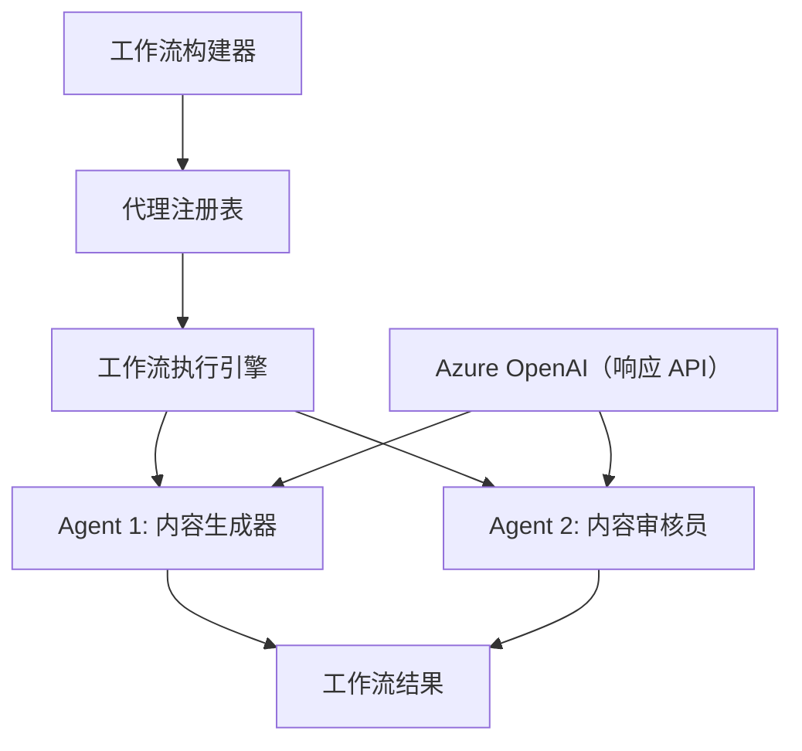

# 08 · 01.dotnet-agent-framework-workflow-ghmodel-basic

[返回：多 Agent 协作](/lessons/multi-agent.md) · [不可变原始文件](https://github.com/microsoft/ai-agents-for-beginners/blob/25b7985f3b2dc37a84f4a7387ccd3c9f0e5b1595/08-multi-agent/code_samples/workflows-agent-framework/dotNET/01.dotnet-agent-framework-workflow-ghmodel-basic.md)

::: info 原课程补充材料
根据对应简体中文译本整理。原代码片段未进行云端验证。
:::

# 🔄 使用 Azure OpenAI（Responses API）的基础 Agent 工作流（.NET）

## 📋 工作流编排教程

本笔记本演示如何使用 Microsoft Agent Framework for .NET 和 Azure OpenAI（Responses API）构建复杂的 **Agent 工作流** 。你将学习创建多步骤业务流程，其中 AI Agent 通过结构化的编排模式协作完成复杂任务。

## 🎯 学习目标

### 🏗️ **工作流架构基础** 
- **工作流构建器** ：设计和编排复杂的多步骤 AI 过程
- **Agent 协调** ：在工作流中协调多个专门化 Agent
- **Azure OpenAI（Responses API）** ：在工作流中利用 Azure OpenAI Responses API
- **可视化工作流设计** ：创建和可视化工作流结构以便更好理解

### 🔄 **流程编排模式** 
- **顺序处理** ：按逻辑顺序串联多个 Agent 任务
- **状态管理** ：维护跨工作流阶段的上下文和数据流
- **错误处理** ：实现强健的错误恢复和工作流弹性
- **性能优化** ：设计高效的企业级工作流

### 🏢 **企业工作流应用** 
- **业务流程自动化** ：自动化复杂的组织工作流
- **内容生产管线** ：包含审核和审批阶段的编辑工作流
- **客户服务自动化** ：多步骤的客户咨询解决流程
- **数据处理工作流** ：带 AI 驱动转换的 ETL 工作流

## ⚙️ 先决条件与设置

### 📦 **所需 NuGet 包** 

此工作流演示使用了几个关键的 .NET 包：

```xml

<PackageReference Include="Microsoft.Extensions.AI" Version="10.*" />


<PackageReference Include="Azure.AI.OpenAI" Version="2.1.0" />
<PackageReference Include="Azure.Identity" Version="1.15.0" />


<PackageReference Include="DotNetEnv" Version="3.1.1" />
```

### 🔑 **Azure OpenAI 配置** 

 **环境设置（.env 文件）：** 
```text
AZURE_OPENAI_ENDPOINT=https://<your-resource>.openai.azure.com
AZURE_OPENAI_DEPLOYMENT=gpt-5-mini
```

 **Azure OpenAI 访问：** 
1. 在 Azure 门户中创建 Azure OpenAI 资源
2. 部署一个模型（例如 `gpt-5-mini`）并记下部署名称
3. 使用 `az login` 登录，并按上述方式配置环境变量

### 🏗️ **工作流架构概览** 



 **关键组件：** 
- **WorkflowBuilder** ：设计工作流的主要编排引擎
- **AIAgent** ：具有特定能力的独立专业 Agent
- **Azure OpenAI 客户端** ：Azure OpenAI Responses API 集成
- **执行上下文** ：管理工作流阶段之间的状态和数据流

## 🎨 **企业工作流设计模式** 

### 📝 **内容生产工作流** 
```
User Request → Content Generation → Quality Review → Final Output
```

### 🔍 **文档处理管线** 
```
Document Input → Analysis → Extraction → Validation → Structured Output
```

### 💼 **商业智能工作流** 
```
Data Collection → Processing → Analysis → Report Generation → Distribution
```

### 🤝 **客户服务自动化** 
```
Customer Inquiry → Classification → Processing → Response Generation → Follow-up
```

## 🏢 **企业优势** 

### 🎯 **可靠性与可扩展性** 
- **确定性执行** ：一致、可重复的工作流结果
- **错误恢复** ：在任何工作流阶段优雅地处理失败
- **性能监控** ：跟踪执行指标和优化机会
- **资源管理** ：高效分配和利用 AI 模型资源

### 🔒 **安全性与合规性** 
- **安全认证** ：通过 `az login` 使用 Microsoft Entra ID 认证（AzureCliCredential）
- **审计跟踪** ：完整记录工作流执行和决策点
- **访问控制** ：针对工作流执行和监控的细粒度权限
- **数据隐私** ：在整个工作流中安全处理敏感信息

### 📊 **可观察性与管理** 
- **可视化工作流设计** ：清晰表现流程流向和依赖关系
- **执行监控** ：实时跟踪工作流进展和性能
- **错误报告** ：详细的错误分析和调试能力
- **性能分析** ：用于优化和容量规划的指标

让我们构建你的首个面向企业的 AI 工作流！🚀

## 💻 运行代码

完整实现可见于 `01.dotnet-agent-framework-workflow-ghmodel-basic.cs`。该文件展示了：

1. **环境配置** — 从 `.env` 文件加载 Azure OpenAI 配置
2. **Azure OpenAI 客户端设置** — 配置客户端以使用 Azure OpenAI Responses API
3. **Agent 创建** — 定义专业 Agent（前台和礼宾）
4. **工作流构建器** — 创建带顺序处理的多 Agent 工作流
5. **工作流执行** — 使用流式结果运行工作流

### 🚀 运行示例

```bash
# 使脚本可执行（Unix/Linux/macOS）
chmod +x 01.dotnet-agent-framework-workflow-ghmodel-basic.cs

# 运行工作流程
./01.dotnet-agent-framework-workflow-ghmodel-basic.cs
```

或在 Windows 上：
```powershell
dotnet run 01.dotnet-agent-framework-workflow-ghmodel-basic.cs
```

### 📝 预期输出

工作流将：
1. 接受你的旅行目的地请求（“我想去巴黎”）
2. 前台 Agent 提供初步推荐
3. 礼宾 Agent 审查并完善推荐
4. 最终输出显示完整对话流

### 🔧 自定义

你可以通过以下方式自定义工作流：
- 修改 Agent 指令以改变其行为
- 添加更多 Agent 以创建复杂的多步骤工作流
- 更改用户消息以测试不同场景
- 调整工作流边缘以创建不同的执行模式

---