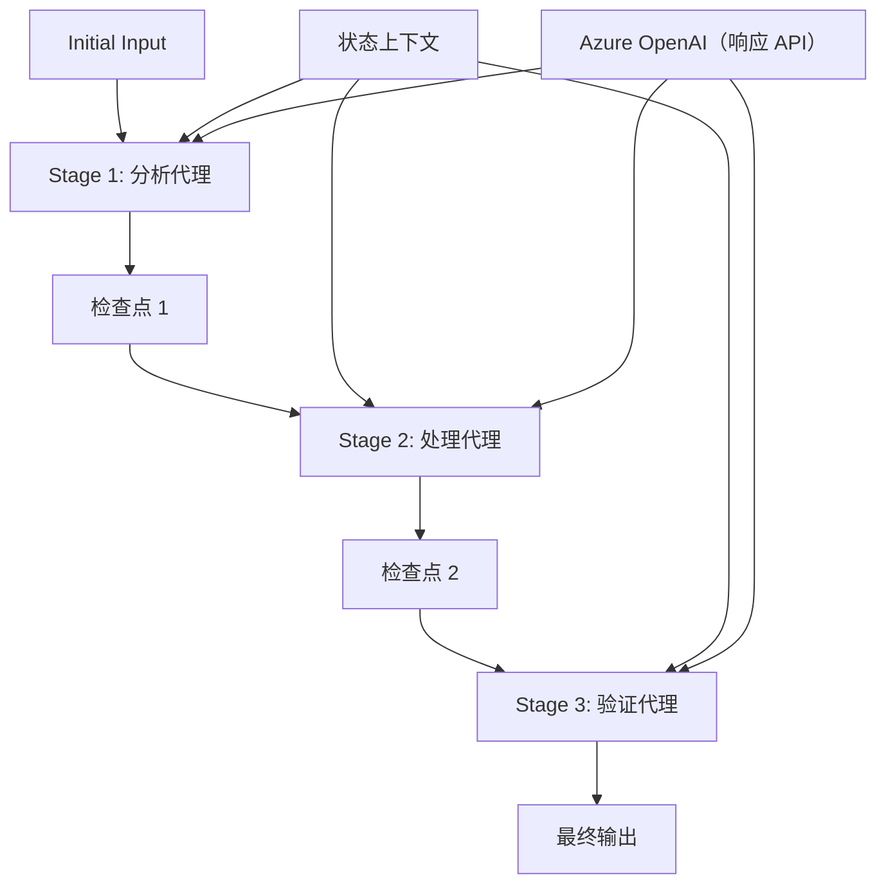

# 08 · 02.dotnet-agent-framework-workflow-ghmodel-sequential

[返回：多 Agent 协作](/lessons/multi-agent.md) · [不可变原始文件](https://github.com/microsoft/ai-agents-for-beginners/blob/25b7985f3b2dc37a84f4a7387ccd3c9f0e5b1595/08-multi-agent/code_samples/workflows-agent-framework/dotNET/02.dotnet-agent-framework-workflow-ghmodel-sequential.ipynb)

::: warning 原课程完整 Notebook · 静态阅读与代码解析
代码按英文源文件顺序保留，中文说明以同版本译本为基础。原始安装单元格可能含无版本上限的 `-U`；请跳过它们，先按[准备篇](/lessons/setup.md)固定依赖。云端服务、模型权限、网站布局和部分 SDK 接口需在你自己的环境验证。本站没有执行云端请求；第 18 章的离线验证状态单独记录在[检查报告](/guide/verification.md)。
:::

## 运行准备

Python 3.12+；在独立虚拟环境安装源仓库依赖与本页中声明的额外依赖。原文件路径：`upstream/08-multi-agent/code_samples/workflows-agent-framework/dotNET/02.dotnet-agent-framework-workflow-ghmodel-sequential.ipynb`。以原仓库根目录为工作目录，在 Jupyter 中按顺序执行；身份与环境变量见准备篇。

```bash
cd upstream
python -m jupyterlab
```

[下载原始 Notebook](/notebooks/08-multi-agent/code_samples/workflows-agent-framework/dotNET/02.dotnet-agent-framework-workflow-ghmodel-sequential.ipynb)。输出为上游文件保存的历史结果，不能用作本站实测证明。

## ⏩ 使用 Azure OpenAI（Responses API）进行顺序 Agent 工作流 (.NET)

## 📋 高级顺序处理教程

本笔记本演示了如何使用 Microsoft Agent Framework for .NET 和 Azure OpenAI（Responses API）实现 **顺序工作流模式** 。你将学习如何构建复杂的逐步处理管道，其中 Agent 按特定顺序执行，每个阶段基于前一阶段的结果进行处理。

## 🎯 学习目标

### 🔄 **顺序处理架构** 
- **线性工作流设计** ：创建具有明确依赖关系的逐步处理管道
- **状态管理** ：维护跨顺序工作流阶段的上下文和数据流
- **Azure OpenAI（Responses API）** ：在多阶段 .NET 工作流中利用 Azure OpenAI 模型
- **企业管道模式** ：构建生产就绪的顺序处理系统

### 🏗️ **高级顺序模式** 
- **阶段门控处理** ：在工作流阶段之间实现验证检查点
- **上下文保持** ：维持所有阶段的状态和累积知识
- **错误传播** ：在顺序处理链中优雅地处理失败
- **性能优化** ：高效的顺序执行，开销最小

### 🏢 **企业顺序应用** 
- **文档处理管道** ：多阶段文档分析、转换和验证
- **质量保证工作流** ：顺序的审核、验证与批准流程
- **内容生产管道** ：研究 → 撰写 → 编辑 → 审核 → 发布
- **业务流程自动化** ：具有明确阶段依赖的多步骤业务工作流

## ⚙️ 先决条件及设置

### 📦 **必备 NuGet 包** 

.NET 顺序工作流的必备包：

```xml

<PackageReference Include="Microsoft.Extensions.AI" Version="9.9.0" />


<PackageReference Include="Azure.AI.OpenAI" Version="2.1.0" />


<PackageReference Include="Azure.Identity" Version="1.15.0" />
<PackageReference Include="System.Linq.Async" Version="6.0.3" />


```

### 🔑 **Azure OpenAI 配置** 

 **环境设置（.env 文件）：** 
```text
AZURE_OPENAI_ENDPOINT=https://<your-resource>.openai.azure.com
AZURE_OPENAI_DEPLOYMENT=gpt-5-mini
```

 **配置管理：** 
```csharp
// Load environment variables securely
Env.Load("../../../.env");
var azureEndpoint = Environment.GetEnvironmentVariable("AZURE_OPENAI_ENDPOINT");
var deployment = Environment.GetEnvironmentVariable("AZURE_OPENAI_DEPLOYMENT");
```

### 🏗️ **顺序工作流架构** 



 **关键组件：** 
- **顺序 Agent** ：专门针对每个处理阶段的 Agent
- **状态上下文** ：维护跨阶段的累积数据和决策
- **检查点** ：阶段之间的验证点，确保质量和一致性
- **Azure OpenAI 客户端** ：跨所有工作流阶段统一的 AI 模型访问

## 🎨 **顺序工作流设计模式** 

### 📝 **文档处理管道** 
```
Raw Document → Content Extraction → Analysis → Validation → Structured Output
```

### 🎯 **内容创作工作流** 
```
Brief/Requirements → Research → Content Creation → Review → Final Polish
```

### 🔍 **质量保证管道** 
```
Initial Review → Technical Validation → Compliance Check → Final Approval
```

### 💼 **业务智能工作流** 
```
Data Collection → Processing → Analysis → Report Generation → Distribution
```

## 🏢 **企业顺序优势** 

### 🎯 **可靠性与质量** 
- **确定性处理** ：通过结构化阶段实现一致的、可重复的结果
- **质量关卡** ：验证检查点确保每个阶段的质量
- **错误隔离** ：一个阶段的问题不会传播到后续阶段
- **审计追踪** ：完整跟踪每个阶段的决策和转换

### 📈 **可扩展性与性能** 
- **模块化设计** ：每个阶段可独立优化
- **资源管理** ：在各阶段有效分配 AI 模型资源
- **状态优化** ：阶段间传输状态最小化，实现最佳性能
- **并行阶段组** ：多个顺序工作流可并行运行

### 🔒 **安全与合规** 
- **阶段级安全** ：不同处理阶段可应用不同安全策略
- **数据验证** ：确保每个检查点的数据完整性和合规性
- **访问控制** ：不同工作流阶段的细粒度权限管理
- **法规合规** ：通过结构化处理满足法规要求

### 📊 **监控与分析** 
- **阶段级指标** ：对各工作流阶段进行性能监控
- **瓶颈识别** ：识别并优化执行较慢的阶段
- **质量指标** ：跟踪各阶段的质量和成功率
- **流程优化** ：基于阶段级分析持续改进

让我们构建强健的顺序 AI 处理管道！🚀

### 代码单元格 2

阅读提示：跟踪本单元格读取的变量、修改的状态以及返回值。按原顺序执行，确认依赖的前序变量已经存在。

```csharp
#r "nuget: Microsoft.Extensions.AI, 10.*"
```

### 代码单元格 3

阅读提示：跟踪本单元格读取的变量、修改的状态以及返回值。按原顺序执行，确认依赖的前序变量已经存在。

```csharp
#r "nuget: Azure.AI.OpenAI, 2.1.0"
```

### 代码单元格 4

阅读提示：跟踪本单元格读取的变量、修改的状态以及返回值。按原顺序执行，确认依赖的前序变量已经存在。

```csharp
#r "nuget: Azure.Identity, 1.15.0"
#r "nuget: System.Linq.Async, 6.0.3"
#r "nuget: OpenTelemetry.Api, 1.*"
```

### 代码单元格 5

阅读提示：跟踪本单元格读取的变量、修改的状态以及返回值。按原顺序执行，确认依赖的前序变量已经存在。

```csharp
#r "nuget: Microsoft.Agents.AI.Workflows, 1.*"
```

### 代码单元格 6

阅读提示：跟踪本单元格读取的变量、修改的状态以及返回值。按原顺序执行，确认依赖的前序变量已经存在。

```csharp
#r "nuget: Microsoft.Agents.AI.OpenAI, 1.*-*"
```

### 代码单元格 7

阅读提示：跟踪本单元格读取的变量、修改的状态以及返回值。按原顺序执行，确认依赖的前序变量已经存在。

```csharp
#r "nuget: DotNetEnv, 3.1.1"
```

### 代码单元格 8

阅读提示：跟踪本单元格读取的变量、修改的状态以及返回值。按原顺序执行，确认依赖的前序变量已经存在。

```csharp
// #r "nuget: Microsoft.Extensions.AI.OpenAI, 9.9.0-preview.1.25458.4"
```

### 代码单元格 9

阅读提示：跟踪本单元格读取的变量、修改的状态以及返回值。按原顺序执行，确认依赖的前序变量已经存在。

```csharp
using System;
using System.ComponentModel;
using Azure.AI.OpenAI;
using Azure.Identity;
using Microsoft.Extensions.AI;
using Microsoft.Agents.AI;
using Microsoft.Agents.AI.Workflows;
```

### 代码单元格 10

阅读提示：跟踪本单元格读取的变量、修改的状态以及返回值。按原顺序执行，确认依赖的前序变量已经存在。

```csharp
using DotNetEnv;
```

### 代码单元格 11

阅读提示：跟踪本单元格读取的变量、修改的状态以及返回值。按原顺序执行，确认依赖的前序变量已经存在。

```csharp
Env.Load("../../../.env");
```

### 代码单元格 12

阅读提示：跟踪本单元格读取的变量、修改的状态以及返回值。按原顺序执行，确认依赖的前序变量已经存在。

```csharp
// Azure OpenAI with the Responses API (stable v1 endpoint). Sign in with `az login`.
var azureEndpoint = Environment.GetEnvironmentVariable("AZURE_OPENAI_ENDPOINT") ?? throw new InvalidOperationException("AZURE_OPENAI_ENDPOINT is not set.");
var deployment = Environment.GetEnvironmentVariable("AZURE_OPENAI_DEPLOYMENT") ?? "gpt-5-mini";

var imgPath ="../imgs/home.png";
```

### 代码单元格 13

阅读提示：跟踪本单元格读取的变量、修改的状态以及返回值。按原顺序执行，确认依赖的前序变量已经存在。

```csharp
// The Azure OpenAI client is created directly from the endpoint and Azure CLI credential — no custom client options are required.
```

### 代码单元格 14

阅读提示：跟踪本单元格读取的变量、修改的状态以及返回值。按原顺序执行，确认依赖的前序变量已经存在。

```csharp
var azureClient = new AzureOpenAIClient(new Uri(azureEndpoint), new AzureCliCredential());
```

### 代码单元格 15

阅读提示：跟踪本单元格读取的变量、修改的状态以及返回值。按原顺序执行，确认依赖的前序变量已经存在。

```csharp
const string SalesAgentName = "Sales-Agent";
const string SalesAgentInstructions = "You are my furniture sales consultant, you can find different furniture elements from the pictures and give me a purchase suggestion";
```

### 代码单元格 16

阅读提示：跟踪本单元格读取的变量、修改的状态以及返回值。按原顺序执行，确认依赖的前序变量已经存在。

```csharp
const string PriceAgentName = "Price-Agent";
const string PriceAgentInstructions = @"You are a furniture pricing specialist and budget consultant. Your responsibilities include:
        1. Analyze furniture items and provide realistic price ranges based on quality, brand, and market standards
        2. Break down pricing by individual furniture pieces
        3. Provide budget-friendly alternatives and premium options
        4. Consider different price tiers (budget, mid-range, premium)
        5. Include estimated total costs for room setups
        6. Suggest where to find the best deals and shopping recommendations
        7. Factor in additional costs like delivery, assembly, and accessories
        8. Provide seasonal pricing insights and best times to buy
        Always format your response with clear price breakdowns and explanations for the pricing rationale.";
```

### 代码单元格 17

阅读提示：跟踪本单元格读取的变量、修改的状态以及返回值。按原顺序执行，确认依赖的前序变量已经存在。

```csharp
const string QuoteAgentName = "Quote-Agent";
const string QuoteAgentInstructions = @"You are a assistant that create a quote for furniture purchase.
        1. Create a well-structured quote document that includes:
        2. A title page with the document title, date, and client name
        3. An introduction summarizing the purpose of the document
        4. A summary section with total estimated costs and recommendations
        5. Use clear headings, bullet points, and tables for easy readability
        6. All quotes are presented in markdown form";
```

### 代码单元格 18

阅读提示：跟踪本单元格读取的变量、修改的状态以及返回值。按原顺序执行，确认依赖的前序变量已经存在。

```csharp
using System.IO;

async Task<byte[]> OpenImageBytesAsync(string path)
{
	return await File.ReadAllBytesAsync(path);
}

var imageBytes = await OpenImageBytesAsync(imgPath);
```

### 代码单元格 19

阅读提示：跟踪本单元格读取的变量、修改的状态以及返回值。按原顺序执行，确认依赖的前序变量已经存在。

```csharp
imageBytes
```

### 代码单元格 20

行为约束：instructions 引导模型，不能替代执行器的权限验证、次数限制和结果检查。

```csharp
AIAgent salesagent = azureClient.GetChatClient(deployment).AsIChatClient().AsAIAgent(
    name:SalesAgentName,instructions:SalesAgentInstructions);
AIAgent priceagent  = azureClient.GetChatClient(deployment).AsIChatClient().AsAIAgent(
    name:PriceAgentName,instructions:PriceAgentInstructions);
AIAgent quoteagent = azureClient.GetChatClient(deployment).AsIChatClient().AsAIAgent(
    name:QuoteAgentName,instructions:QuoteAgentInstructions);
```

### 代码单元格 21

阅读提示：跟踪本单元格读取的变量、修改的状态以及返回值。按原顺序执行，确认依赖的前序变量已经存在。

```csharp
var workflow = new WorkflowBuilder(salesagent)
            .AddEdge(salesagent,priceagent)
            .AddEdge(priceagent, quoteagent)
            .Build();
```

### 代码单元格 22

阅读提示：跟踪本单元格读取的变量、修改的状态以及返回值。按原顺序执行，确认依赖的前序变量已经存在。

```csharp
ChatMessage userMessage = new ChatMessage(ChatRole.User, [
	new DataContent(imageBytes, "image/png"),new TextContent("Please find the relevant furniture according to the image and give the corresponding price for each piece of furniture.Finally Output generates a quotation") 
]);
```

### 代码单元格 23

阅读提示：跟踪本单元格读取的变量、修改的状态以及返回值。按原顺序执行，确认依赖的前序变量已经存在。

```csharp
StreamingRun run = await InProcessExecution.RunStreamingAsync(workflow, userMessage);
```

### 代码单元格 24

阅读提示：跟踪本单元格读取的变量、修改的状态以及返回值。按原顺序执行，确认依赖的前序变量已经存在。

```csharp
await run.TrySendMessageAsync(new TurnToken(emitEvents: true));
string id="";
string messageData="";
await foreach (WorkflowEvent evt in run.WatchStreamAsync().ConfigureAwait(false))
{
    if (evt is AgentResponseUpdateEvent executorComplete && executorComplete.Data is not null)
    {
        if(id=="")
        {
            id=executorComplete.ExecutorId;
        }
        if(id==executorComplete.ExecutorId)
        {
            messageData+=executorComplete.Data?.ToString();
        }
        else
        {
            id=executorComplete.ExecutorId;
        }
    }
}

Console.WriteLine(messageData);
```

::: details 原文件保存的输出（不是本项目实测）

```text
Here are the furniture pieces identified in the image along with estimated prices based on typical market rates for similar items. The prices may vary depending on the retailer or brand.

### Furniture Elements:
1. **Modern TV Console:**
   - Description: A mid-century-style wooden TV console with ample storage and a sleek design.
   - Estimated Price: $350

2. **Flat Screen TV (optional):**
   - Description: A wall-mounted flat screen TV as shown.
   - Estimated Price: $400 (optional add-on)

3. **Armchair (Blue Accent Chair):**
   - Description: A modern navy-blue armchair with a curved back and comfortable seating.
   - Estimated Price: $250

4. **Minimalist Coffee Table:**
   - Description: A white, slightly oval coffee table with a wooden base for a modern look.
   - Estimated Price: $150

5. **Neutral Fabric Sofa:**
   - Description: A long, white upholstered sofa with cushions in varying tones of blue and gray.
   - Estimated Price: $700

6. **Throw Pillows Assortment:**
   - Description: Blue and patterned throw pillows to complement the sofa design.
   - Estimated Price: $25 each (6 pillows total: $150)

7. **End Tables (2x, beside sofa and armchair):**
   - Description: Compact square tables with metal frames and neutral tabletops.
   - Estimated Price: $100 each ($200 total)

8. **Pendant Lights (2x):**
   - Description: Unique modern pendant lights with spherical bulbs near the corner lamp table.
   - Estimated Price: $75 each ($150 total)

9. **Chandelier Lighting Fixture:**
   - Description: Black modern chandelier with spherical glass bulbs.
   - Estimated Price: $180

10. **Curtains (Floor-to-Ceiling):**
    - Description: Dual-layer curtains in gray and white sheers for an elegant touch.
    - Estimated Price: $150

11. **Side Table with Decorative Items/Vase:**
    - Description: A slim, metal-legged side table with a vase and minimalist décor.
    - Estimated Price: $120

12. **Wall Art Frame (Deer Illustration):**
    - Description: Framed wall art with modern deer illustration.
    - Estimated Price: $50

---

### **Quotation**:
1. Modern TV Console - $350  
2. Flat Screen TV (Optional) - $400  
3. Armchair (Blue Accent Chair) - $250  
4. Minimalist Coffee Table - $150  
5. Neutral Fabric Sofa - $700  
6. Throw Pillows (6x) - $150  
7. End Tables (2x) - $200  
8. Pendant Lights (2x) - $150  
9. Chandelier Lighting Fixture - $180  
10. Curtains (Floor-to-Ceiling) - $150  
11. Side Table with Decorative Items/Vase - $120  
12. Wall Art Frame (Deer Illustration) - $50  

---

**Total Price Estimate: $2,930**  
(Note: Excludes optional TV. Add $400 if included.)Below is a detailed furniture pricing analysis and recommendations for furnishing your living room setup: 

---

### Price Breakdown and Rationale

1. **TV Console**  
   - Budget: $150–$250 for basic styles in MDF or particleboard materials.  
   - Mid-Range: $300–$500 for solid wood or modern styles with extra storage.  
   - Premium: $600–$1,000 for designer brands or consoles with built-in cable management systems.  

   **Recommendation:** A stylish mid-century modern option at $350 offers both design aesthetics and functionality without breaking the bank.

---

2. **Flat Screen TV** (Optional)  
   - Budget: $200–$400 for basic HD options under 50 inches.  
   - Mid-Range: $500–$800 for 4K quality screens.  
   - Premium: $1,000+ for OLED technology or large 65-75 inch screens.  

   **Recommendation:** At $400, this provides a reasonable option at mid-range pricing for smaller living rooms, perfect for casual viewing.

---

3. **Armchair (Accent Chair)**  
   - Budget: $100–$200 for basic upholstered options.  
   - Mid-Range: $250–$400 for ergonomic and well-designed fabric chairs.  
   - Premium: $500–$800 for branded or designer luxury chairs.  

   **Recommendation:** The armchair selection at $250 offers comfort and style for a reasonable price in the mid-tier range.

---

4. **Coffee Table**  
   - Budget: $50–$150 for simple MDF designs or second-hand options.  
   - Mid-Range: $200–$400 for solid wood or glass-top tables.  
   - Premium: $500–$800 for marble or custom designer styles.  

   **Recommendation:** The $150 table is a lightweight, budget-friendly choice with modern aesthetics, suitable for small spaces.

---

5. **Neutral Fabric Sofa**  
   - Budget: $300–$600 for basic polyester or cotton upholstery with foam cushions.  
   - Mid-Range: $700–$1,200 for durable performance fabrics like microfiber or linen.  
   - Premium: $1,500+ for leather, velvet, or designer-branded sofas.  

   **Recommendation:** At $700, this mid-range upholstered sofa fits well into stylish setups requiring comfort and durability.

---

6. **Throw Pillows (6 Pillows)**  
   - Budget: $10–$20 each for standard poly-filled pillows.  
   - Mid-Range: $25–$40 each for pillows with decorative designs and quality materials.  
   - Premium: $50–$100+ each for designer or hand-sewn pillows.  

   **Recommendation:** At $150 for six total pillows, this balances quality and affordability for color-coordinated accents.

---

7. **End Tables**  
   - Budget: $50–$100 each for basic designs with MDF surfaces.  
   - Mid-Range: $120–$250 for solid wood or metal-framed options.  
   - Premium: $300–$500 for custom shapes or designer brands.  

   **Recommendation:** The choice at $100 each gives you sturdy, stylish tables without excess costs.

---

8. **Pendant Lights**  
   - Budget: $30–$75 each for basic pendant fixtures.  
   - Mid-Range: $100–$200 each for modern, decorative designs.  
   - Premium: $250+ for artisan-crafted or smart-home technology lighting.  

   **Recommendation:** At $75 each, these pendant lights offer a great balance of utility and design for the price.

---

9. **Chandelier Lighting Fixture**  
   - Budget: $100–$200 for simple yet modern chandelier designs.  
   - Mid-Range: $200–$500 for high-quality, multi-light fixtures with glass components.  
   - Premium: $600+ for luxury lighting sets or custom designs.  

   **Recommendation:** The $180 fixture is affordable and adds elegance without exceeding mid-range pricing.

---

10. **Curtains**  
    - Budget: $50–$100 for polyester or cotton panels with standard lengths.  
    - Mid-Range: $120–$250 for dual-layer block-out curtains or linen sheers.  
    - Premium: $300+ for motorized curtains or designer prints.  

    **Recommendation:** At $150, these dual-layer curtains ensure style, privacy, and light control at a reasonable cost.

---

11. **Side Table and Vase**  
    - Budget: $50–$100 for basic end tables with simple designs.  
    - Mid-Range: $120–$300 for tables with decorative accents or durable materials.  
    - Premium: $400+ for rare wood or branded designs paired with luxury décor pieces.  

    **Recommendation:** A chic metal-leg table with complementary décor at $120 is a solid mid-range choice.

---

12. **Wall Art Frame**  
    - Budget: $20–$40 for printed artwork or poster frames.  
    - Mid-Range: $50–$100 for custom prints or canvas designs.  
    - Premium: $150+ for unique artwork or branded galleries.  

    **Recommendation:** At $50, this modern deer illustration adds personality without breaking the budget.

---

### **Estimated Total Living Room Setup Costs**  

**Budget Tier (low cost):** $1,500–$2,000  
**Mid-Range Tier:** $2,500–$3,500  
**Premium Tier:** $5,000+  

Your quoted total ($2,930) places this setup firmly in the **mid-range tier.**

---

### Budget-Friendly Alternatives  
- Look for second-hand or outlet stores like **Facebook Marketplace**, **Craigslist**, or **Habitat for Humanity ReStores**.  
- Retailers like **IKEA** or **Walmart** have affordable consoles, coffee tables, and sofas.  
- Online clearance sales on sites like **Wayfair** or **Amazon** help reduce costs on lighting and décor.  

---

### Premium Options  
- Check out brands like **West Elm**, **Pottery Barn**, or **Crate & Barrel** for luxurious designs.  
- Explore high-end finishes for armchairs and lighting at specialized stores like **Arhaus** or **RH (Restoration Hardware)**.  

---

### Seasonal Pricing Insights  
- **Best Time to Buy Furniture:**  
  - January and July (clearance sales).  
  - Holiday weekends (like Labor Day and Memorial Day).  
  - Black Friday/Cyber Monday (Mid-to-Premium Tier Deals).  

- **Delivery and Assembly Costs:**  
  - Budget: $50–$100 delivery fee (free for budget options).  
  - Mid-Range/Premium: $150–$300 (varies by retailer).  
  - Assembly: $50–$150 depending on complexity.  

Make sure to calculate delivery and assembly costs when finalizing the purchase.

---

Let me know if you'd like further breakdowns or recommendations!```markdown
# Furniture Purchase Quote

 **Date:** October 31, 2023  
 **Client Name:** [Client's Full Name]

---

## Introduction  
The purpose of this document is to provide a comprehensive quote for the purchase of furniture for your living space. This quote includes an estimated breakdown of costs, a brief description of each proposed item, and recommendations to suit your design preferences and budget. The goal is to ensure you get high-quality furniture that meets your aesthetic and functional needs.

---

## Summary of Total Estimated Costs and Recommendations:  

| Item                        | Quantity | Unit Price (USD) | Total Price (USD) | Recommendation                                                   |
|-----------------------------|----------|------------------|-------------------|-------------------------------------------------------------------|
| TV Console                 | 1        | $350             | $350              | Modern mid-century console offering storage and durability.      |
| Flat Screen TV (Optional)  | 1        | $400             | $400              | Mid-range 4K TV suitable for small living rooms (optional).       |
| Armchair (Accent Chair)    | 1        | $250             | $250              | Comfortable and stylish option for reading or relaxation.        |
| Coffee Table               | 1        | $150             | $150              | Budget-friendly design with modern aesthetics.                   |
| Fabric Sofa                | 1        | $700             | $700              | Mid-range upholstered sofa combining durability and comfort.      |
| Throw Pillows              | 6        | $25              | $150              | A blend of decorative and functional pillows in a neutral tone.  |
| End Tables                 | 2        | $100             | $200              | Practical and sturdy end tables at an affordable price.           |
| Pendant Lights             | 2        | $75              | $150              | Modern-looking pendant lighting to enhance ambience.             |
| Chandelier Lighting Fixture| 1        | $180             | $180              | Elegant chandelier to elevate the room’s lighting aesthetics.     |
| Curtains                   | 1 Set    | $150             | $150              | Functional dual-layer curtains for privacy and light control.     |
| Side Table and Vase        | 1 Set    | $120             | $120              | Chic metal-leg table paired with a complementary modern vase.    |
| Wall Art Frame             | 1        | $50              | $50               | Minimal, modern wall décor to add character to the room.         |

### Total Estimated Cost: **$2,930** 

---

## Detailed Recommendations  

### Budget-Friendly Options:
- For cost savings, explore retailers like **IKEA** , **Amazon** , or **Walmart** for similar-quality items at a reduced price.
- Consider second-hand or lightly-used items from platforms such as **Facebook Marketplace** or **Craigslist** .
- Take advantage of seasonal sales on holiday weekends or clearance sections for discounts.

### Premium Suggestions:
- Upgrade to furniture from **West Elm** , **Crate & Barrel** , or **Pottery Barn** for higher-end designs and materials.
- Opt for more luxurious lighting fixtures like those from **RH (Restoration Hardware)** or designer stores.

---

## Seasonal and Delivery Insights:
- **Best Purchase Times:** January, July (clearance sales) or Black Friday/Cyber Monday.  
- **Delivery Costs:** Estimated $50–$150 for mid-range furniture. Premium items may cost up to $300 for delivery.  
- **Assembly Fees:** Optional assembly services, approx. $50–$150.

---

Should you need further refinement or alternative options for any of the items, please let us know! We’re happy to work with you to ensure your living space is both functional and beautiful.

 **Thank you for choosing us for your furniture needs!** 
```
```

:::

