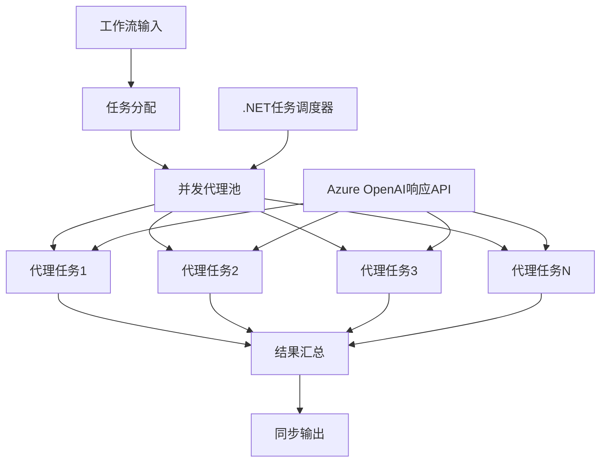

# 08 · 03.dotnet-agent-framework-workflow-ghmodel-concurrent

[返回：多 Agent 协作](/lessons/multi-agent.md) · [不可变原始文件](https://github.com/microsoft/ai-agents-for-beginners/blob/25b7985f3b2dc37a84f4a7387ccd3c9f0e5b1595/08-multi-agent/code_samples/workflows-agent-framework/dotNET/03.dotnet-agent-framework-workflow-ghmodel-concurrent.ipynb)

::: warning 原课程完整 Notebook · 静态阅读与代码解析
代码按英文源文件顺序保留，中文说明以同版本译本为基础。原始安装单元格可能含无版本上限的 `-U`；请跳过它们，先按[准备篇](/lessons/setup.md)固定依赖。云端服务、模型权限、网站布局和部分 SDK 接口需在你自己的环境验证。本站没有执行云端请求；第 18 章的离线验证状态单独记录在[检查报告](/guide/verification.md)。
:::

## 运行准备

Python 3.12+；在独立虚拟环境安装源仓库依赖与本页中声明的额外依赖。原文件路径：`upstream/08-multi-agent/code_samples/workflows-agent-framework/dotNET/03.dotnet-agent-framework-workflow-ghmodel-concurrent.ipynb`。以原仓库根目录为工作目录，在 Jupyter 中按顺序执行；身份与环境变量见准备篇。

```bash
cd upstream
python -m jupyterlab
```

[下载原始 Notebook](/notebooks/08-multi-agent/code_samples/workflows-agent-framework/dotNET/03.dotnet-agent-framework-workflow-ghmodel-concurrent.ipynb)。输出为上游文件保存的历史结果，不能用作本站实测证明。

## ⚡ 使用 Azure OpenAI (Responses API) 进行并发 Agent 工作流 (.NET)

## 📋 高性能并行处理教程

本笔记本演示了如何使用 Microsoft Agent Framework for .NET 和 Azure OpenAI (Responses API) 实现 **并发工作流模式** 。你将学习如何构建高性能的并行处理工作流，通过同时执行多个 AI Agent 来最大化吞吐量，同时保持协调和数据一致性。

> **迁移说明：** 此示例之前使用了 GitHub 模型。GitHub 模型已弃用（将在 2026 年 7 月退休），且不支持 Responses API，因此现在使用通过 `AzureOpenAIClient.GetOpenAIResponseClient(...)` 的 **Azure OpenAI** 和 **Responses API** 。

## 🎯 学习目标

### 🚀 **并发处理基础** 
- **并行 Agent 执行** ：同时运行多个 AI Agent 以获得最大性能
- **异步/等待模式** ：利用 .NET 的异步编程模型实现高效并发
- **Azure OpenAI Responses API 集成** ：协调多路并发调用 Azure OpenAI Responses API
- **资源管理** ：高效管理跨并发操作的 AI 模型资源

### 🏗️ **高级并发架构** 
- **基于任务的并行** ：使用 .NET 任务并行库实现最优并发执行
- **同步模式** ：协调并发 Agent，避免竞争条件
- **负载均衡** ：高效分配可用的并发处理能力
- **容错性** ：处理单个 Agent 失败而不停止整个工作流

### 🏢 **企业级并发应用** 
- **大容量文档处理** ：同时处理多个文档
- **实时内容分析** ：并发分析传入数据流
- **批处理优化** ：最大化大规模数据处理操作的吞吐量
- **多模态分析** ：并行处理不同内容类型和格式

## ⚙️ 前提条件与设置

### 📦 **必需的 NuGet 包** 

高性能并发工作流所需的关键包：

```xml

<PackageReference Include="Microsoft.Extensions.AI" Version="9.9.1" />


<PackageReference Include="Azure.AI.OpenAI" Version="2.1.0" />


<PackageReference Include="Azure.Identity" Version="1.15.0" />
<PackageReference Include="System.Linq.Async" Version="6.0.3" />


```

### 🔑 **Azure OpenAI 配置** 

使用 Azure CLI 登录（`az login`），以便 `AzureCliCredential` 进行身份验证，然后设置你的 Azure OpenAI 资源详情。Responses API 使用稳定的 `/openai/v1/` 端点 — 无需管理 `api-version`。

 **环境设置 (.env 文件)：** 
```text
AZURE_OPENAI_ENDPOINT=https://<your-resource>.openai.azure.com
AZURE_OPENAI_DEPLOYMENT=gpt-5-mini
```

 **并发处理注意事项：** 
```csharp
// Configure connection pooling / timeouts for concurrent requests
var clientOptions = new AzureOpenAIClientOptions()
{
    NetworkTimeout = TimeSpan.FromMinutes(5)
};
var azureClient = new AzureOpenAIClient(new Uri(azureEndpoint), new AzureCliCredential(), clientOptions);
```

### 🏗️ **并发工作流架构** 



 **关键组件：** 
- **任务并行库** ：.NET 内置的并发操作支持
- **Agent 池** ：多个 Agent 实例用于并行处理
- **结果聚合** ：协调并合并并发 Agent 结果
- **同步点** ：确保并发操作间的数据一致性

## 🎨 **并发工作流设计模式** 

### 🔍 **并行研究与分析** 
```
Research Topic → Concurrent Research Agents → Result Synthesis → Final Report
```

### 📊 **多源数据处理** 
```
Data Sources → Parallel Processing Agents → Data Integration → Unified Output
```

### 🎭 **内容生成管道** 
```
Content Requirements → Concurrent Content Generators → Quality Review → Final Content
```

### 🔄 **分发/汇总处理** 
```
Single Input → Multiple Concurrent Processors → Result Aggregation → Single Output
```

## 🏢 **企业性能优势** 

### ⚡ **吞吐量与可扩展性** 
- **线性性能扩展** ：增加并发 Agent 数量以提高吞吐量
- **资源利用率** ：最大化可用 AI 模型容量效率
- **缩短处理时间** ：通过并行执行显著减少时间
- **弹性扩展** ：根据负载动态调整并发 Agent 数

### 🛡️ **可靠性与弹性** 
- **故障隔离** ：单个 Agent 失败不会影响其他并发操作
- **优雅降级** ：系统在 Agent 容量降低时持续运行
- **错误恢复** ：自动重试失败的并发操作
- **负载分配** ：均匀分配工作给可用 Agent

### 📊 **性能监控** 
- **并发执行指标** ：跟踪所有并行操作的性能
- **资源使用分析** ：监控 CPU、内存和网络利用率
- **吞吐量分析** ：衡量并发处理所带来的效率提升
- **瓶颈检测** ：识别并解决性能限制

### 🔧 **开发与运维** 
- **异步编程模型** ：利用 .NET 成熟的 async/await 模式
- **任务协调** ：内置任务管理与协调功能
- **异常处理** ：全面错误处理支持并发操作
- **调试支持** ：Visual Studio 并发工作流调试工具

让我们用 .NET 构建高性能并发 AI 工作流吧！🚀

### 代码单元格 2

阅读提示：跟踪本单元格读取的变量、修改的状态以及返回值。按原顺序执行，确认依赖的前序变量已经存在。

```csharp
#r "nuget: Microsoft.Extensions.AI, 10.*"
```

### 代码单元格 3

阅读提示：跟踪本单元格读取的变量、修改的状态以及返回值。按原顺序执行，确认依赖的前序变量已经存在。

```csharp
#r "nuget: Azure.AI.OpenAI, 2.*"
```

### 代码单元格 4

阅读提示：跟踪本单元格读取的变量、修改的状态以及返回值。按原顺序执行，确认依赖的前序变量已经存在。

```csharp
#r "nuget: Azure.Identity, 1.15.0"
#r "nuget: System.Linq.Async, 6.0.3"
#r "nuget: OpenTelemetry.Api, 1.*"
```

### 代码单元格 5

阅读提示：跟踪本单元格读取的变量、修改的状态以及返回值。按原顺序执行，确认依赖的前序变量已经存在。

```csharp
#r "nuget: Microsoft.Agents.AI.Workflows, 1.*"
```

### 代码单元格 6

阅读提示：跟踪本单元格读取的变量、修改的状态以及返回值。按原顺序执行，确认依赖的前序变量已经存在。

```csharp
#r "nuget: Microsoft.Agents.AI.OpenAI, 1.*-*"
```

### 代码单元格 7

阅读提示：跟踪本单元格读取的变量、修改的状态以及返回值。按原顺序执行，确认依赖的前序变量已经存在。

```csharp
#r "nuget: DotNetEnv, 3.1.1"
```

### 代码单元格 8

阅读提示：跟踪本单元格读取的变量、修改的状态以及返回值。按原顺序执行，确认依赖的前序变量已经存在。

```csharp
// #r "nuget: Microsoft.Extensions.AI.OpenAI, 9.9.0-preview.1.25458.4"
```

### 代码单元格 9

阅读提示：跟踪本单元格读取的变量、修改的状态以及返回值。按原顺序执行，确认依赖的前序变量已经存在。

```csharp
using System;
using System.ComponentModel;
using Azure.AI.OpenAI;
using Azure.Identity;
using Microsoft.Extensions.AI;
using Microsoft.Agents.AI;
using Microsoft.Agents.AI.Workflows;
using Microsoft.Agents.AI.Workflows.Reflection;
```

### 代码单元格 10

阅读提示：跟踪本单元格读取的变量、修改的状态以及返回值。按原顺序执行，确认依赖的前序变量已经存在。

```csharp
using DotNetEnv;
```

### 代码单元格 11

阅读提示：跟踪本单元格读取的变量、修改的状态以及返回值。按原顺序执行，确认依赖的前序变量已经存在。

```csharp
Env.Load("../../../.env");
```

### 代码单元格 12

阅读提示：跟踪本单元格读取的变量、修改的状态以及返回值。按原顺序执行，确认依赖的前序变量已经存在。

```csharp
// Azure OpenAI with the Responses API (stable v1 endpoint). Sign in with `az login`.
var azureEndpoint = Environment.GetEnvironmentVariable("AZURE_OPENAI_ENDPOINT") ?? throw new InvalidOperationException("AZURE_OPENAI_ENDPOINT is not set.");
var deployment = Environment.GetEnvironmentVariable("AZURE_OPENAI_DEPLOYMENT") ?? "gpt-5-mini";
```

### 代码单元格 13

阅读提示：跟踪本单元格读取的变量、修改的状态以及返回值。按原顺序执行，确认依赖的前序变量已经存在。

```csharp
var azureClient = new AzureOpenAIClient(new Uri(azureEndpoint), new AzureCliCredential());
```

### 代码单元格 14

检索过程：跟踪查询、候选结果和实际选入的证据；检索为空时应明确返回缺失，而不是补写答案。

```csharp
const string ResearcherAgentName = "Researcher-Agent";
const string ResearcherAgentInstructions = "You are my travel researcher, working with me to analyze the destination, list relevant attractions, and make detailed plans for each attraction.";
```

### 代码单元格 15

检索过程：跟踪查询、候选结果和实际选入的证据；检索为空时应明确返回缺失，而不是补写答案。

```csharp
const string PlanAgentName = "Plan-Agent";
const string PlanAgentInstructions = "You are my travel planner, working with me to create a detailed travel plan based on the researcher's findings.";
```

### 代码单元格 16

行为约束：instructions 引导模型，不能替代执行器的权限验证、次数限制和结果检查。

检索过程：跟踪查询、候选结果和实际选入的证据；检索为空时应明确返回缺失，而不是补写答案。

```csharp
AIAgent researcherAgent = azureClient.GetChatClient(deployment).AsIChatClient().AsAIAgent(
    name:ResearcherAgentName,instructions:ResearcherAgentInstructions);
AIAgent plannerAgent  = azureClient.GetChatClient(deployment).AsIChatClient().AsAIAgent(
    name:PlanAgentName,instructions:PlanAgentInstructions);
```

### 代码单元格 17

阅读提示：跟踪本单元格读取的变量、修改的状态以及返回值。按原顺序执行，确认依赖的前序变量已经存在。

```csharp
[SendsMessage(typeof(ChatMessage))]
[SendsMessage(typeof(TurnToken))]
public class ConcurrentStartExecutor() : Executor<string>("ConcurrentStartExecutor")
{
    /// <summary>
    /// Starts the concurrent processing by sending messages to the agents.
    /// </summary>
    /// <param name="message">The user message to process</param>
    /// <param name="context">Workflow context for accessing workflow services and adding events</param>
    /// <returns>A task representing the asynchronous operation</returns>
    [MessageHandler]
    public override async ValueTask HandleAsync(string message, IWorkflowContext context, CancellationToken cancellationToken = default)
    {
        // Broadcast the message to all connected agents. Receiving agents will queue
        // the message but will not start processing until they receive a turn token.
        await context.SendMessageAsync(new ChatMessage(ChatRole.User, message));
        // Broadcast the turn token to kick off the agents.
        await context.SendMessageAsync(new TurnToken(emitEvents: true));
    }

}

/// <summary>
/// Executor that aggregates the results from the concurrent agents.
/// </summary>
[YieldsOutput(typeof(string))]
public class ConcurrentAggregationExecutor() : Executor<ChatMessage>("ConcurrentAggregationExecutor")
{
    private readonly List<ChatMessage> _messages = [];
    private readonly object _lock = new();

    /// <summary>
    /// Handles incoming messages from the agents and aggregates their responses.
    /// </summary>
    /// <param name="message">The message from the agent</param>
    /// <param name="context">Workflow context for accessing workflow services and adding events</param>
    /// <returns>A task representing the asynchronous operation</returns>

    public override async ValueTask HandleAsync(ChatMessage message, IWorkflowContext context, CancellationToken cancellationToken = default)
    {
        string? formattedMessages = null;

        lock (this._lock)
        {
            this._messages.Add(message);

            if (this._messages.Count == 2)
            {
                formattedMessages = string.Join(Environment.NewLine, this._messages.Select(m => $"{m.AuthorName}: {m.Text}"));
            }
        }

        if (formattedMessages is not null)
        {
            await context.YieldOutputAsync(formattedMessages);
        }
    }
}
```

### 代码单元格 18

阅读提示：跟踪本单元格读取的变量、修改的状态以及返回值。按原顺序执行，确认依赖的前序变量已经存在。

```csharp
var startExecutor = new ConcurrentStartExecutor();
var aggregationExecutor = new ConcurrentAggregationExecutor();
```

### 代码单元格 19

检索过程：跟踪查询、候选结果和实际选入的证据；检索为空时应明确返回缺失，而不是补写答案。

```csharp
var workflow = new WorkflowBuilder(startExecutor)
            .AddFanOutEdge(startExecutor, targets: [researcherAgent, plannerAgent])
            .AddFanInEdge(aggregationExecutor, sources: [researcherAgent, plannerAgent])
            .WithOutputFrom(aggregationExecutor)
            .Build();
```

### 代码单元格 20

阅读提示：跟踪本单元格读取的变量、修改的状态以及返回值。按原顺序执行，确认依赖的前序变量已经存在。

```csharp
StreamingRun run = await InProcessExecution.StreamAsync(workflow, "Plan a trip to Seattle in December");
        await foreach (WorkflowEvent evt in run.WatchStreamAsync().ConfigureAwait(false))
        {
            if (evt is WorkflowOutputEvent output)
            {
                Console.WriteLine($"Workflow completed with results:\n{output.Data}");
            }
        }
```

::: details 原文件保存的输出（不是本项目实测）

```text
Workflow completed with results:
Plan-Agent: December is a magical time to visit Seattle, as the city embraces the festive season with sparkling holiday lights, seasonal activities, cozy indoor attractions, and hearty cuisine. The weather will be chilly, often rainy, and occasionally snowy, so pack accordingly. Here's a detailed trip plan for your Seattle visit:

---

### **Travel Dates**  
Suggested schedule: **3-5 days in Seattle (example: December 15–19)**  
Adjust according to your preferences and availability.

---

### **Packing Essentials**  
- Warm, waterproof coat  
- Umbrella or rain jacket (Seattle has rainy winters)  
- Waterproof boots or shoes  
- Layers: sweaters, thermal tops, scarves, gloves, and hats  
- Day backpack for exploring  
- Travel charger and portable power bank  
- Camera or phone for holiday photos  

---

### **Day 1: Arrival and Exploring Downtown**  
**Morning**  
- Arrive at **Seattle-Tacoma International Airport (SEA)**.  
- Transfer to your accommodation (stay downtown for convenience). Options:  
  - Luxury: **The Four Seasons Seattle**  
  - Boutique: **The Hotel Andra**  
  - Budget-friendly: **The Mediterranean Inn**  

**Afternoon**  
- Lunch at **Elliott’s Oyster House** near the waterfront for fresh seafood.  
- Begin exploring **Pike Place Market**.  
  - Shop artisan goods and seasonal items.  
  - Watch the famous fishmongers toss fish.  
  - Grab a cup of coffee from the original **Starbucks** store (if the line isn't too long).  

**Evening**  
- Stroll along the **Seattle Waterfront** and explore the festive lights in **Waterfront Park**.  
- Enjoy dinner at **Canlis** for a fine dining experience or **Toulouse Petit** for flavorful Cajun/Creole cuisine.  

---

### **Day 2: Iconic Attractions and Holiday Cheer**  
**Morning**  
- Visit the **Space Needle** first thing for stunning views of the city and Mount Rainier (on clear days).  
- Explore the **Chihuly Garden and Glass** exhibit nearby for mesmerizing art.  

**Afternoon**  
- Head to **Museum of Pop Culture (MoPOP)** for interactive exhibits covering music, gaming, sci-fi, and pop culture.  
- Grab lunch at **The Pink Door**, an Italian-American restaurant with festive vibes.  

**Evening**  
- Discover the **Seattle Center Winterfest**. It features:  
  - Ice skating  
  - Holiday music performances  
  - Winter-themed light displays  
- Dinner at **Serious Pie** for wood-fired pizza or **Mashiko** if you're craving sushi.  

---

### **Day 3: Day Trips and Nature**  
**Morning**  
- Take a short day trip to **Snoqualmie Falls** (about 40 minutes east of downtown Seattle).  
  - Walk the scenic observation trails for stunning views of the waterfalls amidst wintry landscapes.  

**Afternoon**  
- Return to Seattle and warm up with lunch at **Matt’s in the Market** (great views and hearty food downtown).  
- Visit **Kerry Park** for postcard-worthy skyline views, especially during the holidays when lights sparkle across the city.  

**Evening**  
- Return to downtown and enjoy the holiday markets, such as **Downtown Holiday Lights & Market** (check for seasonal pop-ups).  
- Dinner and drinks at **The Nest**, a rooftop bar offering panoramic views of the waterfront.  

---

### **Day 4: Unique Neighborhoods and Relaxing**  
**Morning**  
- Take a stroll through **Capitol Hill**, a trendy neighborhood.  
  - Have brunch at **Tilikum Place Café** or **Tallulah’s**.  
  - Explore local shops and bookstores like **Elliott Bay Book Company**.  

**Afternoon**  
- Take a relaxing afternoon ferry ride to **Bainbridge Island**.  
  - Walk around charming boutiques and coffee shops.  
  - Visit the scenic **Bloedel Reserve**, a stunning garden combining nature and holiday tranquility.  

**Evening**  
- Catch a live holiday-themed performance. Options include:  
  - **The Nutcracker** by the Pacific Northwest Ballet  
  - A Christmas show at **The Paramount Theatre**  

Have your last dinner in Seattle at **Revolver Bar** or **Etta’s**, located near the waterfront.

---

### **Day 5: Departure**  
**Morning**  
- Stop at **Seattle Coffee Works** or **Café Ladro** for your last dose of Seattle coffee culture.  
- Souvenir shopping at **Ye Olde Curiosity Shop** for unique keepsakes.  
- Head to the airport for your flight home.  

---

### **Transportation**  
- **Getting Around**:  
  - Utilize Seattle’s excellent public transit system (Link Light Rail, buses, and streetcars).  
  - Rideshare options like Uber/Lyft are readily available.  
  - Rent a car only if planning day trips outside the city (e.g., Snoqualmie Falls).  

---

### **Budget Considerations**  
- **Accommodations**: $150–$400 per night (depending on preferences)  
- **Food**: $60–$100/day per person  
- **Activities** (tickets): $50–$100/day  
- **Transportation**: $10–$20/day for public transit/rideshares  

---

### **Extra Notes**
- Make restaurant reservations for popular spots, especially during the holidays.  
- Seattle weather can change rapidly, so keep an umbrella or raincoat with you at all times.  
- Be mindful of the shorter daylight hours in December.  

Enjoy the cozy vibes, festive activities, and breathtaking views that Seattle offers in December! Let me know if you'd like more suggestions.
Researcher-Agent: Seattle in December is a wonderful destination with its mix of urban charm, holiday festivities, and nearby natural beauty. While the weather may be chilly (averaging 40°F–47°F with rain), the city’s attractions and seasonal events provide plenty to enjoy. Below, I’ll outline an itinerary and highlight key destinations to make the most of your trip. 

---

### **Day 1: Downtown Seattle Exploration**
1. **Pike Place Market**  
   - **Why Visit?** Seattle’s iconic landmark, filled with local food vendors, artisanal goods, and street performers. Don’t miss the famous fish toss and the original Starbucks store.  
   - **Things to Do**: Browse the market, enjoy lunch at Beecher’s Handmade Cheese or Piroshky Piroshky, and stop at the market’s waterfront for views of Elliott Bay.  
   - **Seasonal Note**: Holiday decorations make this area festive! Look for vendors selling seasonal handicrafts.  

2. **Seattle Aquarium**  
   - **Why Visit?** Located nearby on the waterfront, the aquarium offers interactive exhibits about marine life from the Pacific Northwest.  
   - **Things to Do**: Explore exhibits like the underwater dome, touch tanks with sea stars, and learn about marine conservation.  

3. **Waterfront and Great Wheel**  
   - **Why Visit?** The Seattle Great Wheel, one of the largest Ferris wheels on the West Coast, offers panoramic views of the city, Puget Sound, and mountains.  
   - **Things to Do**: Take a ride on the Great Wheel (especially stunning at twilight), explore the waterfront area, and check out shops or restaurants such as Ivar’s Seafood Bar.  

---

### **Day 2: Iconic Landmarks & Museums**  
1. **Space Needle**  
   - **Why Visit?** This famous tower offers 360-degree views of Seattle, including Mt. Rainier, Puget Sound, and the Olympic and Cascade mountain ranges.  
   - **Things to Do**: Visit the observation deck, take photos of the city skyline, and grab food at the café if desired.  
   - **Seasonal Note**: The views may include snow-capped mountains if the weather is clear.  

2. **Chihuly Garden and Glass**  
   - **Why Visit?** A visually stunning museum featuring Dale Chihuly's unique glass sculptures.  
   - **Things to Do**: Walk through the glasshouse, gardens, and indoor exhibits to marvel at the artistry of blown glass installations.  

3. **Museum of Pop Culture (MoPOP)**  
   - **Why Visit?** A vibrant museum on creativity and entertainment, perfect for pop culture enthusiasts.  
   - **Things to Do**: Explore exhibits on music (like the Nirvana gallery), science fiction, film, gaming, and more.  

4. **Holiday Festivities in Seattle Center**  
   - **Why Visit?** Seattle Center often hosts holiday-themed events in December, like evening light shows and performances. Check out the Winterfest activities, including ice skating at the Seattle Center Armory.  

---

### **Day 3: Nature & Surrounding Areas**  
1. **Discovery Park**  
   - **Why Visit?** Seattle’s largest green space, offering tranquil beaches, forested trails, and stunning views of Puget Sound and the Olympic Mountains.  
   - **Things to Do**: Hike the trails, walk to the West Point Lighthouse, and enjoy the fresh air with gorgeous coastal scenery.  

2. **Fremont Neighborhood**  
   - **Why Visit?** Known as the “Center of the Universe,” this quirky neighborhood offers boutique shops, great restaurants, art, and attractions.  
   - **Things to Do**: See the Fremont Troll under the Aurora Bridge, shop local stores, and dine at neighborhood favorites like Revel or Joule.  

3. **Gas Works Park**  
   - **Why Visit?** A scenic spot for city skyline views. The historic gas plant structures make this park unique.  
   - **Things to Do**: Take photos of the skyline at sunset, have a winter picnic, or simply enjoy the panoramic city-bay views.  

---

### **Day 4: Day Trip to Mount Rainier or Leavenworth**  
1. **Option 1: Mount Rainier National Park**  
   - **Why Visit?** Located about 2 hours from Seattle, this stunning national park offers winter scenery, snowshoeing, and peaceful landscapes.  
   - **Things to Do**: Book a snowshoe tour, visit Paradise for picturesque winter views, and soak in the serenity of nature.  

2. **Option 2: Leavenworth Christmas Village**  
   - **Why Visit?** About 2.5 hours away, Leavenworth is an alpine-style Bavarian village that transforms into a winter wonderland in December.  
   - **Things to Do**: Stroll through the Christmas-lit village, shop for holiday gifts, enjoy German-inspired food and drinks (like bratwurst and glühwein), and check out sleigh rides or sledding opportunities.  

---

### **Optional Activities (in case you extend your stay)**  
- **Pacific Northwest Ballet: "The Nutcracker"**  
   - Why Visit? A quintessential holiday favorite, performed beautifully in Seattle each December.  
- **Woodinville Wine Country** (day trip)  
   - Why Visit? Sip on world-class wines at charming wineries just 30 minutes northeast of Seattle.

---

### Packing Tips for December Seattle Visit:  
1. **Clothing**: Waterproof jacket, warm layers, scarves, and comfortable walking shoes.  
2. **Gear**: Umbrella or hooded raincoat (Seattle is rainy in December!), and a camera for capturing holiday decorations and scenic vistas.

This itinerary blends Seattle’s iconic landmarks, holiday spirit, and nearby natural wonders for a memorable December trip! Let me know if you'd like me to refine or customize further.
```

:::

