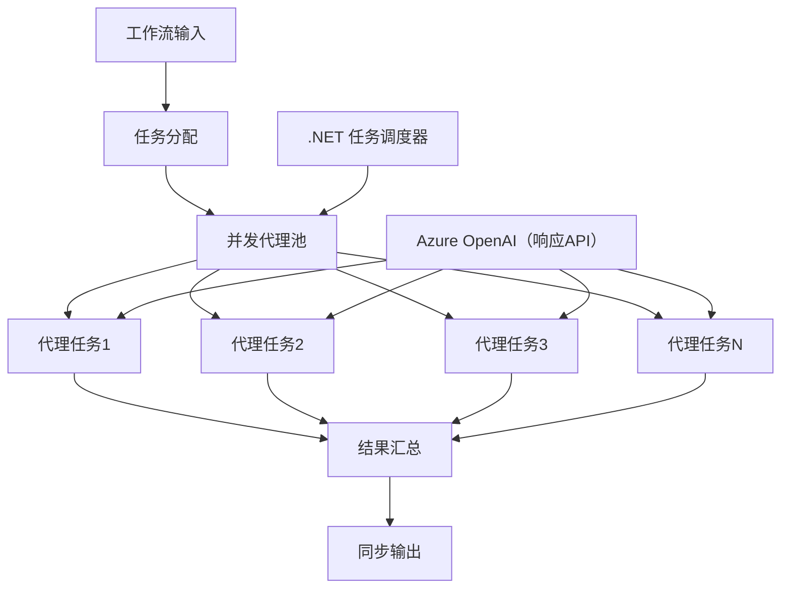

# 08 · 03.dotnet-agent-framework-workflow-ghmodel-concurrent

[返回：多 Agent 协作](/lessons/multi-agent.md) · [不可变原始文件](https://github.com/microsoft/ai-agents-for-beginners/blob/25b7985f3b2dc37a84f4a7387ccd3c9f0e5b1595/08-multi-agent/code_samples/workflows-agent-framework/dotNET/03.dotnet-agent-framework-workflow-ghmodel-concurrent.md)

::: info 原课程补充材料
根据对应简体中文译本整理。原代码片段未进行云端验证。
:::

# ⚡ 使用 Azure OpenAI (Responses API) 的并发 Agent 工作流 (.NET)

## 📋 高性能并行处理教程

本笔记本展示了使用 .NET 的 Microsoft Agent Framework 和 Azure OpenAI (Responses API) 的 **并发工作流模式** 。你将学习如何构建高性能的并行处理工作流，通过同时执行多个 AI Agent 来最大化吞吐量，同时保持协调和数据一致性。

## 🎯 学习目标

### 🚀 **并发处理基础** 
- **并行 Agent 执行** ：同时运行多个 AI Agent 以实现最大性能
- **Async/Await 模式** ：利用 .NET 的异步编程模型实现高效并发
- **Azure OpenAI (Responses API)** ：协调对 Azure OpenAI Responses API 的多次并发调用
- **资源管理** ：高效管理并发操作中的 AI 模型资源

### 🏗️ **高级并发架构** 
- **基于任务的并行处理** ：使用 .NET 任务并行库实现最优并发执行
- **同步模式** ：协调并发 Agent，避免竞态条件
- **负载均衡** ：有效分配工作以利用可用并发处理能力
- **容错能力** ：处理单个 Agent 失败而不影响整个工作流

### 🏢 **企业级并发应用** 
- **高容量文档处理** ：同时处理多个文档
- **实时内容分析** ：并发分析传入的数据流
- **批量处理优化** ：最大化大规模数据处理操作的吞吐量
- **多模态分析** ：并行处理不同内容类型和格式

## ⚙️ 先决条件与设置

### 📦 **必需的 NuGet 包** 

高性能并发工作流所需的核心包：

```xml

<PackageReference Include="Microsoft.Extensions.AI" Version="10.*" />


<PackageReference Include="Azure.AI.OpenAI" Version="2.*" />


<PackageReference Include="Azure.Identity" Version="1.15.0" />
<PackageReference Include="System.Linq.Async" Version="6.0.3" />


```

### 🔑 **Azure OpenAI 配置** 

 **环境配置 (.env 文件)：** 
```text
AZURE_OPENAI_ENDPOINT=https://<your-resource>.openai.azure.com
AZURE_OPENAI_DEPLOYMENT=gpt-5-mini
```

 **并发处理注意事项：** 
```csharp
// Configure for concurrent operations
var clientOptions = new AzureOpenAIClientOptions()
{
    // Configure network timeout for concurrent requests
    NetworkTimeout = TimeSpan.FromMinutes(5)
};
```

### 🏗️ **并发工作流架构** 



 **关键组件：** 
- **任务并行库** ：.NET 内置的并发操作支持
- **Agent 池** ：用于并行处理的多个 Agent 实例
- **结果聚合** ：协调并合并并发 Agent 的结果
- **同步点** ：确保并发操作中的数据一致性

## 🎨 **并发工作流设计模式** 

### 🔍 **并行调研与分析** 
```
Research Topic → Concurrent Research Agents → Result Synthesis → Final Report
```

### 📊 **多源数据处理** 
```
Data Sources → Parallel Processing Agents → Data Integration → Unified Output
```

### 🎭 **内容生成管道** 
```
Content Requirements → Concurrent Content Generators → Quality Review → Final Content
```

### 🔄 **扇出/扇入处理** 
```
Single Input → Multiple Concurrent Processors → Result Aggregation → Single Output
```

## 🏢 **企业性能优势** 

### ⚡ **吞吐量与可扩展性** 
- **线性性能扩展** ：增加更多并发 Agent 以提升吞吐量
- **资源利用率** ：充分发挥可用 AI 模型容量的最大效率
- **减少处理时间** ：通过并行执行显著缩短时间
- **弹性扩展** ：根据工作负载动态调整并发 Agent 数量

### 🛡️ **可靠性与韧性** 
- **故障隔离** ：单个 Agent 失败不影响其他并发操作
- **优雅降级** ：系统在 Agent 容量减少时仍能继续运行
- **错误恢复** ：失败的并发操作自动重试机制
- **负载分配** ：均匀分配工作到可用 Agent

### 📊 **性能监控** 
- **并发执行指标** ：跟踪所有并行操作的性能表现
- **资源使用分析** ：监控 CPU、内存和网络利用率
- **吞吐量分析** ：衡量并发处理带来的效率提升
- **瓶颈检测** ：识别和解决性能瓶颈

### 🔧 **开发与运维** 
- **异步编程模型** ：利用 .NET 成熟的 async/await 模式
- **任务协调** ：内置的任务管理与协调功能
- **异常处理** ：全面的并发操作错误处理
- **调试支持** ：Visual Studio 并发工作流调试工具

让我们使用 .NET 构建高性能并发 AI 工作流吧！ 🚀

## 💻 运行代码

完整实现见 `03.dotnet-agent-framework-workflow-ghmodel-concurrent.cs`。该文件展示了用于旅行规划的 **扇出/扇入并发工作流** ：

### 🏗️ **工作流架构** 

```
User Request → ConcurrentStartExecutor → [Researcher Agent || Planner Agent] → ConcurrentAggregationExecutor → Final Output
```

 **关键组件：** 

1. **ConcurrentStartExecutor** ：同时向所有 Agent 广播用户请求
2. **Researcher Agent** ：并发分析目的地和景点
3. **Planner Agent** ：并发制定详细旅行计划
4. **ConcurrentAggregationExecutor** ：收集并合并两个 Agent 的结果

### 🎯 **扇出/扇入模式** 

该工作流展示了经典的 **扇出/扇入** 模式：
- **扇出** ：将一个输入消息同时广播给多个 Agent
- **并发处理** ：多个 Agent 并行处理同一任务
- **扇入** ：收集所有 Agent 的结果并聚合成单一输出

### 🚀 运行示例

```bash
# 使脚本可执行（Unix/Linux/macOS）
chmod +x 03.dotnet-agent-framework-workflow-ghmodel-concurrent.cs

# 运行并发工作流程
./03.dotnet-agent-framework-workflow-ghmodel-concurrent.cs
```

或在 Windows 上：
```powershell
dotnet run 03.dotnet-agent-framework-workflow-ghmodel-concurrent.cs
```

### 📝 预期输出

工作流将执行：
1. **广播请求** ：向两个 Agent 发送“计划12月去西雅图旅行”
2. **并发处理** ：两个 Agent 同时工作：
   - Researcher 确定景点和详细信息
   - Planner 制定行程和后勤安排
3. **聚合** ：合并双方响应形成综合输出
4. **显示结果** ：展示合并后的完整旅行计划

### 🔧 定制选项

 **添加更多并发 Agent：** 
```csharp
// Create additional specialized agents
AIAgent budgetAgent = azureClient.GetChatClient(deployment).AsAIAgent(
    name: "Budget-Agent", instructions: "Calculate travel costs...");

// Add to fan-out
var workflow = new WorkflowBuilder(startExecutor)
    .AddFanOutEdge(startExecutor, targets: [researcherAgent, plannerAgent, budgetAgent])
    .AddFanInBarrierEdge(sources: [researcherAgent, plannerAgent, budgetAgent], target: aggregationExecutor)
    .WithOutputFrom(aggregationExecutor)
    .Build();

// Update aggregation count
if (this._messages.Count == 3) { ... }
```

 **修改 Agent 指令：** 
```csharp
const string ResearcherAgentInstructions = "Your custom instructions for research...";
const string PlanAgentInstructions = "Your custom instructions for planning...";
```

 **更改任务：** 
```csharp
StreamingRun run = await InProcessExecution.RunStreamingAsync(
    workflow, 
    "Plan a European vacation for 2 weeks in summer"
);
```

### 🎯 现实应用

该并发模式适用于：
- **内容创作** ：多个作者同时撰写不同章节
- **代码审查** ：多位审查员从不同角度分析代码
- **市场调研** ：并行分析不同市场细分
- **文档处理** ：并发抽取、分析和校验
- **多角度分析** ：获取同一输入的多样观点

### 🔍 理解自定义执行器

 **ConcurrentStartExecutor：** 
- 实现 `IMessageHandler&lt;string&gt;` 接收字符串输入
- 向所有连接 Agent 广播消息
- 发送 `TurnToken` 触发并发处理

 **ConcurrentAggregationExecutor：** 
- 实现 `IMessageHandler&lt;ChatMessage&gt;` 接收 Agent 响应
- 以线程安全方式收集消息
- 当所有预期响应到达时聚合它们
- 使用 `context.YieldOutputAsync()` 返回最终输出

### ⚡ 性能优势

 **并发 vs 顺序：** 
- 顺序：Agent1 (30秒) → Agent2 (30秒) = **总计 60 秒** 
- 并发：Agent1 (30秒) || Agent2 (30秒) = **总计 30 秒** 

 **吞吐量提升** ：N 个并发 Agent 时速度提升可达 N 倍（视工作负载和资源而定）

### 🛡️ 错误处理

工作流能优雅地处理单个 Agent 失败：
- 若一 Agent 失败，其他 Agent 继续处理
- 聚合器可实现超时逻辑
- 可按需返回部分结果

### 📊 高级功能

 **动态 Agent 数量：** 
修改聚合逻辑以支持可变 Agent 数量：

```csharp
private int _expectedAgentCount;
private readonly List<ChatMessage> _messages = [];

public override ValueTask HandleAsync(ChatMessage message, IWorkflowContext context, CancellationToken cancellationToken = default)
{
    this._messages.Add(message);
    if (this._messages.Count == _expectedAgentCount)
    {
        // Process aggregation
    }
    
    return ValueTask.CompletedTask;
}
```

该并发工作流模式是构建高性能、可扩展 AI Agent 系统的关键！ 

---