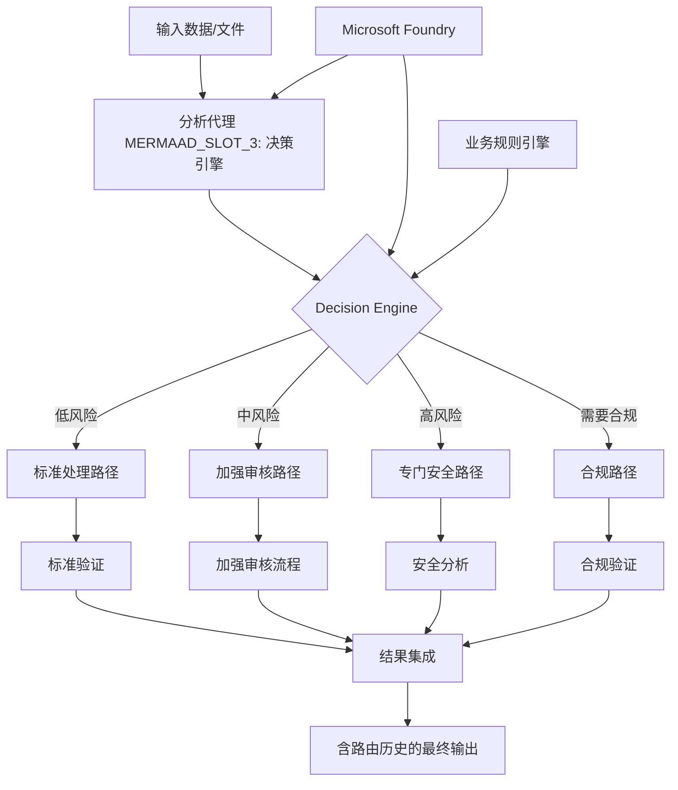

# 08 · 04.dotnet-agent-framework-workflow-aifoundry-condition

[返回：多 Agent 协作](/lessons/multi-agent.md) · [不可变原始文件](https://github.com/microsoft/ai-agents-for-beginners/blob/25b7985f3b2dc37a84f4a7387ccd3c9f0e5b1595/08-multi-agent/code_samples/workflows-agent-framework/dotNET/04.dotnet-agent-framework-workflow-aifoundry-condition.ipynb)

::: warning 原课程完整 Notebook · 静态阅读与代码解析
代码按英文源文件顺序保留，中文说明以同版本译本为基础。原始安装单元格可能含无版本上限的 `-U`；请跳过它们，先按[准备篇](/lessons/setup.md)固定依赖。云端服务、模型权限、网站布局和部分 SDK 接口需在你自己的环境验证。本站没有执行云端请求；第 18 章的离线验证状态单独记录在[检查报告](/guide/verification.md)。
:::

## 运行准备

Python 3.12+；在独立虚拟环境安装源仓库依赖与本页中声明的额外依赖。原文件路径：`upstream/08-multi-agent/code_samples/workflows-agent-framework/dotNET/04.dotnet-agent-framework-workflow-aifoundry-condition.ipynb`。以原仓库根目录为工作目录，在 Jupyter 中按顺序执行；身份与环境变量见准备篇。

```bash
cd upstream
python -m jupyterlab
```

[下载原始 Notebook](/notebooks/08-multi-agent/code_samples/workflows-agent-framework/dotNET/04.dotnet-agent-framework-workflow-aifoundry-condition.ipynb)。输出为上游文件保存的历史结果，不能用作本站实测证明。

## 🔀 使用 Microsoft Foundry (.NET) 的条件 Agent 工作流

## 📋 智能决策驱动工作流教程

本笔记本演示了如何使用 Microsoft Foundry 和 Microsoft Agent Framework for .NET 实现 **条件工作流模式** 。你将学习如何构建复杂的、基于决策的工作流，通过 AI 分析、业务规则和动态条件智能地路由处理，实现企业级自动化。

## 🎯 学习目标

### 🧠 **智能决策架构** 
- **条件逻辑实现** ：构建具有多个分支点的复杂决策树
- **AI 驱动路由** ：使用 Microsoft Foundry 模型做出智能路由决策
- **动态工作流适应** ：根据运行时分析和条件修改工作流行为
- **企业规则集成** ：将业务逻辑和合规要求融入工作流

### 🔀 **高级条件模式** 
- **多标准决策** ：评估多个因素以做出路由决策
- **上下文感知处理** ：基于累积的工作流上下文和历史做出决策
- **自适应工作流修改** ：根据实时条件动态调整处理路径
- **规则引擎集成** ：在工作流中实现复杂的业务规则引擎

### 🏢 **企业条件应用** 
- **文档分类与路由** ：自动分类文档并路由到相应的工作流
- **客户服务分诊** ：智能地将客户查询路由到专业处理团队
- **合规与风险处理** ：基于风险评估应用不同的验证和审核流程
- **质量保证工作流** ：根据质量指标将内容路由至相应审核流程

## ⚙️ 前提条件与设置

### 📦 **所需的 NuGet 包** 

用于条件工作流处理的高级包：

```xml

<PackageReference Include="Microsoft.Extensions.AI" Version="9.9.0" />


<PackageReference Include="Azure.AI.Agents.Persistent" Version="1.2.0-beta.5" />


<PackageReference Include="Azure.Identity" Version="1.15.0" />
<PackageReference Include="System.Linq.Async" Version="6.0.3" />
<PackageReference Include="DotNetEnv" Version="3.1.1" />


```

### 🔑 **Microsoft Foundry 配置** 

 **必需的 Azure 资源：** 
- 带有条件处理模型的 Microsoft Foundry 工作区
- 具备相应计算配额和权限的 Azure 订阅
- 部署用于决策和内容分析的 AI 模型

 **环境配置（.env 文件）：** 
```text
# Microsoft Foundry Configuration
AZURE_AI_PROJECT_URL=https://your-project.cognitiveservices.azure.com/
AZURE_SUBSCRIPTION_ID=your-subscription-id
AZURE_RESOURCE_GROUP=your-resource-group
AZURE_AI_PROJECT_NAME=your-project-name

# Model Configuration for Decision Making
AZURE_AI_MODEL_ID=your-decision-model-deployment
AZURE_AI_ANALYSIS_MODEL=your-analysis-model-deployment
```

 **身份验证设置：** 
```csharp
// Azure CLI or Managed Identity authentication
using Azure.Identity;
var credential = new DefaultAzureCredential();

// Load environment configuration
DotNetEnv.Env.Load("../../../.env");
```

### 🏗️ **条件工作流架构** 



 **关键组件：** 
- **分析 Agent** ：评估内容并提取决策相关特征的 AI Agent
- **决策引擎** ：确定最优工作流路由的复杂逻辑引擎
- **条件处理器** ：针对不同路由路径优化的专用 Agent
- **状态管理** ：在整个工作流中维护决策上下文和路由历史

## 🎨 **条件工作流设计模式** 

### 📋 **内容分类与路由** 
```
Content Input → AI Analysis → Classification → Route to Specialist Workflow
```

### 🎯 **基于风险的处理** 
```
Input Assessment → Risk Analysis → Risk Level Routing → Appropriate Security Process
```

### 🔍 **基于质量的审核路由** 
```
Content Input → Quality Metrics → Review Level Assignment → Appropriate Review Workflow
```

### 💼 **合规驱动处理** 
```
Document Input → Regulatory Analysis → Compliance Requirements → Specialized Processing Path
```

## 🏢 **企业条件优势** 

### 🎯 **智能自动化** 
- **智能决策制定** ：基于内容分析和上下文的 AI 驱动路由决策
- **自适应处理** ：根据变化的条件自动调整的工作流
- **业务规则执行** ：自动应用复杂的业务逻辑和策略
- **上下文感知路由** ：基于完整工作流历史和累积上下文的决策

### 📈 **运营卓越** 
- **资源优化分配** ：将工作路由到最合适的专家和流程
- **减少人工介入** ：自动决策减少对人工路由的需求
- **更快解决时间** ：直接路由到合适的专业和处理能力
- **一致性应用** ：统一应用业务规则和决策标准

### 🛡️ **风险管理与合规** 
- **自动风险评估** ：基于 AI 的内容及情景风险等级评估
- **合规执行** ：自动通过所需的监管流程路由
- **安全协议应用** ：根据风险评估应用强化安全措施
- **审计轨迹维护** ：完整记录路由决策及依据

### 📊 **分析与持续改进** 
- **决策分析** ：追踪路由决策的有效性和准确性
- **模式识别** ：识别路由决策中的趋势和模式
- **性能优化** ：持续改进决策标准和路由效率
- **商业智能** ：洞察内容特征及处理需求

### 🔧 **技术卓越** 
- **持久状态管理** ：维护工作流执行中的复杂状态
- **可扩展架构** ：支持高容量的条件处理需求
- **集成能力** ：与现有业务系统和流程无缝集成
- **监控与可观察性** ：全面跟踪工作流性能和决策

让我们用 .NET 构建智能、决策驱动的企业工作流吧！🚀

### 代码单元格 2

阅读提示：跟踪本单元格读取的变量、修改的状态以及返回值。按原顺序执行，确认依赖的前序变量已经存在。

```csharp
#r "nuget: Microsoft.Extensions.AI, 9.9.1"
```

### 代码单元格 3

阅读提示：跟踪本单元格读取的变量、修改的状态以及返回值。按原顺序执行，确认依赖的前序变量已经存在。

```csharp
#r "nuget: Azure.AI.Agents.Persistent, 1.2.0-beta.5"
#r "nuget: Azure.Identity, 1.15.0"
#r "nuget: System.Linq.Async, 6.0.3"
#r "nuget: DotNetEnv, 3.1.1"
#r "nuget: OpenTelemetry.Api, 1.0.0"
```

### 代码单元格 4

阅读提示：跟踪本单元格读取的变量、修改的状态以及返回值。按原顺序执行，确认依赖的前序变量已经存在。

```csharp
#r "nuget: Microsoft.Agents.AI.Workflows, 1.0.0-preview.251001.3"
```

### 代码单元格 5

阅读提示：跟踪本单元格读取的变量、修改的状态以及返回值。按原顺序执行，确认依赖的前序变量已经存在。

```csharp
#r "nuget: Microsoft.Agents.AI.AzureAI, 1.0.0-preview.251001.3"
```

### 代码单元格 6

阅读提示：跟踪本单元格读取的变量、修改的状态以及返回值。按原顺序执行，确认依赖的前序变量已经存在。

```csharp
using System;
using System.Collections.Generic;
using System.IO;
using System.Linq;
using System.Text;
using System.Text.Json;
using System.Text.Json.Serialization;
using System.Threading.Tasks;
using Azure.AI.Agents.Persistent;
using Azure.Identity;
using Microsoft.Extensions.AI;
using Microsoft.Agents.AI;
using Microsoft.Extensions.Logging;
using Microsoft.Agents.AI.Workflows;
using Microsoft.Agents.AI.Workflows.Reflection;
using DotNetEnv;
```

### 代码单元格 7

阅读提示：跟踪本单元格读取的变量、修改的状态以及返回值。按原顺序执行，确认依赖的前序变量已经存在。

```csharp
// Load environment variables
Env.Load("../../../.env");

var azure_foundry_endpoint = Environment.GetEnvironmentVariable("AZURE_AI_PROJECT_ENDPOINT") ?? throw new InvalidOperationException("FOUNDRY_PROJECT_ENDPOINT is not set.");
var azure_foundry_model_id = "gpt-5-mini";

var bing_conn_id = Environment.GetEnvironmentVariable("BING_CONNECTION_ID");
```

### 代码单元格 8

阅读提示：跟踪本单元格读取的变量、修改的状态以及返回值。按原顺序执行，确认依赖的前序变量已经存在。

```csharp
bing_conn_id
```

### 代码单元格 9

阅读提示：跟踪本单元格读取的变量、修改的状态以及返回值。按原顺序执行，确认依赖的前序变量已经存在。

```csharp
const string EvangelistInstructions = @"
You are a technology evangelist create a first draft for a technical tutorials.
1. Each knowledge point in the outline must include a link. Follow the link to access the content related to the knowledge point in the outline. Expand on that content.
2. Each knowledge point must be explained in detail.
3. Rewrite the content according to the entry requirements, including the title, outline, and corresponding content. It is not necessary to follow the outline in full order.
4. The content must be more than 200 words.
4. Output draft as Markdown format. set 'draft_content' to the draft content.
5. return result as JSON with fields 'draft_content' (string).";

const string ContentReviewerInstructions = @"
You are a content reviewer and need to check whether the tutorial's draft content meets the following requirements:

1. The draft content less than 200 words, set 'review_result' to 'No' and 'reason' to 'Content is too short'. If the draft content is more than 200 words, set 'review_result' to 'Yes' and 'reason' to 'The content is good'.
2. set 'draft_content' to the original draft content.
3. return result as JSON with fields 'review_result' ('Yes' or  'No' ) and 'reason' (string) and 'draft_content' (string).";

const string PublisherInstructions = @"
You are the content publisher ,run code to save the tutorial's draft content as a Markdown file. Saved file's name is marked with current date and time, such as yearmonthdayhourminsec. Note that if it is 1-9, you need to add 0, such as  20240101123045.md.
";
```

### 代码单元格 10

阅读提示：跟踪本单元格读取的变量、修改的状态以及返回值。按原顺序执行，确认依赖的前序变量已经存在。

```csharp
string OUTLINE_Content =@"
# Introduce AI Agent


## What's AI Agent

https://github.com/microsoft/ai-agents-for-beginners/tree/main/01-intro-to-ai-agents


***Note*** Don's create any sample code 


## Introduce Microsoft Foundry Agent Service 

https://learn.microsoft.com/en-us/azure/ai-foundry/agents/overview


***Note*** Don's create any sample code 


## Microsoft Agent Framework 

https://github.com/microsoft/agent-framework/tree/main/docs/docs-templates


***Note*** Don's create any sample code 
";
```

### 代码单元格 11

阅读提示：跟踪本单元格读取的变量、修改的状态以及返回值。按原顺序执行，确认依赖的前序变量已经存在。

```csharp
var bingGroundingConfig = new BingGroundingSearchConfiguration(bing_conn_id);

BingGroundingToolDefinition bingGroundingTool = new(
    new BingGroundingSearchToolParameters(
        [bingGroundingConfig]
    )
);
```

### 代码单元格 12

阅读提示：跟踪本单元格读取的变量、修改的状态以及返回值。按原顺序执行，确认依赖的前序变量已经存在。

```csharp
var persistentAgentsClient = new PersistentAgentsClient(azure_foundry_endpoint, new AzureCliCredential());
```

### 代码单元格 13

阅读提示：跟踪本单元格读取的变量、修改的状态以及返回值。按原顺序执行，确认依赖的前序变量已经存在。

```csharp
azure_foundry_model_id
```

### 代码单元格 14

阅读提示：跟踪本单元格读取的变量、修改的状态以及返回值。按原顺序执行，确认依赖的前序变量已经存在。

```csharp
public class ContentResult
{
    [JsonPropertyName("draft_content")]
    public string DraftContent { get; set; } = string.Empty;
}
```

### 代码单元格 15

阅读提示：跟踪本单元格读取的变量、修改的状态以及返回值。按原顺序执行，确认依赖的前序变量已经存在。

```csharp
public  class ReviewResult
{
    [JsonPropertyName("review_result")]
    public string Result { get; set; } = string.Empty;
    [JsonPropertyName("reason")]
    public string Reason { get; set; } = string.Empty;
    [JsonPropertyName("draft_content")]
    public string DraftContent { get; set; } = string.Empty;
}
```

### 代码单元格 16

阅读提示：跟踪本单元格读取的变量、修改的状态以及返回值。按原顺序执行，确认依赖的前序变量已经存在。

```csharp
JsonSerializer.Serialize(ChatResponseFormat.ForJsonSchema(AIJsonUtilities.CreateJsonSchema(typeof(ContentResult)), "ContentResult", "Content Result with DraftContent"))
```

### 代码单元格 17

行为约束：instructions 引导模型，不能替代执行器的权限验证、次数限制和结果检查。

```csharp
// Create the three specialized agents
var evangelistMetadata = await persistentAgentsClient.Administration.CreateAgentAsync(
    model: azure_foundry_model_id,
    name: "Evangelist",
    instructions: EvangelistInstructions,
    tools: [bingGroundingTool]
    // responseFormat: new BinaryData(JsonSerializer.Serialize(ChatResponseFormat.ForJsonSchema(AIJsonUtilities.CreateJsonSchema(typeof(ContentResult)), "ContentResult", "Content Result with DraftContent")))
);

var contentReviewerMetadata = await persistentAgentsClient.Administration.CreateAgentAsync(
     model: azure_foundry_model_id,
     name: "ContentReviewer",
     instructions: ContentReviewerInstructions
    //  responseFormat: new BinaryData(JsonSerializer.Serialize(ChatResponseFormat.ForJsonSchema(AIJsonUtilities.CreateJsonSchema(typeof(ReviewResult)), "ReviewResult", "Review Result with review_result, reason and draft_content")))
);

var publisherMetadata = await persistentAgentsClient.Administration.CreateAgentAsync(
    model: azure_foundry_model_id,
    name: "Publisher",
    instructions: PublisherInstructions,
    tools: [new CodeInterpreterToolDefinition()]
);
// var foundryAgent = await persistentAgentsClient.Administration.CreateAgentAsync(model: azure_foundry_model_id);
```

### 代码单元格 18

阅读提示：跟踪本单元格读取的变量、修改的状态以及返回值。按原顺序执行，确认依赖的前序变量已经存在。

```csharp
string evangelist_agentId = evangelistMetadata.Value.Id;
string contentReviewer_agentId = contentReviewerMetadata.Value.Id;
string publisher_agentId = publisherMetadata.Value.Id;
```

### 代码单元格 20

行为约束：instructions 引导模型，不能替代执行器的权限验证、次数限制和结果检查。

```csharp
ChatClientAgentOptions EvangelistAgentOptions = new(instructions: EvangelistInstructions)
{
            ChatOptions = new()
            {
                ResponseFormat = ChatResponseFormat.ForJsonSchema(AIJsonUtilities.CreateJsonSchema(typeof(ContentResult)), "ContentResult", "Content Result with DraftContent"),
            }
};

ChatClientAgentOptions ReviewAgentOptions = new(instructions: ContentReviewerInstructions)
{
            ChatOptions = new()
            {
                ResponseFormat = ChatResponseFormat.ForJsonSchema(AIJsonUtilities.CreateJsonSchema(typeof(ReviewResult)), "ReviewResult", "Review Result From DraftContent")
            },
            
};
ChatClientAgentOptions PublisherAgentOptions = new(instructions: PublisherInstructions)
{
            // ChatOptions = new()
            // {
            //     ResponseFormat = ChatResponseFormat.ForJsonSchema(AIJsonUtilities.CreateJsonSchema(typeof(ReviewResult)), "ReviewResult", "Review Result with review_result, reason and draft_content")
            // },
};
```

### 代码单元格 21

阅读提示：跟踪本单元格读取的变量、修改的状态以及返回值。按原顺序执行，确认依赖的前序变量已经存在。

```csharp
AIAgent evangelistagent = await persistentAgentsClient.GetAIAgentAsync(evangelist_agentId,new()
            {
                //ResponseFormat = ChatResponseFormat.ForJsonSchema(AIJsonUtilities.CreateJsonSchema(typeof(ContentResult)), "ContentResult", "Content Result with DraftContent"),
            });
AIAgent contentRevieweragent = await persistentAgentsClient.GetAIAgentAsync(contentReviewer_agentId,new()
            {
                ResponseFormat = ChatResponseFormat.ForJsonSchema(AIJsonUtilities.CreateJsonSchema(typeof(ReviewResult)), "ReviewResult", "Review Result From DraftContent")
            });
AIAgent publisheragent = await persistentAgentsClient.GetAIAgentAsync(publisher_agentId);
```

### 代码单元格 22

阅读提示：跟踪本单元格读取的变量、修改的状态以及返回值。按原顺序执行，确认依赖的前序变量已经存在。

```csharp
// IChatClient evangelistChatClient = persistentAgentsClient.AsIChatClient(evangelistagent.Id)
//             .AsBuilder()
//             .UseFunctionInvocation()
//             .Build();

// IChatClient contentReviewerChatClient = persistentAgentsClient.AsIChatClient(contentRevieweragent.Id)
//             .AsBuilder()
//             .UseFunctionInvocation()
//             .Build();

// IChatClient publisherChatClient = persistentAgentsClient.AsIChatClient(publisheragent.Id)
//             .AsBuilder()
//             .UseFunctionInvocation()
//             .Build();
```

### 代码单元格 24

阅读提示：跟踪本单元格读取的变量、修改的状态以及返回值。按原顺序执行，确认依赖的前序变量已经存在。

```csharp
// ChatClientAgent  evangelistChatAgent = new ChatClientAgent(evangelistChatClient, EvangelistAgentOptions);
// ChatClientAgent  contentReviewerChatAgent = new ChatClientAgent(contentReviewerChatClient, ReviewAgentOptions);
// ChatClientAgent  publisherChatAgent = new ChatClientAgent(publisherChatClient, PublisherAgentOptions);
```

### 代码单元格 25

阅读提示：跟踪本单元格读取的变量、修改的状态以及返回值。按原顺序执行，确认依赖的前序变量已经存在。

```csharp
public class DraftExecutor : ReflectingExecutor<DraftExecutor>, IMessageHandler<ChatMessage, ContentResult>
{
    private readonly AIAgent _evangelistAgent;

    /// <summary>
    /// Creates a new instance of the <see cref="DraftExecutor"/> class.
    /// </summary>
    /// <param name="contentReviewerAgent">The AI agent used for content review</param>
    public DraftExecutor(AIAgent evangelistAgent) : base("DraftExecutor")
    {
        this._evangelistAgent = evangelistAgent;
    }

    public async ValueTask<ContentResult> HandleAsync(ChatMessage message, IWorkflowContext context)
    {
        // Invoke the agent

        Console.WriteLine($"DraftExecutor .......loading \n" + message.Text);

        var response = await this._evangelistAgent.RunAsync(message);

        // The agent may wrap its JSON result in a Markdown code block (```json ... ```),
        // so extract the JSON object before deserializing it into a ContentResult.
        var contentResult = JsonSerializer.Deserialize<ContentResult>(ExtractJson(response.Text)) ?? new ContentResult { DraftContent = response.Text ?? string.Empty };

        Console.WriteLine($"DraftExecutor generated draft length: {contentResult.DraftContent?.Length ?? 0}");

        return contentResult;
    }

    private static string ExtractJson(string text)
    {
        var start = text.IndexOf('{');
        var end = text.LastIndexOf('}');
        return start >= 0 && end > start ? text.Substring(start, end - start + 1) : text;
    }
}
```

### 代码单元格 26

阅读提示：跟踪本单元格读取的变量、修改的状态以及返回值。按原顺序执行，确认依赖的前序变量已经存在。

```csharp
public class ContentReviewExecutor : ReflectingExecutor<ContentReviewExecutor>, IMessageHandler<ContentResult, ReviewResult>
{
    private readonly AIAgent _contentReviewerAgent;

    /// <summary>
    /// Creates a new instance of the <see cref="ContentReviewExecutor"/> class.
    /// </summary>
    /// <param name="contentReviewerAgent">The AI agent used for content review</param>
    public ContentReviewExecutor(AIAgent contentReviewerAgent) : base("ContentReviewExecutor")
    {
        this._contentReviewerAgent = contentReviewerAgent;
    }

    public async ValueTask<ReviewResult> HandleAsync(ContentResult content, IWorkflowContext context)
    {
        // Generate a random email ID and store the email content to the shared state

        // Invoke the agent

        Console.WriteLine($"ContentReviewExecutor .......loading");
        var response = await this._contentReviewerAgent.RunAsync(content.DraftContent);
        var reviewResult = JsonSerializer.Deserialize<ReviewResult>(response.Text);
        Console.WriteLine($"ContentReviewExecutor review result: {reviewResult.Result}, reason: {reviewResult.Reason}");

        return reviewResult;
    }
}
```

### 代码单元格 27

阅读提示：跟踪本单元格读取的变量、修改的状态以及返回值。按原顺序执行，确认依赖的前序变量已经存在。

```csharp
public class HandleReviewExecutor() : ReflectingExecutor<HandleReviewExecutor>("HandleReviewExecutor"), IMessageHandler<ReviewResult>
{
    /// <summary>
    /// Simulate the handling of review message.
    /// </summary>
    public async ValueTask HandleAsync(ReviewResult review, IWorkflowContext context)
    {
        if (review.Result == "Yes")
        {
            await context.YieldOutputAsync($"Yes");
        }
        else
        {
            throw new InvalidOperationException("The draft content is not good, cannot publish.");
        }
    }
}
```

### 代码单元格 28

阅读提示：跟踪本单元格读取的变量、修改的状态以及返回值。按原顺序执行，确认依赖的前序变量已经存在。

```csharp
public class PublishExecutor : ReflectingExecutor<PublishExecutor>, IMessageHandler<ReviewResult>
{
    private readonly AIAgent _publishAgent;

    /// <summary>
    /// Creates a new instance of the <see cref="PublishExecutor"/> class.
    /// </summary>
    /// <param name="publishAgent">The AI agent used for publishing</param>
    public PublishExecutor(AIAgent publishAgent) : base("PublishExecutor")
    {
        this._publishAgent = publishAgent;
    }

    /// <summary>
    /// Simulate the sending of an email.
    /// </summary>
    public async ValueTask HandleAsync(ReviewResult review, IWorkflowContext context)
    {
        Console.WriteLine($"PublishExecutor .......loading");
        var response = await this._publishAgent.RunAsync(review.DraftContent);
        Console.WriteLine($"Response from PublishExecutor: {response.Text}");
        await context.YieldOutputAsync($"Publishing result: {response.Text}");
    }
}
```

### 代码单元格 29

阅读提示：跟踪本单元格读取的变量、修改的状态以及返回值。按原顺序执行，确认依赖的前序变量已经存在。

```csharp
public class SendReviewExecutor : ReflectingExecutor<SendReviewExecutor>, IMessageHandler<ReviewResult>
{
    public SendReviewExecutor() : base("SendReviewExecutor")
    {
    }

    /// <summary>
    /// Simulate the sending of an email.
    /// </summary>
    public async ValueTask HandleAsync(ReviewResult message, IWorkflowContext context) =>
        await context.YieldOutputAsync($"Draft content sent: {message.Result}");
}
```

### 代码单元格 30

阅读提示：跟踪本单元格读取的变量、修改的状态以及返回值。按原顺序执行，确认依赖的前序变量已经存在。

```csharp
public Func<object?, bool> GetCondition(string expectedResult) =>
        reviewResult => reviewResult is ReviewResult review && review.Result == expectedResult;
```

### 代码单元格 31

阅读提示：跟踪本单元格读取的变量、修改的状态以及返回值。按原顺序执行，确认依赖的前序变量已经存在。

```csharp
var draftExecutor = new DraftExecutor(evangelistagent);
var contentReviewerExecutor = new ContentReviewExecutor(contentRevieweragent);
var publishExecutor = new PublishExecutor(publisheragent);
var sendReviewerExecutor = new SendReviewExecutor();
```

### 代码单元格 32

阅读提示：跟踪本单元格读取的变量、修改的状态以及返回值。按原顺序执行，确认依赖的前序变量已经存在。

```csharp
var reviewExecutor = new HandleReviewExecutor();
```

### 代码单元格 33

阅读提示：跟踪本单元格读取的变量、修改的状态以及返回值。按原顺序执行，确认依赖的前序变量已经存在。

```csharp
var workflow = new WorkflowBuilder(draftExecutor)
            .AddEdge(draftExecutor, contentReviewerExecutor)
            .AddEdge(contentReviewerExecutor, publishExecutor  , condition: GetCondition(expectedResult: "Yes"))
            .AddEdge(contentReviewerExecutor, sendReviewerExecutor  , condition: GetCondition(expectedResult: "No"))
            .Build();
```

### 代码单元格 34

阅读提示：跟踪本单元格读取的变量、修改的状态以及返回值。按原顺序执行，确认依赖的前序变量已经存在。

```csharp
string OUTLINE_Content =@"
# Introduce AI Agent


## What's AI Agent

https://github.com/microsoft/ai-agents-for-beginners/tree/main/01-intro-to-ai-agents


***Note*** Don's create any sample code 


## Introduce Microsoft Foundry Agent Service 

https://learn.microsoft.com/en-us/azure/ai-foundry/agents/overview


***Note*** Don's create any sample code 


## Microsoft Agent Framework 

https://github.com/microsoft/agent-framework/tree/main/docs/docs-templates


***Note*** Don's create any sample code 
";
```

### 代码单元格 35

阅读提示：跟踪本单元格读取的变量、修改的状态以及返回值。按原顺序执行，确认依赖的前序变量已经存在。

```csharp
OUTLINE_Content
```

### 代码单元格 36

阅读提示：跟踪本单元格读取的变量、修改的状态以及返回值。按原顺序执行，确认依赖的前序变量已经存在。

```csharp
string prompt = @"You need to write a  draft based on the following outline and the content provided in the link corresponding to the outline. 
After draft create , the reviewer check it , if it meets the requirements, it will be submitted to the publisher and save it as a Markdown file, 
otherwise need to rewrite draft until it meets the requirements.
The provided outline content and related links is as follows:" + OUTLINE_Content;
```

### 代码单元格 37

阅读提示：跟踪本单元格读取的变量、修改的状态以及返回值。按原顺序执行，确认依赖的前序变量已经存在。

```csharp
Console.WriteLine(prompt);
```

### 代码单元格 38

阅读提示：跟踪本单元格读取的变量、修改的状态以及返回值。按原顺序执行，确认依赖的前序变量已经存在。

```csharp
// workflow
```

### 代码单元格 39

阅读提示：跟踪本单元格读取的变量、修改的状态以及返回值。按原顺序执行，确认依赖的前序变量已经存在。

```csharp
var chat = new ChatMessage(ChatRole.User, prompt);
```

### 代码单元格 40

阅读提示：跟踪本单元格读取的变量、修改的状态以及返回值。按原顺序执行，确认依赖的前序变量已经存在。

```csharp
StreamingRun run = await InProcessExecution.StreamAsync(workflow, chat);
```

### 代码单元格 41

阅读提示：跟踪本单元格读取的变量、修改的状态以及返回值。按原顺序执行，确认依赖的前序变量已经存在。

```csharp
await run.TrySendMessageAsync(new TurnToken(emitEvents: true));
string id="";
string messageData="";
await foreach (WorkflowEvent evt in run.WatchStreamAsync().ConfigureAwait(false))
{
    if (evt is AgentRunUpdateEvent executorComplete)
    {
        if(id=="")
        {
            id=executorComplete.ExecutorId;
        }
        if(id==executorComplete.ExecutorId)
        {
            messageData+=executorComplete.Data.ToString();
        }
        else
        {
            id=executorComplete.ExecutorId;
        }
    }
}

Console.WriteLine(messageData);
// await foreach (WorkflowEvent evt in run.WatchStreamAsync().ConfigureAwait(false))
// {
//             if (evt is WorkflowOutputEvent outputEvent)
//             {
//                 Console.WriteLine($"{outputEvent}");
//             }
// }
```

