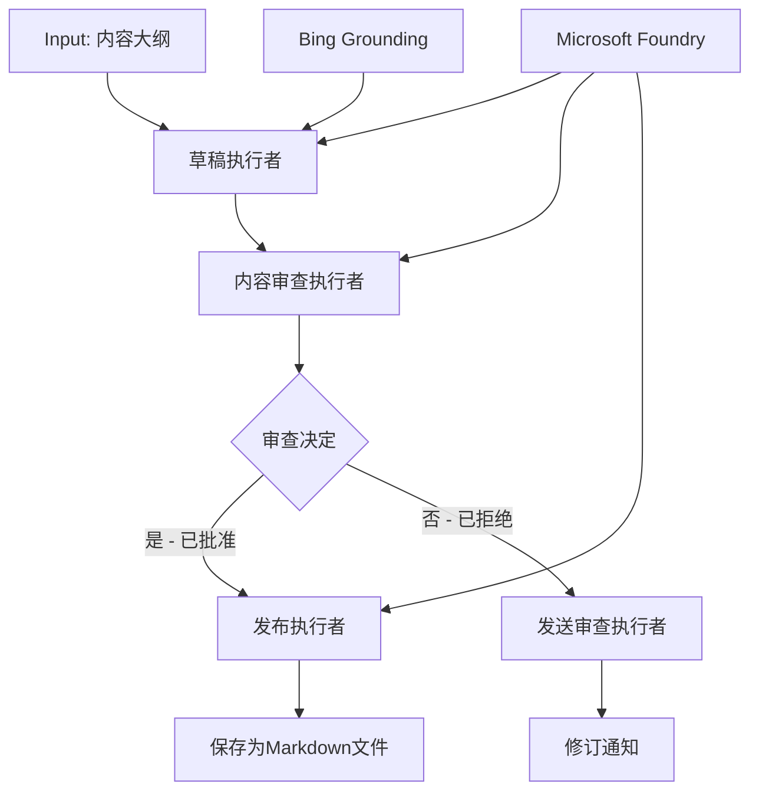

# 08 · 04.dotnet-agent-framework-workflow-aifoundry-condition

[返回：多 Agent 协作](/lessons/multi-agent.md) · [不可变原始文件](https://github.com/microsoft/ai-agents-for-beginners/blob/25b7985f3b2dc37a84f4a7387ccd3c9f0e5b1595/08-multi-agent/code_samples/workflows-agent-framework/dotNET/04.dotnet-agent-framework-workflow-aifoundry-condition.md)

::: info 原课程补充材料
根据对应简体中文译本整理。原代码片段未进行云端验证。
:::

# 🔀 使用 Microsoft Foundry (.NET) 的条件 Agent 工作流

## 📋 智能决策驱动工作流教程

本笔记本演示了使用 Microsoft Foundry 和 .NET 版 Microsoft Agent Framework 的 **条件工作流模式** 。你将学习如何构建复杂的、基于决策的工作流，通过 AI 分析、业务规则和动态条件智能地路由处理，实现企业级自动化。

## 🎯 学习目标

### 🧠 **智能决策架构** 
- **条件逻辑实现** ：构建具有多个分支点的复杂决策树
- **AI 驱动的路由** ：使用 Microsoft Foundry 模型做出智能路由决策
- **动态工作流适应** ：基于运行时分析和条件修改工作流行为
- **企业规则集成** ：将业务逻辑和合规需求融入工作流

### 🔀 **高级条件模式** 
- **多标准决策制定** ：评估多项因素以做出路由决定
- **上下文感知处理** ：基于累计的工作流上下文和历史做出决策
- **自适应工作流修改** ：根据实时条件动态调整处理路径
- **规则引擎集成** ：在工作流中实现复杂的业务规则引擎

### 🏢 **企业级条件应用** 
- **文档分类与路由** ：自动分类并将文档路由至适当的工作流
- **客户服务分诊** ：智能将客户咨询路由至专业处理团队
- **合规与风险处理** ：基于风险评估应用不同的验证和审查流程
- **质量保证工作流** ：根据质量指标将内容路由至合适的审查流程

## ⚙️ 先决条件与设置

### 📦 **必需的 NuGet 包** 

用于条件工作流处理的高级包：

```xml

<PackageReference Include="Microsoft.Extensions.AI" Version="9.9.0" />


<PackageReference Include="Azure.AI.Agents.Persistent" Version="1.2.0-beta.5" />


<PackageReference Include="Azure.Identity" Version="1.15.0" />
<PackageReference Include="System.Linq.Async" Version="6.0.3" />
<PackageReference Include="DotNetEnv" Version="3.1.1" />


```

### 🔑 **Microsoft Foundry 配置** 

 **所需 Azure 资源：** 
- 带有条件处理模型的 Microsoft Foundry 工作区
- 具有合适计算配额和权限的 Azure 订阅
- 部署用于决策和内容分析的 AI 模型
- （可选）用于落实功能的 Bing 搜索 API 连接

 **环境配置 (.env 文件)：** 
```text
# Microsoft Foundry Configuration
AZURE_AI_PROJECT_ENDPOINT=https://your-project.cognitiveservices.azure.com/
BING_CONNECTION_ID=your-bing-connection-id
```

 **身份认证设置：** 
```csharp
// Azure CLI or Managed Identity authentication
using Azure.Identity;
var credential = new AzureCliCredential();

// Load environment configuration
DotNetEnv.Env.Load("../../../.env");
```

### 🏗️ **条件工作流架构** 



 **关键组件：** 
- **起草执行器** ：基于提纲创建初稿的 AI Agent
- **内容审查执行器** ：评估稿件质量和合规性的 AI Agent
- **条件路由** ：基于审查结果进行路由的决策逻辑
- **发布/审查路径** ：对通过和未通过内容分开的处理路径
- **状态管理** ：维护整个工作流中的内容及审查上下文

## 🎨 **条件工作流设计模式** 

### 📋 **带质量门控的内容生产** 
```
Outline → Draft Creation → Quality Review → {Approve: Publish | Reject: Revise}
```

### 🎯 **基于风险的文档处理** 
```
Document → Risk Assessment → {Low: Standard | High: Enhanced Review}
```

### 🔍 **智能客户服务路由** 
```
Customer Query → Analysis → {Simple: FAQ Bot | Complex: Human Agent}
```

### 💼 **合规驱动的工作流** 
```
Content → Compliance Check → {Pass: Publish | Fail: Legal Review}
```

## 🏢 **企业条件的优势** 

### 🎯 **智能自动化** 
- **智能决策制定** ：基于内容分析和上下文的 AI 路由决策
- **自适应处理** ：根据变化条件自动调整的工作流
- **业务规则执行** ：自动应用复杂业务逻辑和政策
- **上下文感知路由** ：基于完整工作流历史和累计上下文的决策

### 📈 **运营卓越** 
- **优化资源分配** ：将工作路由到最合适的专家和流程
- **减少人工干预** ：自动决策减少人工路由需求
- **更快解决时间** ：直接路由到合适的专业知识和处理能力
- **一致性应用** ：统一执行业务规则和决策标准

### 🛡️ **风险管理与合规性** 
- **自动风险评估** ：基于 AI 的内容和情境风险水平评估
- **合规执行** ：自动通过所需的法规流程路由
- **安全协议应用** ：基于风险评估加强安全措施
- **审计跟踪维护** ：完整记录路由决策和原因

### 📊 **分析与持续改进** 
- **决策分析** ：跟踪路由决策的效果和准确性
- **模式识别** ：识别路由决策中的趋势和模式
- **性能优化** ：持续改进决策标准和路由效率
- **业务智能** ：洞察内容特性和处理需求

### 🔧 **技术卓越** 
- **持久状态管理** ：在工作流执行中维护复杂状态
- **可扩展架构** ：满足高量条件处理需求
- **集成能力** ：与现有业务系统和流程无缝集成
- **监控与观测性** ：全面跟踪工作流性能和决策

让我们用 .NET 构建智能、决策驱动的企业工作流吧！🚀

## 💻 运行代码

完整实现代码位于 `04.dotnet-agent-framework-workflow-aifoundry-condition.cs`。该示例演示了一个 **带质量门控的内容生产工作流** ：

### 🏗️ **工作流架构** 

```
Content Outline → Draft Creation → Quality Review → Conditional Routing:
                                                      ├─ Approved (>200 words) → Publish
                                                      └─ Rejected (<200 words) → Review Notification
```

 **工作流中的 Agent：** 
1. **传教士 Agent** ：基于提纲结合 Bing 落地创建教程草稿
2. **内容审查 Agent** ：评估稿件质量（字数、完整性）
3. **发布 Agent** ：将审批通过的内容保存为带时间戳的 Markdown 文件

 **自定义执行器：** 
1. **DraftExecutor** ：协调起草创建
2. **ContentReviewExecutor** ：执行质量评估
3. **PublishExecutor** ：处理批准内容发布
4. **SendReviewExecutor** ：管理拒绝内容通知

### 🚀 运行示例

 **先决条件：** 
- 配置好的 Microsoft Foundry 工作区
- Azure CLI 身份验证 (`az login`)
- （可选）用于落地的 Bing 搜索连接

```bash
# 使脚本可执行（Unix/Linux/macOS）
chmod +x 04.dotnet-agent-framework-workflow-aifoundry-condition.cs

# 运行条件工作流
./04.dotnet-agent-framework-workflow-aifoundry-condition.cs
```

或者在 Windows 上：
```powershell
dotnet run 04.dotnet-agent-framework-workflow-aifoundry-condition.cs
```

### 📝 预期输出

工作流将：
1. **创建 Agent** ：初始化三个专门的 Microsoft Foundry Agent
2. **生成草稿** ：传教士 Agent 基于提纲创建教程草稿
3. **审查内容** ：内容审查 Agent 评估草稿质量
4. **条件路由** ：
   - **如果通过（>200字）** ：发布执行器将内容保存为 Markdown 文件
   - **如果未通过（<200字）** ：发送审查通知
5. **显示结果** ：展示最终工作流结果

### 🔧 定制选项

 **修改审查标准：** 
```csharp
const string ContentReviewerInstructions = @"
You are a content reviewer...
1. Check if content is more than 500 words (instead of 200)
2. Verify technical accuracy
3. Ensure proper formatting
...";
```

 **添加更多条件路径：** 
```csharp
var workflow = new WorkflowBuilder(draftExecutor)
    .AddEdge(draftExecutor, contentReviewerExecutor)
    .AddEdge(contentReviewerExecutor, publishExecutor, condition: GetCondition("Excellent"))
    .AddEdge(contentReviewerExecutor, editExecutor, condition: GetCondition("Good"))
    .AddEdge(contentReviewerExecutor, sendReviewerExecutor, condition: GetCondition("Poor"))
    .Build();
```

 **更改内容要求：** 
```csharp
string OUTLINE_Content = @"
# Your Custom Topic
## Section 1
https://your-reference-url
## Section 2
...
";
```

### 🎯 现实应用

该条件工作流模式适用于：
- **内容管理系统** ：带质量门控的自动编辑工作流
- **文档处理** ：基于分类和合规路由文档
- **客户支持** ：基于复杂度和紧急度智能票务路由
- **法律审查** ：基于风险评估和价值路由合同
- **人力资源流程** ：按适当筛选工作流路由申请

### 🔍 理解条件逻辑

 **条件函数：** 
```csharp
public Func<object?, bool> GetCondition(string expectedResult) =>
    reviewResult => reviewResult is ReviewResult review && review.Result == expectedResult;
```

该函数创建了一个谓词：
1. 检查结果是否为 `ReviewResult` 类型
2. 比较 `Result` 属性与预期值
3. 返回真假决定路由方向

 **带条件的工作流边：** 
```csharp
.AddEdge(contentReviewerExecutor, publishExecutor, condition: GetCondition("Yes"))
.AddEdge(contentReviewerExecutor, sendReviewerExecutor, condition: GetCondition("No"))
```

### 📊 高级功能

 **JSON 模式验证：** 
工作流采用 JSON 模式确保结构化响应：

```csharp
// Define response structure
public class ReviewResult
{
    [JsonPropertyName("review_result")]
    public string Result { get; set; } = string.Empty;
    
    [JsonPropertyName("reason")]
    public string Reason { get; set; } = string.Empty;
    
    [JsonPropertyName("draft_content")]
    public string DraftContent { get; set; } = string.Empty;
}

// Apply to agent
ResponseFormat = ChatResponseFormat.ForJsonSchema(
    AIJsonUtilities.CreateJsonSchema(typeof(ReviewResult)), 
    "ReviewResult", 
    "Review Result From DraftContent"
)
```

 **Bing 落地集成：** 
传教士 Agent 使用 Bing 落地访问实时信息：

```csharp
var bingGroundingConfig = new BingGroundingSearchConfiguration(bing_conn_id);
BingGroundingToolDefinition bingGroundingTool = new(
    new BingGroundingSearchToolParameters([bingGroundingConfig])
);
```

这使 Agent 能够跟踪提纲中的 URL 并提取最新信息。

### 🛡️ 错误处理

工作流包含了针对拒绝内容的健壮错误处理：
- 审查失败将触发替代路径
- 通知明确拒绝原因
- 内容保留以供修订

### 🔄 扩展工作流

 **添加修订循环：** 
创建一个自动重新起草内容的反馈循环：

```csharp
.AddEdge(contentReviewerExecutor, publishExecutor, condition: GetCondition("Yes"))
.AddEdge(contentReviewerExecutor, draftExecutor, condition: GetCondition("No")) // Loop back
```

 **实现多级审查：** 
添加多个具有不同标准的审查阶段：

```csharp
.AddEdge(draftExecutor, technicalReviewer)
.AddEdge(technicalReviewer, editorialReviewer, condition: GetCondition("TechPass"))
.AddEdge(editorialReviewer, publishExecutor, condition: GetCondition("EditPass"))
```

这种条件工作流模式为构建复杂、智能的企业自动化系统奠定了基础！🚀

---