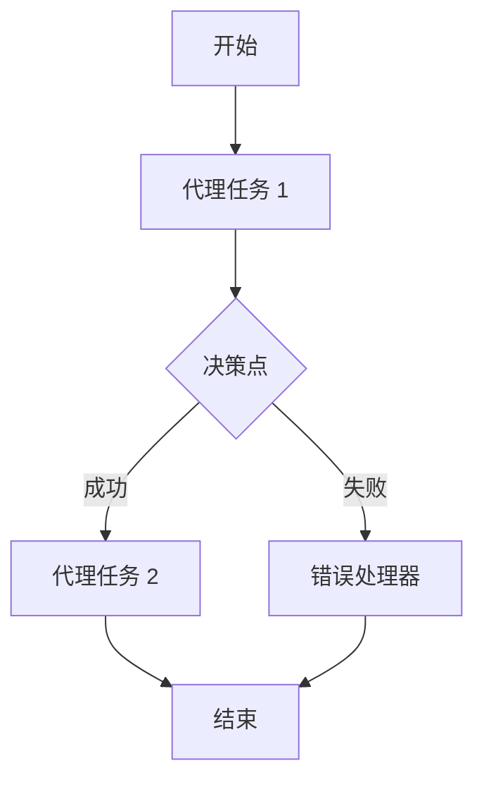

# 08 · 01.python-agent-framework-workflow-ghmodel-basic

[返回：多 Agent 协作](/lessons/multi-agent.md) · [不可变原始文件](https://github.com/microsoft/ai-agents-for-beginners/blob/25b7985f3b2dc37a84f4a7387ccd3c9f0e5b1595/08-multi-agent/code_samples/workflows-agent-framework/python/01.python-agent-framework-workflow-ghmodel-basic.ipynb)

::: warning 原课程完整 Notebook · 静态阅读与代码解析
代码按英文源文件顺序保留，中文说明以同版本译本为基础。原始安装单元格可能含无版本上限的 `-U`；请跳过它们，先按[准备篇](/lessons/setup.md)固定依赖。云端服务、模型权限、网站布局和部分 SDK 接口需在你自己的环境验证。本站没有执行云端请求；第 18 章的离线验证状态单独记录在[检查报告](/guide/verification.md)。
:::

## 运行准备

Python 3.12+；在独立虚拟环境安装源仓库依赖与本页中声明的额外依赖。原文件路径：`upstream/08-multi-agent/code_samples/workflows-agent-framework/python/01.python-agent-framework-workflow-ghmodel-basic.ipynb`。以原仓库根目录为工作目录，在 Jupyter 中按顺序执行；身份与环境变量见准备篇。

```bash
cd upstream
python -m jupyterlab
```

[下载原始 Notebook](/notebooks/08-multi-agent/code_samples/workflows-agent-framework/python/01.python-agent-framework-workflow-ghmodel-basic.ipynb)。输出为上游文件保存的历史结果，不能用作本站实测证明。

## 🔄 使用 Microsoft Foundry 的基础 Agent 工作流（Python）

## 📋 工作流编排教程

本笔记本介绍了 Microsoft Agent Framework 强大的 **Workflow Builder** 功能。学习如何创建复杂的多步骤 Agent 工作流，能够处理复杂的业务流程并无缝协调多个 AI 操作。

> **迁移说明：** 此示例之前引用了 GitHub Models。GitHub Models 已弃用（2026 年 7 月退役），因此现在通过 `FoundryChatClient` 使用 **Microsoft Foundry** ，其目标是 Azure OpenAI 的 **Responses API** 。

## 🎯 学习目标

### 🏗️ **工作流架构** 
- **Workflow Builder** ：设计和编排复杂的多步骤流程
- **事件驱动执行** ：处理工作流事件和状态转换
- **可视化工作流设计** ：创建并可视化工作流结构
- **Microsoft Foundry 集成** ：在工作流上下文中利用 AI 模型

### 🔄 **流程编排** 
- **顺序操作** ：以逻辑顺序串联多个 Agent 任务
- **条件逻辑** ：实现决策点和分支工作流
- **错误处理** ：强健的错误恢复和工作流弹性
- **状态管理** ：跟踪和管理工作流执行状态

### 📊 **企业工作流模式** 
- **业务流程自动化** ：自动化复杂的组织工作流
- **多 Agent 协调** ：协调多个专业 Agent
- **可扩展执行** ：设计适合企业规模的工作流
- **监控与可观测性** ：跟踪工作流性能和结果

## ⚙️ 前提条件与设置

### 📦 **必需依赖** 

安装具有工作流功能的 Agent Framework：

```bash
pip install agent-framework -U
```

### 🔑 **Microsoft Foundry 配置** 

使用 Azure CLI 登录（`az login`），以使 `AzureCliCredential` 能进行身份验证，然后设置你的 Microsoft Foundry 项目信息。

 **环境设置（.env 文件）：** 
```text
AZURE_AI_PROJECT_ENDPOINT=https://<your-project>.services.ai.azure.com
AZURE_AI_MODEL_DEPLOYMENT_NAME=gpt-5-mini
```

### 🏢 **企业用例** 

 **业务流程示例：** 
- **客户入职** ：多步骤验证和设置工作流
- **内容管道** ：自动内容创建、审核和发布
- **数据处理** ：带有 AI 驱动转换的 ETL 工作流
- **质量保证** ：自动化测试和验证流程

 **工作流优势：** 
- 🎯 **可靠性** ：确定性执行和错误恢复
- 📈 **可扩展性** ：处理高负载流程自动化
- 🔍 **可观测性** ：完整的审计追踪和监控
- 🔧 **可维护性** ：可视化设计和模块化组件

## 🎨 工作流设计模式

### 基础工作流结构


 **主要组件：** 
- **WorkflowBuilder** ：主要编排引擎
- **WorkflowEvent** ：事件处理和通信
- **WorkflowViz** ：工作流可视化表示和调试

让我们一起构建你的第一个智能工作流！🚀

### 代码单元格 2

阅读提示：跟踪本单元格读取的变量、修改的状态以及返回值。按原顺序执行，确认依赖的前序变量已经存在。

```python
# Already covered by repo-level requirements.txt; left for reference.
# !pip install agent-framework -U
```

### 代码单元格 3

模型连接：project_endpoint 是项目地址，model 是实际部署名称；credential 提供访问身份。客户端创建本身不证明已经部署服务端 Agent。

```python
# Core components for building sophisticated agent workflows
from agent_framework import WorkflowBuilder, WorkflowEvent, WorkflowViz
from agent_framework.foundry import FoundryChatClient
from azure.identity import AzureCliCredential
```

### 代码单元格 4

配置加载：从本地环境读取端点与部署名；缺少变量时先修复配置，不要把密钥写进代码。

```python
# 📦 Import Environment and System Utilities
# Essential libraries for configuration and environment management

import os                      # 🔧 Environment variable access
from dotenv import load_dotenv # 📁 Secure configuration loading
```

### 代码单元格 5

配置加载：从本地环境读取端点与部署名；缺少变量时先修复配置，不要把密钥写进代码。

```python
# 🔧 Initialize Environment Configuration
# Load Microsoft Foundry project settings from .env file
load_dotenv()
```

### 代码单元格 6

模型连接：project_endpoint 是项目地址，model 是实际部署名称；credential 提供访问身份。客户端创建本身不证明已经部署服务端 Agent。

```python
# Configure the Microsoft Foundry client with keyless authentication.
# FoundryChatClient targets the Azure OpenAI Responses API.
provider = FoundryChatClient(
    project_endpoint=os.environ["AZURE_AI_PROJECT_ENDPOINT"],
    model=os.environ["AZURE_AI_MODEL_DEPLOYMENT_NAME"],
    credential=AzureCliCredential(),
)
```

### 代码单元格 7

阅读提示：跟踪本单元格读取的变量、修改的状态以及返回值。按原顺序执行，确认依赖的前序变量已经存在。

```python
REVIEWER_NAME = "Concierge"
REVIEWER_INSTRUCTIONS = """
    You are an are hotel concierge who has opinions about providing the most local and authentic experiences for travelers.
    The goal is to determine if the front desk travel agent has recommended the best non-touristy experience for a traveler.
    If so, state that it is approved.
    If not, provide insight on how to refine the recommendation without using a specific example. 
    """
```

### 代码单元格 8

阅读提示：跟踪本单元格读取的变量、修改的状态以及返回值。按原顺序执行，确认依赖的前序变量已经存在。

```python
FRONTDESK_NAME = "FrontDesk"
FRONTDESK_INSTRUCTIONS = """
    You are a Front Desk Travel Agent with ten years of experience and are known for brevity as you deal with many customers.
    The goal is to provide the best activities and locations for a traveler to visit.
    Only provide a single recommendation per response.
    You're laser focused on the goal at hand.
    Don't waste time with chit chat.
    Consider suggestions when refining an idea.
    """
```

### 代码单元格 9

行为约束：instructions 引导模型，不能替代执行器的权限验证、次数限制和结果检查。

```python
reviewer_agent = provider.as_agent(
    name=REVIEWER_NAME,
    instructions=REVIEWER_INSTRUCTIONS,
)

front_desk_agent = provider.as_agent(
    name=FRONTDESK_NAME,
    instructions=FRONTDESK_INSTRUCTIONS,
)
```

### 代码单元格 10

阅读提示：跟踪本单元格读取的变量、修改的状态以及返回值。按原顺序执行，确认依赖的前序变量已经存在。

```python
workflow = (
    WorkflowBuilder(start_executor=front_desk_agent)
    .add_edge(front_desk_agent, reviewer_agent)
    .build()
)
```

### 代码单元格 11

输出观察：print 展示应用可观察结果；预存输出和现场结果可能不同，它不是模型内部思考记录。

```python
print("Generating workflow visualization...")
viz = WorkflowViz(workflow)
# Print out the mermaid string.
print("Mermaid string: \n=======")
print(viz.to_mermaid())
print("=======")
# Print out the DiGraph string.
print("DiGraph string: \n=======")
print(viz.to_digraph())
print("=======")
# SVG export needs the optional graphviz extra plus the graphviz system binary;
# fall back gracefully if it is not available.
try:
    svg_file = viz.export(format="svg")
    print(f"SVG file saved to: {svg_file}")
except ImportError as e:
    svg_file = None
    print(f"SVG export skipped (install graphviz to enable): {e}")
```

### 代码单元格 12

阅读提示：跟踪本单元格读取的变量、修改的状态以及返回值。按原顺序执行，确认依赖的前序变量已经存在。

```python
class DatabaseEvent(WorkflowEvent): ...
```

### 代码单元格 13

输出观察：print 展示应用可观察结果；预存输出和现场结果可能不同，它不是模型内部思考记录。

```python
# Display the exported workflow SVG inline in the notebook

from IPython.display import SVG, display, HTML
import os

print(f"Attempting to display SVG file at: {svg_file}")

if svg_file and os.path.exists(svg_file):
    try:
        # Preferred: direct SVG rendering
        display(SVG(filename=svg_file))
    except Exception as e:
        print(f"⚠️ Direct SVG render failed: {e}. Falling back to raw HTML.")
        try:
            with open(svg_file, "r", encoding="utf-8") as f:
                svg_text = f.read()
            display(HTML(svg_text))
        except Exception as inner:
            print(f"❌ Fallback HTML render also failed: {inner}")
else:
    print("❌ SVG file not found. Ensure viz.export(format='svg') ran successfully.")
```

### 代码单元格 14

阅读提示：跟踪本单元格读取的变量、修改的状态以及返回值。按原顺序执行，确认依赖的前序变量已经存在。

```python
# Workflow.run_stream is no longer part of the public API; the current Workflow
# returns a results object whose `get_outputs()` produces the AgentResponse from
# each output executor. The reviewer (last stage) is the only output here.
events = await workflow.run("I would like to go to Paris.")
outputs = events.get_outputs()
result = outputs[0].text if outputs else ""
```

### 代码单元格 15

阅读提示：跟踪本单元格读取的变量、修改的状态以及返回值。按原顺序执行，确认依赖的前序变量已经存在。

```python
result.replace("None", "")
```

