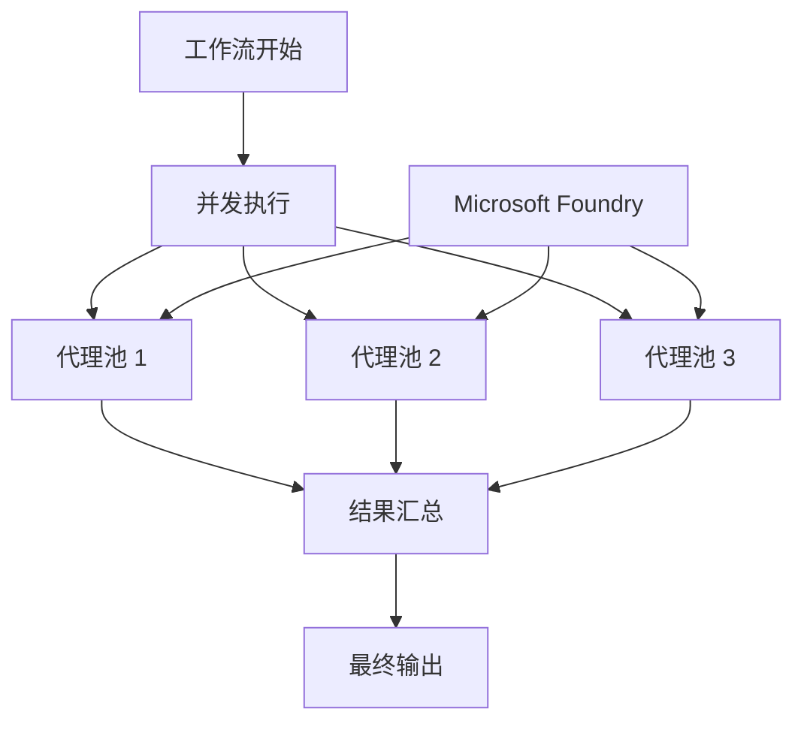

# 08 · 03.python-agent-framework-workflow-ghmodel-concurrent

[返回：多 Agent 协作](/lessons/multi-agent.md) · [不可变原始文件](https://github.com/microsoft/ai-agents-for-beginners/blob/25b7985f3b2dc37a84f4a7387ccd3c9f0e5b1595/08-multi-agent/code_samples/workflows-agent-framework/python/03.python-agent-framework-workflow-ghmodel-concurrent.ipynb)

::: warning 原课程完整 Notebook · 静态阅读与代码解析
代码按英文源文件顺序保留，中文说明以同版本译本为基础。原始安装单元格可能含无版本上限的 `-U`；请跳过它们，先按[准备篇](/lessons/setup.md)固定依赖。云端服务、模型权限、网站布局和部分 SDK 接口需在你自己的环境验证。本站没有执行云端请求；第 18 章的离线验证状态单独记录在[检查报告](/guide/verification.md)。
:::

## 运行准备

Python 3.12+；在独立虚拟环境安装源仓库依赖与本页中声明的额外依赖。原文件路径：`upstream/08-multi-agent/code_samples/workflows-agent-framework/python/03.python-agent-framework-workflow-ghmodel-concurrent.ipynb`。以原仓库根目录为工作目录，在 Jupyter 中按顺序执行；身份与环境变量见准备篇。

```bash
cd upstream
python -m jupyterlab
```

[下载原始 Notebook](/notebooks/08-multi-agent/code_samples/workflows-agent-framework/python/03.python-agent-framework-workflow-ghmodel-concurrent.ipynb)。输出为上游文件保存的历史结果，不能用作本站实测证明。

## ⚡ 使用 Microsoft Foundry 的并发 Agent 工作流（Python）

## 📋 高级并行处理教程

本笔记本演示了使用 Microsoft Agent Framework 的 **并发工作流模式** 。你将学习如何构建高性能的并行处理工作流，其中多个 AI Agent 同时执行，显著提高吞吐量并支持复杂的多线程业务流程。

> **迁移说明：** 此示例之前引用了 GitHub Models。GitHub Models 已弃用（2026 年 7 月退役），现在使用通过 `FoundryChatClient` 调用 Azure OpenAI **Responses API** 的 **Microsoft Foundry** 。

## 🎯 学习目标

### 🚀 **并发处理基础** 
- **并行 Agent 执行** ：同时运行多个 Agent 以实现最高效率
- **工作流编排** ：协调并发操作同时保持数据一致性
- **性能优化** ：通过并行处理显著加速
- **资源管理** ：高效利用并发操作中的 AI 模型资源

### 🏗️ **高级并发模式** 
- **分叉-合并处理** ：将工作分配给多个 Agent 并合并结果
- **流水线并行** ：执行阶段重叠实现持续吞吐
- **负载均衡** ：均匀分配工作到可用 Agent 资源
- **同步点** ：在关键工作流阶段协调并发 Agent

### 🏢 **企业级并发应用** 
- **高量文档处理** ：同时处理多个文档
- **实时内容分析** ：并发分析接收的数据流
- **批处理优化** ：最大化大规模操作的吞吐量
- **多模态分析** ：对不同内容类型（文本、图像、数据）进行并行处理

## ⚙️ 前提条件与设置

### 📦 **必需依赖** 

安装支持并发工作流的 Agent Framework：

```bash
pip install agent-framework -U
```

### 🔑 **Microsoft Foundry 配置** 

使用 Azure CLI 登录（`az login`），以便 `AzureCliCredential` 进行认证，然后设置 Microsoft Foundry 项目信息。

 **环境配置（.env 文件）：** 
```text
AZURE_AI_PROJECT_ENDPOINT=https://<your-project>.services.ai.azure.com
AZURE_AI_MODEL_DEPLOYMENT_NAME=gpt-5-mini
```

 **并发处理注意事项：** 
- **速率限制** ：监控 Azure OpenAI 并发请求的速率限制
- **资源使用** ：考虑多 Agent 并发时的内存和 CPU 使用
- **错误处理** ：为并行操作实现健壮的错误恢复机制

### 🏗️ **并发工作流架构** 



 **主要优势：** 
- **⚡ 性能** ：通过并行执行显著加速
- **📈 可扩展性** ：处理更多工作负载而不成比例增长时间
- **🔄 效率** ：更好利用计算资源
- **🎯 吞吐量** ：在相同时长内处理更多任务

## 🎨 **并发工作流设计模式** 

### 🔍 **研究与分析流水线** 
```
Research Task → Parallel Research Agents → Content Synthesis → Quality Review
```

### 📊 **数据处理工作流** 
```
Input Data → Concurrent Processing Agents → Result Aggregation → Final Report
```

### 🎭 **内容创作流水线** 
```
Content Brief → Parallel Content Generators → Review & Merge → Final Content
```

### 🔄 **多阶段处理** 
```
Input → Stage 1 (Concurrent) → Stage 2 (Concurrent) → Stage 3 (Sequential) → Output
```

## 🏢 **企业性能优势** 

### ⚡ **吞吐优化** 
- **并行执行** ：多个 Agent 同时工作
- **资源利用** ：最大效率利用 AI 模型容量
- **时间缩短** ：显著减少整体处理时间
- **可扩展架构** ：按需轻松增加更多并发 Agent

### 🛡️ **可靠性与韧性** 
- **容错性** ：单个 Agent 失败不影响整体工作流
- **故障隔离** ：一个并发分支的问题不会影响其他分支
- **优雅降级** ：即使 Agent 容量减小，系统仍能运行
- **恢复机制** ：失败操作自动重试和错误处理

### 📊 **监控与可观测性** 
- **并发执行跟踪** ：监控所有并行操作进度
- **性能指标** ：衡量加速与效率提升
- **资源使用分析** ：优化并发 Agent 分配
- **瓶颈识别** ：发现并解决性能限制

让我们一起构建高性能并发 AI 工作流！🚀

### 代码单元格 2

阅读提示：跟踪本单元格读取的变量、修改的状态以及返回值。按原顺序执行，确认依赖的前序变量已经存在。

```python
# Already covered by repo-level requirements.txt; left for reference.
# !pip install agent-framework -U
```

### 代码单元格 3

配置加载：从本地环境读取端点与部署名；缺少变量时先修复配置，不要把密钥写进代码。

模型连接：project_endpoint 是项目地址，model 是实际部署名称；credential 提供访问身份。客户端创建本身不证明已经部署服务端 Agent。

```python
import os
from typing import Any

from agent_framework import (
    Executor,
    Message,
    WorkflowBuilder,
    WorkflowContext,
    WorkflowViz,
    handler,
)
from agent_framework.foundry import FoundryChatClient
from azure.identity import AzureCliCredential
from dotenv import load_dotenv

load_dotenv()
```

### 代码单元格 4

模型连接：project_endpoint 是项目地址，model 是实际部署名称；credential 提供访问身份。客户端创建本身不证明已经部署服务端 Agent。

```python
# Configure the Microsoft Foundry client with keyless authentication.
# FoundryChatClient targets the Azure OpenAI Responses API.
provider = FoundryChatClient(
    project_endpoint=os.environ["AZURE_AI_PROJECT_ENDPOINT"],
    model=os.environ["AZURE_AI_MODEL_DEPLOYMENT_NAME"],
    credential=AzureCliCredential(),
)
```

### 代码单元格 5

检索过程：跟踪查询、候选结果和实际选入的证据；检索为空时应明确返回缺失，而不是补写答案。

```python
ResearcherAgentName = "Researcher-Agent"
ResearcherAgentInstructions = "You are my travel researcher, working with me to analyze the destination, list relevant attractions, and make detailed plans for each attraction."
```

### 代码单元格 6

检索过程：跟踪查询、候选结果和实际选入的证据；检索为空时应明确返回缺失，而不是补写答案。

```python
PlanAgentName = "Plan-Agent"
PlanAgentInstructions = "You are my travel planner, working with me to create a detailed travel plan based on the researcher's findings."
```

### 代码单元格 7

行为约束：instructions 引导模型，不能替代执行器的权限验证、次数限制和结果检查。

检索过程：跟踪查询、候选结果和实际选入的证据；检索为空时应明确返回缺失，而不是补写答案。

```python
research_agent = provider.as_agent(
    name=ResearcherAgentName,
    instructions=ResearcherAgentInstructions,
)

plan_agent = provider.as_agent(
    name=PlanAgentName,
    instructions=PlanAgentInstructions,
)
```

### 代码单元格 8

异步执行：async def 定义协程，await 等待结果；普通 .py 脚本需要 asyncio.run() 入口，Notebook 支持顶层 await。

检索过程：跟踪查询、候选结果和实际选入的证据；检索为空时应明确返回缺失，而不是补写答案。

```python
# A passthrough executor that broadcasts the user input to every agent in parallel.
class InputDispatcher(Executor):
    """Forward the user input unchanged to all participating agents."""

    @handler
    async def forward(self, text: str, ctx: WorkflowContext[str]) -> None:
        await ctx.send_message(text)


dispatcher = InputDispatcher(id="dispatcher")
agents = [research_agent, plan_agent]

workflow = (
    WorkflowBuilder(
        start_executor=dispatcher,
        output_executors=agents,
    )
    .add_fan_out_edges(dispatcher, agents)
    .build()
)
```

### 代码单元格 9

输出观察：print 展示应用可观察结果；预存输出和现场结果可能不同，它不是模型内部思考记录。

```python
print("Generating workflow visualization...")
viz = WorkflowViz(workflow)
# Print out the mermaid string.
print("Mermaid string: \n=======")
print(viz.to_mermaid())
print("=======")
# Print out the DiGraph string.
print("DiGraph string: \n=======")
print(viz.to_digraph())
print("=======")
# SVG export needs the optional graphviz extra plus the graphviz system binary;
# fall back gracefully if it is not available.
try:
    svg_file = viz.export(format="svg")
    print(f"SVG file saved to: {svg_file}")
except ImportError as e:
    svg_file = None
    print(f"SVG export skipped (install graphviz to enable): {e}")
```

### 代码单元格 10

输出观察：print 展示应用可观察结果；预存输出和现场结果可能不同，它不是模型内部思考记录。

```python
from IPython.display import SVG, display, HTML
import os

print(f"Attempting to display SVG file at: {svg_file}")

if svg_file and os.path.exists(svg_file):
    try:
        # Preferred: direct SVG rendering
        display(SVG(filename=svg_file))
    except Exception as e:
        print(f"⚠️ Direct SVG render failed: {e}. Falling back to raw HTML.")
        try:
            with open(svg_file, "r", encoding="utf-8") as f:
                svg_text = f.read()
            display(HTML(svg_text))
        except Exception as inner:
            print(f"❌ Fallback HTML render also failed: {inner}")
else:
    print("❌ SVG file not found. Ensure viz.export(format='svg') ran successfully.")
```

### 代码单元格 11

阅读提示：跟踪本单元格读取的变量、修改的状态以及返回值。按原顺序执行，确认依赖的前序变量已经存在。

```python
events = await workflow.run("Plan a trip to Seattle in December")
outputs = events.get_outputs()
```

### 代码单元格 12

检索过程：跟踪查询、候选结果和实际选入的证据；检索为空时应明确返回缺失，而不是补写答案。

输出观察：print 展示应用可观察结果；预存输出和现场结果可能不同，它不是模型内部思考记录。

```python
if outputs:
    print("===== Final Aggregated Responses =====")
    # outputs is a list of AgentResponse objects, one per output executor
    # (research_agent then plan_agent), in the order given to output_executors.
    for i, response in enumerate(outputs, start=1):
        print(f"{'-' * 60}\n\n{i:02d}:\n{response.text}")
```

