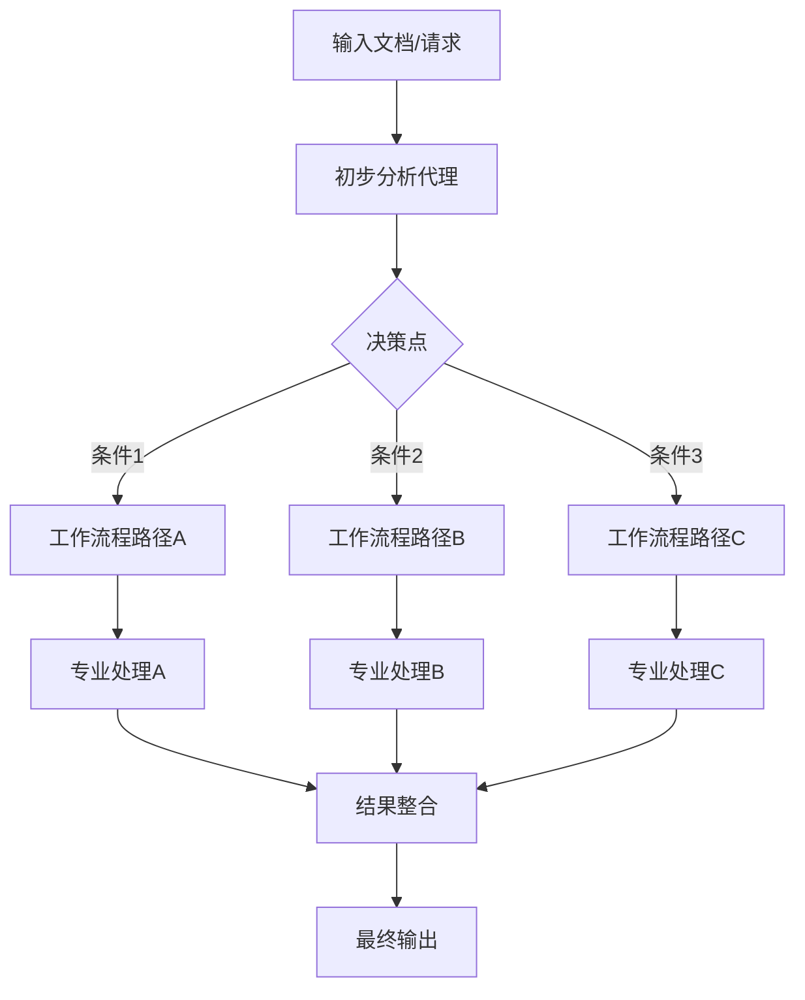

# 08 · 04.python-agent-framework-workflow-aifoundry-condition

[返回：多 Agent 协作](/lessons/multi-agent.md) · [不可变原始文件](https://github.com/microsoft/ai-agents-for-beginners/blob/25b7985f3b2dc37a84f4a7387ccd3c9f0e5b1595/08-multi-agent/code_samples/workflows-agent-framework/python/04.python-agent-framework-workflow-aifoundry-condition.ipynb)

::: warning 原课程完整 Notebook · 静态阅读与代码解析
代码按英文源文件顺序保留，中文说明以同版本译本为基础。原始安装单元格可能含无版本上限的 `-U`；请跳过它们，先按[准备篇](/lessons/setup.md)固定依赖。云端服务、模型权限、网站布局和部分 SDK 接口需在你自己的环境验证。本站没有执行云端请求；第 18 章的离线验证状态单独记录在[检查报告](/guide/verification.md)。
:::

## 运行准备

Python 3.12+；在独立虚拟环境安装源仓库依赖与本页中声明的额外依赖。原文件路径：`upstream/08-multi-agent/code_samples/workflows-agent-framework/python/04.python-agent-framework-workflow-aifoundry-condition.ipynb`。以原仓库根目录为工作目录，在 Jupyter 中按顺序执行；身份与环境变量见准备篇。

```bash
cd upstream
python -m jupyterlab
```

[下载原始 Notebook](/notebooks/08-multi-agent/code_samples/workflows-agent-framework/python/04.python-agent-framework-workflow-aifoundry-condition.ipynb)。输出为上游文件保存的历史结果，不能用作本站实测证明。

## 🔀 使用 Microsoft Foundry 的条件 Agent 工作流（Python）

## 📋 高级基于决策的工作流教程

本笔记本演示了使用 Microsoft Foundry 和 Microsoft Agent Framework 的 **条件工作流模式** 。你将学习如何构建智能的基于决策的工作流，能够根据内容分析、业务规则和 AI 驱动的决策动态地路由处理。

## 🎯 学习目标

### 🧠 **智能决策** 
- **条件逻辑** ：基于 AI 分析和业务规则实现动态分支
- **内容感知路由** ：根据内容分析和分类路由工作流路径
- **自适应处理** ：根据实时条件和数据调整工作流行为
- **Azure AI 集成** ：利用 Microsoft Foundry 的高级决策能力

### 🔀 **高级工作流模式** 
- **决策树** ：构建带有多分支点的复杂决策结构
- **基于规则的处理** ：实现业务逻辑和合规要求
- **动态工作流修改** ：根据运行时条件调整工作流
- **上下文感知操作** ：基于累积的工作流上下文做决策

### 🏢 **企业条件应用** 
- **文档分类** ：将文档路由到适当的处理工作流
- **客户服务分诊** ：自动将咨询路由到专业处理工作流
- **合规处理** ：基于内容类型和法规应用不同验证规则
- **质量保证** ：根据质量指标通过不同的审核流程路由内容

## ⚙️ 前提条件与设置

### 📦 **安装与依赖** 

该工作流需要针对 Microsoft Foundry 集成的特定安装步骤：

```bash

pip install agent-framework-azure-ai -U 
```

### 🔑 **Microsoft Foundry 配置** 

 **所需 Azure 资源：** 
- 部署了适当模型的 Microsoft Foundry 工作区
- 具有必要权限的 Azure 订阅
- 配置了 Azure CLI 认证


 **认证设置：** 
```bash
# Azure CLI 认证
az login
az account set --subscription "your-subscription-id"
azd auth login
```

### 🏗️ **条件工作流架构** 



 **关键组件：** 
- **分析 Agent** ：评估内容并做出路由决策的 AI Agent
- **决策点** ：确定工作流路径的条件逻辑
- **专用处理器** ：针对特定内容类型或场景优化的不同 Agent
- **集成层** ：合并来自不同工作流路径的结果

## 🎨 **条件工作流设计模式** 

### 📋 **文档处理分诊** 
```
Document Input → Content Analysis → Classification → Specialized Processing Workflow
```

### 🎯 **客户服务路由** 
```
Customer Inquiry → Intent Analysis → Urgency Assessment → Route to Specialist Team
```

### 🔍 **质量保证工作流** 
```
Content Input → Quality Metrics → Risk Assessment → Appropriate Review Process
```

### 📊 **商业智能管道** 
```
Data Input → Source Analysis → Processing Rules → Specialized Analytics Workflow
```

## 🏢 **企业效益** 

### 🎯 **智能自动化** 
- **智能路由** ：自动将工作指向最合适的处理路径
- **自适应行为** ：基于模式和结果学习和适应的工作流
- **业务规则集成** ：融合复杂的业务逻辑和合规要求
- **上下文感知处理** ：基于完整工作流上下文和历史做决策

### 📈 **运营效率** 
- **减少人工干预** ：自动决策降低人工路由需求
- **专用处理** ：每条工作流路径针对特定场景优化
- **资源优化** ：基于内容类型高效分配处理资源
- **更快解决时间** ：直接路由到合适的专家和流程

### 🛡️ **治理与控制** 
- **审计跟踪** ：完整记录决策点和路由理由
- **合规执行** ：自动应用法规和政策要求
- **风险管理** ：通过加强安全和审核流程路由高风险内容
- **质量保证** ：基于内容特征确保适当的审核层级

### 📊 **分析与优化** 
- **决策分析** ：跟踪路由决策和工作流路径的有效性
- **性能指标** ：衡量不同工作流分支的效率
- **持续改进** ：识别条件逻辑中的优化机会
- **商业智能** ：洞察内容模式和处理需求

让我们构建智能的基于决策的 AI 工作流吧！🚀

### 代码单元格 2

阅读提示：跟踪本单元格读取的变量、修改的状态以及返回值。按原顺序执行，确认依赖的前序变量已经存在。

```text
! pip install agent-framework-azure-ai -U
```

requirements.txt & constraints.txt - 在 ./Installation 中

请将 .env.examples 复制为 .env

 **注意** 选择 gpt-5-mini

### 代码单元格 5

数据结构：Pydantic 模型定义字段类型；只有传入实际的 response_format 并检查解析结果，才能约束本次输出。

```python
import os

from dataclasses import dataclass
from typing_extensions import Literal
from pydantic import BaseModel
```

### 代码单元格 6

配置加载：从本地环境读取端点与部署名；缺少变量时先修复配置，不要把密钥写进代码。

```python
from azure.identity.aio import AzureCliCredential
from dotenv import load_dotenv

from agent_framework import HostedWebSearchTool
from agent_framework.azure import AzureAIAgentClient
from agent_framework import (
    AgentExecutor,
    AgentExecutorRequest,
    AgentExecutorResponse,
    HostedCodeInterpreterTool,
    ChatMessage,
    Role,
    WorkflowBuilder,
    WorkflowContext,
    WorkflowEvent,
    executor,
    WorkflowViz
)


from azure.ai.agents.models import BingGroundingTool,CodeInterpreterTool
```

### 代码单元格 7

配置加载：从本地环境读取端点与部署名；缺少变量时先修复配置，不要把密钥写进代码。

```python
load_dotenv()
```

### 代码单元格 8

阅读提示：跟踪本单元格读取的变量、修改的状态以及返回值。按原顺序执行，确认依赖的前序变量已经存在。

```python
EvangelistInstructions = """
You are a technology evangelist create a first draft for a technical tutorials.
1. Each knowledge point in the outline must include a link. Follow the link to access the content related to the knowledge point in the outline. Expand on that content.
2. Each knowledge point must be explained in detail.
3. Rewrite the content according to the entry requirements, including the title, outline, and corresponding content. It is not necessary to follow the outline in full order.
4. The content must be more than 200 words.
4. Output draft as Markdown format. set 'draft_content' to the draft content.
5. return result as JSON with fields 'draft_content' (string).
"""

ContentReviewerInstructions = """
You are a content reviewer for a publishing company. You need to check whether the tutorial's draft content meets the following requirements:

1. The draft content less than 200 words, set 'review_result' to 'No' and 'reason' to 'Content is too short'. If the draft content is more than 200 words, set 'review_result' to 'Yes' and 'reason' to 'The content is good'.
2. set 'draft_content' to the original draft content.
3. return result as JSON with fields 'review_result' (one of Yes, No) and 'reason' (string) and 'draft_content' (string).

"""

PublisherInstructions = """
You are the content publisher ,run code to save the tutorial's draft content as a Markdown file. Saved file's name is marked with current date and time, such as yearmonthdayhourminsec. Note that if it is 1-9, you need to add 0, such as  20240101123045.md. 
"""
```

### 代码单元格 9

阅读提示：跟踪本单元格读取的变量、修改的状态以及返回值。按原顺序执行，确认依赖的前序变量已经存在。

```python
OUTLINE_Content ="""
# Introduce AI Agent


## What's AI Agent

https://github.com/microsoft/ai-agents-for-beginners/tree/main/01-intro-to-ai-agents


***Note*** Don's create any sample code 


## Introduce Microsoft Foundry Agent Service 

https://learn.microsoft.com/en-us/azure/ai-foundry/agents/overview


***Note*** Don's create any sample code 


## Microsoft Agent Framework 

https://github.com/microsoft/agent-framework/tree/main/docs/docs-templates


***Note*** Don's create any sample code 
"""
```

### 代码单元格 10

阅读提示：跟踪本单元格读取的变量、修改的状态以及返回值。按原顺序执行，确认依赖的前序变量已经存在。

```python
conn_id = os.environ["BING_CONNECTION_ID"]  # Ensure the BING_CONNECTION_NAME environment variable is set

# Initialize the Bing Grounding tool
bing = BingGroundingTool(connection_id=conn_id)

code_interpreter = CodeInterpreterTool()
```

### 代码单元格 11

数据结构：Pydantic 模型定义字段类型；只有传入实际的 response_format 并检查解析结果，才能约束本次输出。

异步执行：async def 定义协程，await 等待结果；普通 .py 脚本需要 asyncio.run() 入口，Notebook 支持顶层 await。

输出观察：print 展示应用可观察结果；预存输出和现场结果可能不同，它不是模型内部思考记录。

```python
class EvangelistAgent(BaseModel):
    draft_content: str

class ReviewAgent(BaseModel):
    review_result: Literal["Yes", "No"]
    reason: str
    draft_content: str

class PublisherAgent(BaseModel):
    file_path: str

@dataclass
class ReviewResult:
    review_result: str
    reason: str
    draft_content: str

@executor(id="to_reviewer_result")
async def to_reviewer_result(response: AgentExecutorResponse, ctx: WorkflowContext[ReviewResult]) -> None:

    print(f"Raw response from reviewer agent: {response.agent_run_response.text}")

    parsed = ReviewAgent.model_validate_json(response.agent_run_response.text)
    await ctx.send_message(
        ReviewResult(
            review_result=parsed.review_result,
            reason=parsed.reason,
            draft_content=parsed.draft_content,
        )
    )


def select_targets(review: ReviewResult, target_ids: list[str]) -> list[str]:
        # Order: [handle_review, submit_to_email_assistant, summarize_email, handle_uncertain]
        handle_review_id, save_draft_id = target_ids
        if review.review_result == "Yes":
            return [save_draft_id]
        else:
            return [handle_review_id]
        


@executor(id="handle_review")
async def handle_review(review: ReviewResult, ctx: WorkflowContext[str]) -> None:
    if review.review_result == "No":
        await ctx.yield_output(f"Review failed: {review.reason}, please revise the draft.")
    else:
        await ctx.send_message(
            AgentExecutorRequest(messages=[ChatMessage(Role.USER, text=review.draft_content)], should_respond=True)
        )


@executor(id="save_draft")
async def save_draft(review: ReviewResult, ctx: WorkflowContext[AgentExecutorRequest]) -> None:
    # Only called for long NotSpam emails by selection_func
    await ctx.send_message(
        AgentExecutorRequest(messages=[ChatMessage(Role.USER, text=review.draft_content)], should_respond=True)
    )
```

### 代码单元格 12

阅读提示：跟踪本单元格读取的变量、修改的状态以及返回值。按原顺序执行，确认依赖的前序变量已经存在。

```python
from IPython.display import SVG, display, HTML
```

### 代码单元格 13

阅读提示：跟踪本单元格读取的变量、修改的状态以及返回值。按原顺序执行，确认依赖的前序变量已经存在。

```python
class DatabaseEvent(WorkflowEvent): ...
```

### 代码单元格 14

行为约束：instructions 引导模型，不能替代执行器的权限验证、次数限制和结果检查。

输出观察：print 展示应用可观察结果；预存输出和现场结果可能不同，它不是模型内部思考记录。

```python
async with (
        AzureCliCredential() as credential,
        AzureAIAgentClient(async_credential=credential) as chat_client,
    ):  
        try:
                evangelist_agent = AgentExecutor(chat_client.create_agent(
                    instructions= (EvangelistInstructions),
                    tools=[HostedWebSearchTool()],
                    # response_format=EvangelistAgent
                ),  id="evangelist_agent")
                reviewer_agent = AgentExecutor(chat_client.create_agent(
                    instructions=(ContentReviewerInstructions),
                    # response_format=ReviewAgent
                ), id="reviewer_agent")
                publisher_agent = AgentExecutor(chat_client.create_agent(
                    instructions=PublisherInstructions,
                    tools=HostedCodeInterpreterTool(),
                    response_format=PublisherAgent
                ), id="publisher_agent")

                workflow = (
                    WorkflowBuilder()
                        .set_start_executor(evangelist_agent)
                        .add_edge(evangelist_agent, reviewer_agent)
                        .add_edge(reviewer_agent, to_reviewer_result)
                        .add_multi_selection_edge_group(
                            to_reviewer_result,
                            [handle_review, save_draft],
                            selection_func=select_targets,
                        )
                        .add_edge(save_draft, publisher_agent)
                        .build()
                )

                # workflow = SequentialBuilder().participants([evangelist_chat_agent, reviewer_chat_agent, publisher_chat_agent]).build()
                print("Generating workflow visualization...")
                viz = WorkflowViz(workflow)
                # Print out the mermaid string.
                print("Mermaid string: \n=======")
                print(viz.to_mermaid())
                print("=======")
                # Print out the DiGraph string.
                print("DiGraph string: \n=======")
                print(viz.to_digraph())
                print("=======")
                svg_file = viz.export(format="svg")
                print(f"SVG file saved to: {svg_file}")

                if svg_file and os.path.exists(svg_file):
                    try:
                        # Preferred: direct SVG rendering
                        display(SVG(filename=svg_file))
                    except Exception as e:
                        print(f"⚠️ Direct SVG render failed: {e}. Falling back to raw HTML.")
                        try:
                            with open(svg_file, "r", encoding="utf-8") as f:
                                svg_text = f.read()
                            display(HTML(svg_text))
                        except Exception as inner:
                            print(f"❌ Fallback HTML render also failed: {inner}")
                else:
                    print("❌ SVG file not found. Ensure viz.export(format='svg') ran successfully.")

                
                task = """
                    You are a evangelist , need to write a  draft based on the following outline and the content provided in the link corresponding to the outline. After draft create , the reviewer check it , if it meets the requirements, it will be submitted to the publisher and save it as a Markdown file, otherwise need to rewrite draft until it meets the requirements.
                        The provided outline content and related links is as follows:

                    """ + OUTLINE_Content

                
                async for event in workflow.run_stream(task):
                    if isinstance(event, DatabaseEvent):
                        print(f"{event}")
                    if isinstance(event, WorkflowEvent):
                        print(f"Workflow output: {event.data}")


        finally:
            print("done")
```

