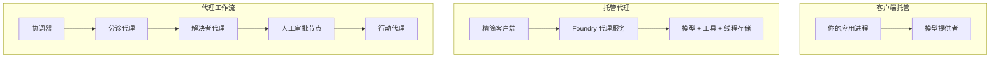
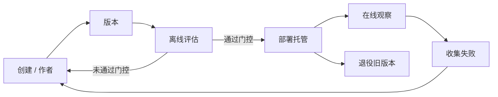
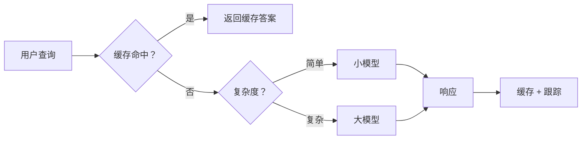
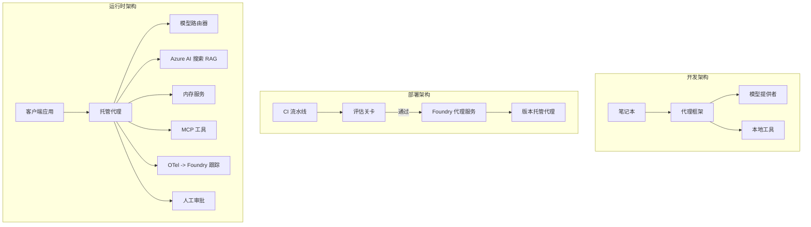

# 可扩展部署

## 本章目标与前置知识（补充讲解）

先完成[生产实践](./production.md)与[框架](./agent-framework.md)。本章从能在 Notebook 运行，走向可发布、可扩容、可回滚的服务设计；同时识别演示代码与真正部署之间的差距。

十个用户同时问退款政策，单进程里的历史、缓存和任务队列会互相影响。扩展服务不能只增加模型调用并发：还要隔离用户状态、保护上游额度、限制重试、记录版本，并在失败后恢复。


*图：本项目重绘。浏览器不持有模型密钥；应用服务验证身份与执行权限，工作进程访问受控工具和模型，持久化状态位于服务端。本站本身只是静态教程，不运行此后端。*

::: warning 原实验没有执行真实发布
`16-python-agent-framework.ipynb` 演示客服路由、缓存、记忆、审批和评估；其发布函数输出“promoting”信息，没有调用部署 API。内存缓存也不是多实例共享数据库。本文将其称为生产概念练习，不把运行 Notebook 等同于完成可扩展生产部署。
:::


::: info 原课程代码片段的阅读范围
下方精读保留上游主要知识与片段，可能包含历史 SDK 写法、示意端点及未完整定义的函数；这些片段不等同于经过本站验证的完整程序。运行前优先阅读本章实际 Notebook 导读与版本校订。已验证的无 API 实验在“扩展实践”中另行标明。
:::

## 原课程精读：使用 Microsoft Foundry 部署可扩展 Agent


在本课程到目前为止，你已经构建了运行在笔记本内、由 `az login` 和少量环境变量驱动的 Agent，这些 Agent 运行在你的笔记本电脑上。这完全是学习的正确方式。但这并不是让数千客户在凌晨三点依赖的 Agent 的正确运行方式。

本课讲述的是“在我的机器上运行正常”和“在生产环境中可靠且经济地运行正常”之间的差距。我们通过使用 **Microsoft Foundry** 和 **Microsoft Foundry Agent Service** 来弥合这一差距，并通过构建一个具有工具调用、检索、记忆、评估和监控功能的真实客户支持 Agent 来实现。

## 简介

本课将涵盖：

- **原型 Agent** 与 **已部署 Agent** 的区别，以及为什么过渡主要是关于模型*周围*的一切。
- Agent 的 **部署模式** ：客户端托管、服务托管（托管 Agent）和工作流编排。
- Microsoft Foundry 上的 **Agent 生命周期** — 创建、版本、部署、评估、观察和退休。
- **扩展策略** ：模型路由、缓存、并发和无状态设计。
- 使用 OpenTelemetry 和 Foundry 跟踪的 **可观测性** 。
- 通过模型选择、路由和评估门实现的 **成本优化** 。
- **企业考虑** ：治理、人类审批以及在生产环境安全运行 MCP 服务器。

## 学习目标

完成本课后，你将学会：

- 为给定 Agent 工作负载选择合适的部署模式。
- 将 Agent 部署到 Microsoft Foundry Agent Service，使其具备版本控制、治理和可观测性。
- 为 Agent 添加追踪，并设置在每次发布前运行的评估管道。
- 应用模型路由和缓存，在规模化时保持延迟和成本的可控。
- 为高风险操作添加人工审批门，并以生产安全的方式集成 MCP 服务器。

## 先决条件

本课假设你已经完成前面的课程并熟悉：

- 使用 [Microsoft Agent Framework](/lessons/agent-framework.md) 构建 Agent（第14课）。
- [工具使用](/lessons/tools.md)（第4课）和 [Agentic RAG](/lessons/rag.md)（第5课）。
- [Agent 内存](/lessons/memory.md)（第13课）和 [Agent 协议 / MCP](/lessons/protocols.md)（第11课）。
- [可观测性和评估](/lessons/production.md)（第10课） — 本课将直接建立在此基础上。

你还需要：

- 一个 **Azure 订阅** 和至少部署了一个聊天模型的 **Microsoft Foundry 项目** 。
- 通过身份验证的 **Azure CLI** （`az login`）。
- Python 3.12+ 及本仓库中的 [`requirements.txt`](https://github.com/microsoft/ai-agents-for-beginners/blob/25b7985f3b2dc37a84f4a7387ccd3c9f0e5b1595/requirements.txt) 所列的包。

## 从原型到生产：真正变化的是什么

原型 Agent 和生产 Agent 共享相同的核心循环——推理、调用工具、响应。改变的是包裹在该循环周围的一切。模型大约占生产 Agent 的 20%；其余 80% 是运营框架。

| 关注点 | 原型 | 生产 |
| --- | --- | --- |
| **托管** | 在笔记本中运行 | 作为托管服务运行，具备版本管理和推送功能 |
| **身份** | 使用你的 `az login` Token | 使用具有限定 RBAC 的托管身份 |
| **状态** | 内存中，重启后丢失 | 外部持久化（线程存储、内存服务） |
| **失败处理** | 查看堆栈跟踪 | 重试、回退、死信队列和警报 |
| **成本** | “几分钱” | 按请求追踪，路由和缓存，预算控制 |
| **质量** | 手动检查输出 | 在每次发布前自动评估 |
| **信任** | 你批准每个动作 | 策略+人机交互审批高风险操作 |

记住这张表。下面的每个章节都对应表中的一行。

## Agent 部署模式

有三种部署模式，通常会组合使用。

### 1. 客户端托管 Agent

Agent 对象存在于*你的*应用进程内。你的代码直接调用模型提供者；推理循环在你的服务中运行。所有前面的课程都是这样操作的。

- **使用场景** ：需要完全控制推理循环、定制中间件，或将 Agent 嵌入现有后端。
- **权衡** ：你自行负责扩展、状态和可靠性。

### 2. 托管 Agent（Foundry Agent Service）

Agent 作为资源*注册在* Microsoft Foundry 中。Foundry 托管推理循环，存储线程，执行内容安全和 RBAC，并在 Foundry 门户中展示 Agent。你的应用成为一个瘦客户端，创建线程并读取响应。

- **使用场景** ：需要持久性、内置可观测性、治理，且降低运营复杂度。
- **权衡** ：以减少底层控制为代价，换取托管运行时。

### 3. Agent 工作流

多个 Agent（和工具）组成有明确控制流的图——顺序步骤、分支、人类审批节点和可暂停恢复的持久检查点。这是 Microsoft Agent Framework **工作流** 功能在部署规模上的应用。

- **使用场景** ：当一个任务涉及多个专项 Agent 或中间需要审批步骤时。
- **权衡** ：组件更多，需要编排级别的可观测性。



## Microsoft Foundry 上的 Agent 生命周期

部署 Agent 不是一次性的 `push` 操作，而是一个循环，很像软件发布生命周期，因为它就是。



这一核心理念继承自 [第10课](/lessons/production.md)： **离线评估是门槛，而非事后考虑。** 新版本 Agent 必须通过评估门槛后才能发布。上线可观测性将真实失败反馈入离线测试集。整个流程如是。

## 扩展策略

扩展 Agent 不同于扩展无状态的 web API，因为每个请求可能触发多次高成本的模型和工具调用。核心的四种方法：

 **无状态请求处理。** 不在进程内存中保存任何用户状态。将对话线程持久化存储在 Foundry 线程存储或内存服务中，任何实例都能处理任意请求。这让你能水平扩展——增加实例，无需粘性会话。

 **模型路由。** 并非每个请求都需要最强大（最昂贵）的模型。将简单请求——意图分类、简短事实回答——路由到小型快速模型，复杂推理请求才用大模型。Foundry 的 **模型路由器** 可以帮你做，或你也可以自己做轻量分类器。实验课会实现自定义版本。

 **响应缓存。** 很多支持查询是近似重复的（“如何重置密码？”）。缓存常见问题的答案，直接返回，避免触发模型调用。即使是适度的缓存命中率，成本和延迟都能大幅降低。

 **并发与背压。** 模型服务有速率限制。限制并发量，使用指数退避重试，优雅失败（排队回复“我们正在处理”要胜过 500 错误）。



## 生产环境中的可观测性

不可见则不可操作。正如第10课所述，Microsoft Agent Framework 原生发出 **OpenTelemetry** 跟踪——每次模型调用、工具调用和编排步骤变成一个执行片段（Span）。生产环境中将这些执行片段（Span）导出到 Microsoft Foundry（或任何支持 OTel 的后端），以实现：

- 跨所有模型和工具调用，追踪单个客户投诉的端到端过程。
- 观察随时间变化的 p50/p95 延迟和每请求成本。
- 在用户（或财务团队）发现之前，对错误率激增和成本异常发出警报。

```python
from agent_framework.observability import get_tracer

tracer = get_tracer()

with tracer.start_as_current_span("support_request") as span:
    span.set_attribute("customer.tier", "enterprise")
    span.set_attribute("routed.model", "gpt-5-nano")
    # agent execution is traced automatically inside this span
```

属性如 `customer.tier` 和 `routed.model` 将大量追踪转化成可回答的问题（“企业客户是否过度地路由到小模型？”）。

## 成本优化

生产 Agent 中成本主要由Token费用决定。影响最大的三个杠杆：

1. **合理选择模型大小。** 通过评估门槛的较小模型往往比通过评估的更大模型便宜。用评估来*证明*小模型足够好，而非默认使用最大模型以防万一。
2. **按复杂度路由。** 前述——仅为需要复杂推理的请求付出大模型的价格。
3. **积极缓存。** 最便宜的模型调用是你从不发出的调用。

评估门和成本控制是同一学科的两面：评估告诉你*质量下限*，路由和缓存让你尽可能接近该下限的*成本*。

## 企业部署考虑

 **治理。** 托管 Agent 继承 Foundry 的 RBAC、内容安全和审计日志。为每个 Agent 分配权限最小的托管身份——只读知识库，限定访问工单 API，不多不少。

 **人机交互。** 某些操作影响重大，无法完全自动化——退款、删除账户、提交法律团队等。Microsoft Agent Framework 支持 **需审批的工具** ：Agent 提出操作，执行暂停，人批准或拒绝，之后工作流继续。第6课已介绍该原语；这里是具体部署。

 **生产环境中的 MCP。** [MCP](/lessons/protocols.md) 允许 Agent 通过标准接口调用外部工具。生产中应将每个 MCP 服务器视为不可信边界：锁定服务器版本，使用限定身份运行，验证输出，绝不暴露秘密。MCP 服务是依赖项，需要补丁、审计和速率限制。



这三张图——开发、部署、运行时——展示了同一 Agent 生命的不同时期。接下来的实验引导你一步步构建。

## 实操实验：用于理解生产机制的客户支持示例

打开 [`code_samples/16-python-agent-framework.ipynb`](/labs/16-deploying-scalable-agents-code-samples-16-python-agent-framework-notebook.md)，从头到尾完成。你将组装一个具有所有生产关切点的 **Contoso 客户支持 Agent** ：

1. **工具调用** — 查询订单状态和开工单。
2. **RAG** — 从知识库（Azure AI 搜索，带内存回退以使笔记本无需 Search 资源即可运行）回答政策相关问题。
3. **记忆** — 记住客户对话中的多轮信息。
4. **模型路由** — 复杂度分类器将请求路由到小模型或大模型。
5. **响应缓存** — 重复问题从缓存服务。
6. **人工审批** — 超过阈值的退款需人工签字。
7. **评估管道** — 小型离线测试集为 Agent 打分，作为发布门槛。
8. **可观测性** — 每条请求均有 OpenTelemetry 跟踪。

### 逐步讲解

笔记本组织成每个生产关切点是独立、可运行的部分。其核心是路由加缓存的请求处理程序：

```python
async def handle_support_request(query: str, customer_id: str) -> str:
    # 1. Serve from cache when we can.
    cached = response_cache.get(normalize(query))
    if cached:
        return cached

    # 2. Route by complexity to control cost.
    model = "gpt-5-nano" if is_simple(query) else "gpt-5-mini"

    # 3. Run the agent inside a trace span for observability.
    with tracer.start_as_current_span("support_request") as span:
        span.set_attribute("routed.model", model)
        span.set_attribute("customer.id", customer_id)
        response = await support_agent.run(query, model=model)

    # 4. Cache and return.
    response_cache.set(normalize(query), response.text)
    return response.text
```

评估门看起来是这样：

```python
async def evaluation_gate(agent, test_cases, threshold: float = 0.8) -> bool:
    passed = 0
    for case in test_cases:
        result = await agent.run(case["input"])
        if score_response(result.text, case["expected"]) >= 0.8:
            passed += 1
    pass_rate = passed / len(test_cases)
    print(f"Evaluation pass rate: {pass_rate:.0%} (gate: {threshold:.0%})")
    return pass_rate >= threshold  # only deploy if the gate passes
```

逐行仔细阅读——笔记本将原语保持非常小巧，没有任何隐藏在框架调用后面。

## 使用冒烟测试验证已部署 Agent

上述评估门在*离线*评估你的 Agent 对象。Agent 一旦作为托管 Agent 部署，你需要另一个更便宜的检查： **已部署的端点是否真的响应？** 

“成功部署”只证明控制平面接受了定义——但不能证明 Agent 真的响应。缺少依赖、错误的模型路由或连接过期都可能导致部署成功但无响应。 **冒烟测试** 可在几秒内捕捉这些问题，每次部署时运行，成本远低于完整评估。

本仓库自带基于 [AI Smoke Test](https://github.com/marketplace/actions/ai-smoke-test) GitHub Action 的现成冒烟测试方案：

- **目录** — [`tests/lesson-16-smoke-tests.json`](https://github.com/microsoft/ai-agents-for-beginners/blob/25b7985f3b2dc37a84f4a7387ccd3c9f0e5b1595/tests/lesson-16-smoke-tests.json) 包含 Contoso 支持 Agent 的提示和断言（基于政策的答案、订单查询、保持主题和多轮对话连贯）。其他课程 Agent 的目录文件与其共存—见 [`tests/README.md`](https://github.com/microsoft/ai-agents-for-beginners/blob/25b7985f3b2dc37a84f4a7387ccd3c9f0e5b1595/tests/README.md)。
- **工作流** — [`.github/workflows/smoke-test.yml`](https://github.com/microsoft/ai-agents-for-beginners/blob/25b7985f3b2dc37a84f4a7387ccd3c9f0e5b1595/.github/workflows/smoke-test.yml) 使用 Azure OIDC 登录，将每个提示 POST 到 Agent 的 Responses 端点，任何断言失败时任务失败。

```yaml
- name: Smoke-test hosted agent
  uses: JFolberth/ai-smoketest@v1
  with:
    project_endpoint: ${{ inputs.project_endpoint }}
    agent_name: ContosoSupportAgent
    tests_file: tests/lesson-16-smoke-tests.json
```


部署 Agent 后，从 **Actions** 选项卡运行它，提供你的 Foundry 项目端点和 Agent 名称。联邦身份需要在 Foundry 项目范围内拥有 **Azure AI User** 角色。将这些层级想象成金字塔：冒烟测试（是否可达且响应？）在每次部署时运行，离线评估（够好可以发布吗？）在晋级前运行，在线评估（在实际环境中表现如何？）持续运行。

## 知识检测

在进入作业之前测试你的理解。

 **1. 生产 Agent 中“大致有多少比例是‘模型’，剩下的是什么？** 

<details>
<summary>答案</summary>

模型只是系统的一小部分——通常引用约 20%。其余部分是操作框架：托管和版本控制，身份与 RBAC，外部状态，故障处理，成本跟踪，评估，以及人工干预控制。进入生产主要是构建围绕推理循环的所有其他内容。
</details>

 **2. 在什么情况下你会选择托管 Agent 而不是客户机托管的 Agent？** 

<details>
<summary>答案</summary>

当你想要一个带有内置持久性（线程能够保持和恢复）、可观察性、内容安全及 RBAC 的托管运行时，并且愿意在推理循环的部分低级控制上做出让步以减少运维工作量时。需要对循环完全控制或在现有后端中嵌入 Agent 时，客户机托管更合适。
</details>

 **3. 为什么可扩展 Agent 在其自身进程内存中必须是无状态的？** 

<details>
<summary>答案</summary>

这样任何实例都可以处理任何请求，这允许水平扩展且不需要粘性会话。每个用户的对话状态外部化到线程存储或内存服务。如果状态存在于进程内存中，重启时会丢失状态且无法自由分配负载。
</details>

 **4. 模型路由解决什么问题，它和评估有什么关系？** 

<details>
<summary>答案</summary>

路由将简单请求发送给小型、便宜且快速的模型，将大型模型保留给真正的推理，从而控制延迟和成本。它与评估相关，因为评估是证明小模型足以处理某类请求——没有评估的路由只是猜测。
</details>

 **5. 什么是“评估门”，它在生命周期中处于什么位置？** 

<details>
<summary>答案</summary>

评估门是在新 Agent 版本上运行的离线测试集，除非通过率达到阈值，否则阻止部署。它位于生命周期中的“版本”和“部署”之间，使质量成为发布的前提条件，而非发布后的检查项。
</details>

 **6. 为什么 MCP 服务器在生产中应被视为不可信边界？** 

<details>
<summary>答案</summary>

因为它是你的 Agent 调用的外部依赖。你应该固定其版本，用受限身份运行，验证其输出，限流，并且绝不暴露密钥给它——这和你对任何第三方依赖的管理一样严谨。其输出流入 Agent 的推理，因此未经验证的信任是一种安全风险。
</details>

 **7. 通常哪个单一改变对生产 Agent 成本影响最大，为什么？** 

<details>
<summary>答案</summary>

选定合适大小的模型——使用尽可能小且能通过你的评估门的模型。成本受Token数量主导，满足质量标准的小模型几乎总是比大模型便宜。缓存和路由能进一步降低成本，但选择合适的基础模型产生最大的一级影响。
</details>

 **8. 像 `customer.tier` 和 `routed.model` 这样的执行片段（Span）属性在可观察性中扮演什么角色？** 

<details>
<summary>答案</summary>

它们将原始跟踪变成可回答的业务问题。没有属性你只有一堆执行片段（Span）；有属性你可以问“企业客户是否被过多路由到小模型？”或者“哪个模型处理我们最慢的请求？”属性是你按运营重要维度切分遥测数据的工具。
</details>

## 作业

采用实验中的客户支持 Agent 并强化它以适应特定场景： **一个 SaaS 公司的订阅计费支持 Agent。** 

你的提交应包括：

1. **替换工具** 为计费相关工具：`get_subscription_status`、`get_invoice` 和 `issue_credit`（超过 50 美元的信用需人工审批）。
2. **增加三份检索增强生成 (RAG) 文档** ，涵盖该公司的退款政策、计费周期和取消政策。
3. **扩展评估集** 至至少八个用例，包括至少两个应触发人工审批路径的用例，并确认你的评估门正确通过或拒绝。
4. **增加一份成本报告** ：在通过 Agent 运行十个混合查询后，打印多少查询去了小模型，多少用了大模型，以及多少从缓存中服务。

写一小段文字（Markdown 单元格中），解释你选择了哪条模型路由规则以及如何用真实流量验证它。没有唯一正确答案——评估重点是你是否将生产关注点合理连接起来。

## 总结

本课中，你用 Microsoft Foundry 将 Agent 从原型推向生产：

- 迈向生产主要是围绕模型的 **操作框架** ——托管、身份、状态、故障处理、成本、质量和信任。
- 你了解了三种 **部署模式** ——客户机托管、托管 Agent 和 Agent 工作流——以及各自适用场景。
- 你走过了 **Agent 生命周期** ，离线 **评估作为发布门** ，在线可观察性将故障反馈回测试集。
- 你应用了 **扩展策略** ——无状态设计、模型路由、缓存和有界并发——并将它们与 **成本优化** 相连接。
- 你接入了 **企业控制** ：RBAC、人工审批以及生产安全的 MCP 集成。
- 你构建了一个 **用于理解生产机制的客户支持示例** ，将这些关注点都融合到可运行代码中。

下一课走相反的路线：你将把 Agent **缩小** 到单个开发者机器并完全本地运行。

## 附加资源

- [Microsoft Foundry 文档](https://learn.microsoft.com/azure/ai-foundry/what-is-azure-ai-foundry)
- [Microsoft Foundry Agent Service概览](https://learn.microsoft.com/azure/ai-foundry/agents/overview)
- [Microsoft Agent Framework](https://aka.ms/ai-agents-beginners/agent-framework)
- [Microsoft Foundry 中的模型路由器](https://learn.microsoft.com/azure/ai-foundry/concepts/model-router)
- [Azure AI 搜索](https://learn.microsoft.com/azure/search/search-what-is-azure-search)
- [OpenTelemetry](https://opentelemetry.io/)
- [AI 冒烟测试 GitHub 操作](https://github.com/marketplace/actions/ai-smoke-test)
- [模型上下文协议 (MCP)](https://modelcontextprotocol.io/)

## 部署模式如何选择（补充讲解）

| 模式 | 谁运行应用循环 | 你仍需要管理 |
| --- | --- | --- |
| 客户端托管 Agent | 自己的 Python 服务或工作进程 | 扩缩容、状态、密钥、超时、观测 |
| Foundry 托管 Agent | 支持的托管运行环境 | 应用版本、权限、依赖、工具范围、发布验证 |
| Agent 工作流 | 编排服务或你部署的执行器 | 节点可靠性、事件、恢复与副作用去重 |

发布生命周期包括开发、注册/打包、部署、流量验证、监控和回滚。模型部署与 Agent 应用部署是两件事；创建 `FoundryChatClient` 只连接已存在的服务能力，不替代应用发布。

对突发请求，可用队列平滑流量并设置过期时间；对长任务用任务 ID 查询进度，避免让浏览器一直保持一个长 HTTP 请求。自动扩容时外部服务额度仍然有限，指数退避加随机抖动应有总时间上限。写操作重试必须携带幂等标识。

## 客服 Notebook 的关键核对

原例包含模型分层路由、缓存、客户记忆、退款工具、可选 Azure AI Search、调用链和小型评估。按[准备篇](./setup.md)安装固定环境，配置小/大型模型部署后运行；仅同时设置 Search endpoint 与 key 才启用远端检索，否则走内存资料。

1. `_agents_by_model` 按模型缓存 Agent 对象。这能减少重复构造，但不要在共享对象上混入每个用户的可变会话。
2. `handle_support_request` 的缓存键只规范化了问题文本。 **涉及客户记忆或账户数据时可能跨用户返回旧答案** 。应按用户/租户、问题、策略与文档版本分区，或只缓存公开政策的检索结果。
3. `refund_needs_approval` 中金额阈值只是辅助函数；示例 `issue_refund` 使用 `always_require`，实际要求全部退款批准，不能声称小额自动退款已接好。
4. 遥测导入失败时存在无操作回退；没有报错并不证明 Trace 已发到后端。必须在后端确认关联 ID 与 span。
5. 评估采用关键词重合，并且没有完整覆盖真实路由与缓存路径。它是初步烟测，不证明客服质量或发布安全。
6. `release()` 仅打印发布动作；生产部署还要选定平台并执行实际的打包、配置、发布和回滚流程。

## 可运行的隔离与幂等验收（扩展实践）

Python 3.12+，在项目根目录运行：

```bash
python3 -m unittest discover -s examples/assistant -p 'test_*.py' -v
python3 examples/assistant/evaluate.py
```

测试验证 Alice/Bob 本地命名空间隔离、相同请求去重、未经批准不写入、超过工具预算停止。它们是部署之前就能执行的行为检查， **没有进行负载测试或云发布** 。

把本地助手改成 Web 服务的下一步，应先明确认证与存储，再做 API：从服务端身份取得 user ID；持久化层增加事务与唯一幂等键；把模型/API 凭据保留在服务端；以任务 ID 管理长任务；通过固定回归集后再做并发压测。本站静态部署方式见项目 README，不需要这些后端组件。

## 故障定位与练习

| 现象 | 可能原因 | 处理 |
| --- | --- | --- |
| 扩容后会话丢失 | 状态只存在某个进程内存 | 外部持久化与显式 session ID |
| 429 越重试越多 | 所有实例同步重试 | 抖动退避、限流与队列 |
| 答案便宜但不准确 | 简单路由规则误分复杂任务 | 评估路由错误，允许有条件升级 |
| 新政策上线仍回答旧版 | 缓存没有文档版本/失效策略 | 缓存键含版本，设置过期与主动失效 |
| 发布后无法恢复 | 没保存上一版本与迁移兼容策略 | 发布前演练回滚与数据兼容 |

 **练习：** `cache[question]` 为什么不适合“我上次的订单到了吗”？请设计一个更合理的缓存范围。

::: details 参考答案
同一句问题对应不同用户的不同订单，还随时间变化。先在服务端确定用户与订单权限，缓存键至少包含租户、用户、订单 ID 和状态版本/短 TTL。更稳妥的是不缓存个性化最终回答，只缓存不含用户信息且有版本的公开政策。缓存隔离不能代替查询时授权。
:::

下一章把一部分推理放到[本地](./local-agents.md)，比较隐私、延迟与能力的取舍。


## 原课程代码与补充材料

以下是本章实际源文件对应的阅读页。Notebook 已分解为说明、代码及原文件输出；云端示例未进行联网端到端验证。正文中的片段用于解释，运行时使用完整 Notebook 和准备篇的固定依赖。

- [16-python-agent-framework.ipynb](/labs/16-deploying-scalable-agents-code-samples-16-python-agent-framework-notebook.md)

## 本章来源

基于 [英文原文](https://github.com/microsoft/ai-agents-for-beginners/blob/25b7985f3b2dc37a84f4a7387ccd3c9f0e5b1595/16-deploying-scalable-agents/README.md) 与 [简体中文翻译](https://github.com/microsoft/ai-agents-for-beginners/blob/25b7985f3b2dc37a84f4a7387ccd3c9f0e5b1595/translations/zh-CN/16-deploying-scalable-agents/README.md) 整理，原作者为 Microsoft 与开源贡献者，采用 MIT 许可证。本页标明“补充讲解”与“扩展实践”的内容为本项目新增。

来源提交：`25b7985f3b2d` · 获取日期：2026-09-14。参见[版本校订记录](/guide/sources.md)。
