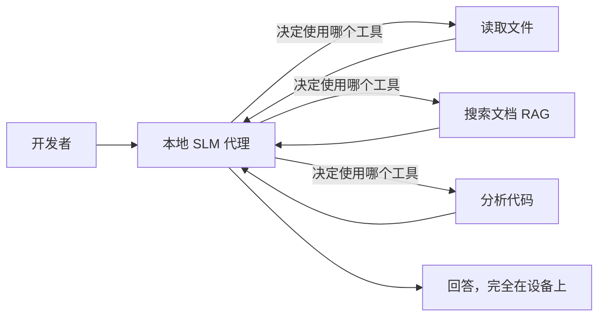
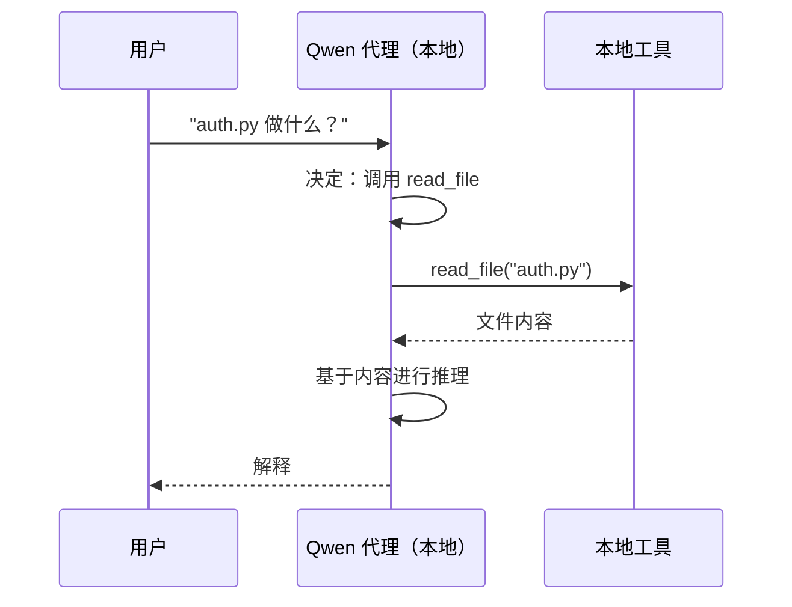
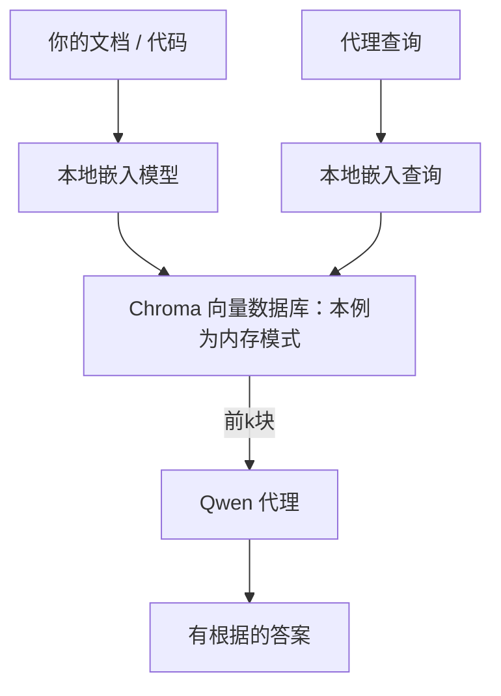
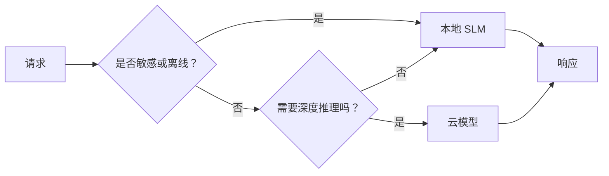

# 本地 Agent

## 本章目标与前置知识（补充讲解）

先掌握[工具](./tools.md)、[RAG](./rag.md)和[MCP](./protocols.md)。本章学习在设备上运行小语言模型（Small Language Model，SLM），用工具补足知识与计算能力，并辨认哪些组件仍可能访问网络。

本地模型适合敏感文档、离线环境或高频小任务，但仍消耗内存、电力和维护时间。 **“推理在本地”不等于“整个应用永远不联网”** ：首次下载模型/嵌入模型、远端工具、遥测与云端回退都需要单独检查。

原例使用 Foundry Local、Qwen、OpenAI Python SDK 的 Chat Completions 和 Chroma，没有把主执行循环换成 Microsoft Agent Framework。兼容性要核对具体端点与模型工具调用能力，不能仅凭“兼容 OpenAI”就把 Responses 与 Chat Completions 随意互换。


::: info 原课程代码片段的阅读范围
下方精读保留上游主要知识与片段，可能包含历史 SDK 写法、示意端点及未完整定义的函数；这些片段不等同于经过本站验证的完整程序。运行前优先阅读本章实际 Notebook 导读与版本校订。已验证的无 API 实验在“扩展实践”中另行标明。
:::

## 原课程精读：使用 Microsoft Foundry Local 和 Qwen 创建本地 AI Agent


上一课将 Agent 扩展到了云端。本课则将它们带回到单机上。完成后，你将拥有一个能推理、调用工具、读取文件、搜索文档的工作中的工程助手—— **无需任何云端推理调用。** 

为什么要这样做？真实工程工作中经常遇到三个原因：

- **隐私。** 可以把推理与资料处理留在本机；是否存在外传还要检查工具、遥测与混合路由。
- **成本。** 本地推理不产生每 token 收费。你可以用电费价钱整天迭代。
- **离线。** 在飞机上、保密设施中或设备仍有电且依赖已缓存的断网期间，Agent 依然工作。

代价是你以 CPU、GPU 或 NPU 上运行的 **小型语言模型 (SLM)** 取代前沿的云端大模型。本课重点是构建在这个限制下*表现良好*的 Agent，而不是假装限制不存在。

## 简介

本课内容包括：

- **小型语言模型 (SLMs)** ——它们是什么、适合做什么、不适合做什么。
- **Microsoft Foundry Local** ——一个在设备上下载并服务模型的运行时，支持 **兼容 OpenAI 的 API** 。
- **Qwen 函数调用模型** ——SLMs 能可靠地产生工具调用，是本地*Agent*（而非仅本地聊天）成为可能的关键。
- **本地工具、本地 RAG 以及本地 MCP** ——赋予 Agent 无需云端即可工作的能力。
- **混合模式** ——何时保持本地，何时调用云端。

## 学习目标

完成本课后，你将能够：

- 解释 SLM 的权衡并选择合适的本地 Agent 场景。
- 通过 Foundry Local 本地服务 Qwen 模型，并通过兼容 OpenAI 的端点连接。
- 构建一个完全在工作站上运行的工具调用 Agent。
- 使用本地向量数据库（Chroma）为自己的文档添加本地 RAG。
- 连接 Agent 到本地 MCP 服务器，并推断本地/云混合设计。

## 前置条件

本课假设你已经完成之前的课程，熟悉：

- [工具使用](/lessons/tools.md) (第4课) 和 [Agentic RAG](/lessons/rag.md) (第5课)。
- [Agentic 协议 / MCP](/lessons/protocols.md) (第11课)。
- [Microsoft Agent Framework](/lessons/agent-framework.md) (第14课)。

你还需要：

- 一台开发工作站。上游以 **8 GB RAM** 为实验起点、建议 16 GB 以上；实际需求取决于模型、量化和运行时，不能作为所有硬件的最低保证。有 GPU 或 NPU 有帮助，但非必须。
- 安装 **Microsoft Foundry Local** （见下文安装部分）。
- Python 3.12+ 及仓库中的依赖包 [`requirements.txt`](https://github.com/microsoft/ai-agents-for-beginners/blob/25b7985f3b2dc37a84f4a7387ccd3c9f0e5b1595/requirements.txt)，本课还需安装 `foundry-local-sdk`、`openai` 和 `chromadb`。

## 小型语言模型：本地工作的正确工具

大模型常需要更多计算资源；小语言模型通常参数更少，可选择适合设备内存的量化版本。本例 Qwen 7B 的“7B”指约 70 亿参数，不是几亿。这个差异带来明确的预期。

 **SLM 擅长：** 

- 结构化、有边界的任务——分类、抽取、已知文档的摘要。
- **工具调用** ——决策调用哪个函数及参数。
- 在你自己的数据上快速、廉价且私密的迭代。

 **SLM 不擅长：** 

- 开放式、多跳、多上下文的推理。
- 宽泛的世界知识（见闻有限，遗忘多）。

因此，本地 Agent 的制胜策略是： **让 SLM 负责编排，工具负责繁重工作。** 模型不需要*懂*你的代码库——它需要知道何时调用 `read_file` 和 `search_docs`。这正是 SLM 的优势所在。



## Microsoft Foundry Local

 **Microsoft Foundry Local** 是一个轻量级运行时，能在你机器上完全下载、管理和服务模型。对我们最重要的功能是它暴露了 **兼容 OpenAI 的 HTTP 端点** ——本例使用 OpenAI SDK 的 Chat Completions 接口。其他客户端是否可迁移还要核对接口类型、模型工具能力、消息与参数兼容性，不能保证只改 `base_url`。

Foundry Local 还能自动为你的硬件选择最佳模型构建——CPU 构建、CUDA/GPU 构建或 NPU 构建——无需你为每台机器手动优化。

### 安装

安装 Foundry Local（见你的操作系统的[文档](https://learn.microsoft.com/azure/ai-foundry/foundry-local/)），然后确认其功能正常：

```bash
# Install (example; follow the docs for your platform)
winget install Microsoft.FoundryLocal      # Windows
# brew install microsoft/foundrylocal/foundrylocal   # macOS

# Download and run a Qwen model, then start the local service
foundry model run qwen2.5-7b-instruct
foundry service status
```

服务启动后，你就拥有了本地的兼容 OpenAI 端点（通常是 `http://localhost:PORT/v1`）。笔记本使用 `foundry-local-sdk` 自动发现端点，无需硬编码端口。

## Qwen 函数调用：重要性所在

本课构建的本地 Agent 需要可靠的工具调用能力。许多 SLM 可以聊天，但无法可靠生成标准格式的工具调用。本课选择的 **Qwen** 模型具有工具调用支持，但输出格式与成功率仍要在所选运行时验证——这正是让本地聊天模型成为本地*Agent*的关键。

流程是你熟悉的标准工具调用循环，只是运行在设备上：



## 本地 RAG

文档检索是本地 Agent 的立足之地。不是指望 SLM 记住框架文档，而是把文档嵌入到 **本地向量数据库** ，让 Agent 按需检索相关片段。

我们使用 **Chroma** ，它是一个嵌入式向量库，运行在进程内，无需服务器管理。数据流完全本地：本地嵌入模型 → 本地向量 → 本地检索 → 本地 SLM。



这与第5课的 Agentic RAG 模式相同——唯一变化是各组件都运行在你机器上。

## 本地 MCP 服务器

[MCP](/lessons/protocols.md) 是一种传输协议，不是云服务。MCP 服务器可以作为本地进程运行于 `stdio`，通过标准协议向 Agent 暴露工具。这让你可以离线复用日益丰富的 MCP 服务器生态——文件系统访问、git 操作、数据库查询等。

本地的安全策略不同于云端，但并非不存在：本地 MCP 服务器仍以你的用户权限运行，因此应限制其访问范围（项目目录，而非整个家目录）并将其输出视为输入，进行验证。

## 混合云+本地模式

本地优先不等于只能本地。成熟系统会根据敏感程度和难度分流：

| 场景 | 运行位置 |
| --- | --- |
| 敏感代码/数据，或离线时 | **本地 SLM** |
| 简单、有边界的任务 | **本地 SLM** （廉价、快速） |
| 非敏感数据的复杂多跳推理 | **云端模型** |
| 故障期间 | **本地 SLM** （优雅降级） |

这映射了第16课的 **模型路由** 理念——区别在于“模型”之一是你的本地机器。健壮设计是云不可用时回退到本地，让 Agent 质量下降而非完全失败。



## 实操实验：本地工程助理

打开 [`code_samples/17-local-agent-foundry-local.ipynb`](/labs/17-creating-local-ai-agents-code-samples-17-local-agent-foundry-local-notebook.md) 并完成实验。你将构建一个 **完全运行在工作站上的本地工程助理** ，能够：

1. **工具调用** ——通过 Foundry Local 使用 Qwen 函数调用。
2. **本地文件操作** ——列出和读取项目目录文件。
3. **代码分析** ——对源文件报告基本指标。
4. **文档搜索** ——使用 Chroma 在本地文档文件夹上进行 RAG。
5. **使用 MCP** ——连接到本地 MCP 服务器（未配置时优雅跳过）。

期间完全不使用云端推理。

### 解析指导

助理通过兼容 OpenAI 的端点连接 Foundry Local，Agent 代码几乎和云端课程完全一致——唯一变化是客户端：

```python
from foundry_local import FoundryLocalManager
from openai import OpenAI

# Foundry Local discovers/downloads the model and gives us a local endpoint.
manager = FoundryLocalManager(\"qwen2.5-7b-instruct\")
client = OpenAI(base_url=manager.endpoint, api_key=manager.api_key)  # api_key is a local placeholder
```

工具是普通的 Python 函数，限制在项目目录内：

```python
def read_file(path: str) -> str:
    \"\"\"Read a file, but only inside the sandboxed project directory.\"\"\"
    full = (PROJECT_ROOT / path).resolve()
    if PROJECT_ROOT not in full.parents and full != PROJECT_ROOT:
        return \"Access denied: path is outside the project directory.\"
    return full.read_text(encoding=\"utf-8\")
```

注意沙箱检查——即使本地，读取任意路径的工具也是风险。笔记本将所有工具均限定在单一项目根目录。

## 知识检测

在做作业前测试你的理解。

 **1. 给出在本地运行 Agent 而非云端的两个具体理由。** 

<details>
<summary>答案</summary>

任选两项： **隐私** （可把代码和数据处理留在本机，需另查网络工具）、 **成本** （无每 token 推理计费）和 **离线能力** （无网络也能工作，如飞机、保密设施或设备仍有电的断网环境）。法律/合规限制禁止传输数据设备外，往往是隐私驱动的主要原因。
</details>

 **2. SLM 与其工具在本地 Agent 中的推荐分工是什么，为什么？** 

<details>
<summary>答案</summary>

让 SLM **负责编排** （决定调用哪个工具及参数），让 **工具负责繁重工作** （读文件、取文档、计算结果）。SLM 擅长有限决策如工具选择，不擅长广泛知识和长多步推理，因此依赖工具发挥优势。
</details>

 **3. 是什么使我们能用 Foundry Local 复用云端 Agent 代码？** 

<details>
<summary>答案</summary>

Foundry Local 暴露了 **兼容 OpenAI 的 HTTP 端点** 。本例 OpenAI SDK 使用本地 `base_url` 和本地连接参数。其他框架客户端需核对是否使用相同的 Chat Completions 接口，工具能力与参数也要实测。
</details>

 **4. 为什么具体使用 Qwen 函数调用模型，而非任意 SLM？** 

<details>
<summary>答案</summary>

因为 Agent 必须生成可靠且格式良好的 **工具调用** 。许多 SLM 可聊天，但产生格式错误或不一致的工具调用。Qwen 模型专注函数调用训练，产出一致的工具调用，是本地聊天模型变工作 Agent 的关键。
</details>

 **5. 在本地 RAG 流程中，哪些组件运行在机器上？** 

<details>
<summary>答案</summary>

全部：嵌入模型、向量数据库（本例进程内 Chroma；显式持久化后才保存到磁盘）、检索步骤和 SLM。文档本地嵌入、本地存储、本地检索、本地模型推理——推理与检索可以在本地完成；首次模型下载与其他工具的网络行为仍需检查。
</details>

 **6. 本地 MCP 服务器运行在你机器上，这是否自动意味着它安全？还需采取什么预防措施？** 

<details>
<summary>答案</summary>

不是。它以你的用户权限运行，因此能访问你能访问的一切。应限制其范围（如仅限某项目目录，而非整个家目录），并将其输出视为输入，验证后再操作。
</details>

 **7. 描述包含本地模型的合理混合路由规则。** 

<details>
<summary>答案</summary>

将敏感或离线请求路由到本地 SLM；将简单有边界任务路由到本地 SLM（快速、廉价）；将非敏感数据上的复杂多跳推理路由到云模型；云不可用时回退本地 SLM，使 Agent 优雅降级而非失败。这是第16课模型路由思想，本地机器作为其中一个模型。
</details>

 **8. 本课本地 Agent 运行的实际最低内存需求是多少？更多内存带来什么？** 

<details>
<summary>答案</summary>

实际最低约 **8 GB** ；16 GB 以上更舒适。更多内存允许运行更大更强模型，保持更多上下文。GPU 或 NPU 加速推理，但非必须——无加速时 Foundry Local 选择 CPU 版本。
</details>

## 作业

将本地工程助理扩展成一个你选小项目的 **本地文档审阅器** （可用本仓库的任一课程文件夹）。

你的提交应包含：

1. 把真实的文档/代码文件夹索引入 Chroma（至少五个文件）。
2. 添加一个 `find_todos` 工具，扫描项目中的 `TODO`/`FIXME` 注释并返回文件和行号——保持与 `read_file` 一样的沙箱检查。

3. **向 Agent 提三个问题** ，迫使它结合使用工具：一个纯RAG问题，一个需要阅读特定文件的问题，以及一个需要查找TODO的问题。
4. **测量它** ：记录三个回答的时间，并在markdown单元中注明。评论延迟是否符合你预期的工作流程。

然后写一段简短的文字，说明 **你会将哪些内容迁移到云端，哪些内容保留在本地** ，以及原因。评估重点是本地组件是否正确连接，以及混合推理是否合理——而非模型质量。

## 总结

在本课中，你构建了一个完全在自己电脑上运行的 Agent：

- **SLMs** 以部分通用能力与设备资源消耗，换取本地处理、离线运行和无按 Token 推理计费的可能——当它们 **编排工具** 而不是自身承载所有知识时，表现尤为出色。
- **Foundry Local** 在设备上通过一个 **兼容OpenAI的端点** 提供模型，迁移仍需核对具体 API 与模型能力。
- **Qwen函数调用模型** 使得本地工具调用变得可靠，因此本地*Agent*成为可能。
- **本地RAG** （Chroma）和 **本地MCP** 赋予 Agent 不离开机器的能力。
- **混合模式** 让你根据敏感性和难度路由，以本地作为优雅的回退方案。

这完成了部署过程：第16课将 Agent 扩展到了Microsoft Foundry，本课则将它们缩减到了单个工作站。下一课将聚焦于保持已经部署 Agent 的安全。

## 附加资源

- [Microsoft Foundry Local 文档](https://learn.microsoft.com/azure/ai-foundry/foundry-local/)
- [Microsoft Foundry 文档](https://learn.microsoft.com/azure/ai-foundry/what-is-azure-ai-foundry)
- [Microsoft Agent Framework](https://aka.ms/ai-agents-beginners/agent-framework)
- [Qwen函数调用文档](https://qwen.readthedocs.io/en/latest/framework/function_call.html)
- [模型上下文协议 (MCP)](https://modelcontextprotocol.io/)
- [Chroma向量数据库](https://docs.trychroma.com/)

## 原工程助手的输入、处理与退出（补充讲解）

用户问“项目里的 auth.py 做什么？” → 本地 Qwen 返回 `read_file` 请求 → 应用核对工具名和路径 → 执行本地函数 → 将结果与调用 ID 放回消息列表 → 模型回答。`max_iterations=5` 限制循环；工具 JSON 参数解析失败、未知工具与文件越界应得到可观察错误。

`FoundryLocalManager("qwen2.5-7b-instruct")` 寻找/下载该模型并提供 endpoint 与本地连接参数；可用模型别名依平台与运行时版本变化。先用 `foundry model list`（以当前 CLI 帮助为准）确认本机支持，再运行原 Notebook。课程给出的 8 GB/16 GB 是示例资源预期，不是所有模型与设备的保证。

### 代码解析

- `client.chat.completions.create(..., tools=...)` 请求模型生成回答或结构化工具调用。应用解析 `tool_calls` 后才真正调用函数。
- `_safe_path` 使用 `Path.resolve()` 后判断是否仍在 `PROJECT_ROOT` 内，防止简单的 `../` 越界。应配合符号链接策略、文件大小与允许扩展名限制；这不是操作系统级沙箱。
- `chromadb.Client()` 是本进程内存实例。原图说“磁盘存储”与这段代码不一致；需要跨进程保存时应明确改用 `PersistentClient(path=...)`，再验证重启后集合存在。
- MCP 分支完成初始化和列出工具，不代表已经把那些工具全部接入模型循环。未配置服务端时按原代码跳过。

### 原实验运行前提

先安装与平台匹配的 Foundry Local、下载模型，并在独立 Python 环境准备 Notebook 声明的 `foundry-local-sdk`、`openai`、`chromadb` 与 MCP 依赖。原文含未固定版本安装命令，因此该联网实验标为 **静态导读，未在本项目设备上运行模型** 。详细命令与完整代码在底部 Notebook 页；安装前按 [Foundry Local 官方文档](https://learn.microsoft.com/azure/ai-foundry/foundry-local/) 与 [Qwen 函数调用文档](https://qwen.readthedocs.io/en/latest/framework/function_call.html) 核对所选版本。

预期看到本地服务端点、工具清单、工具调用结果和有文档依据的回答。第一次 Chroma 默认嵌入模型可能下载文件，断网验证要放在所需权重和依赖都缓存之后。

## 不下载模型也能练的部分（扩展实践）

综合项目使用真实本地文件存储和词法检索，以规则模拟模型决策。Python 3.12+、无需额外依赖：

```bash
python3 examples/assistant/app.py '如何查询物流？' --stage 5
python3 examples/assistant/app.py '这个知识库没有的事情' --stage 5
```

预期第一条引用 `shipping` 文档，第二条说明未找到证据。这个实验验证检索→选择→引用的连接， **没有验证 Qwen 性能，也没有使用向量库** 。可把同一组问题保留下来，日后比较真实本地模型的答案质量与延迟。

## 本地与云的选择、排错与练习

| 情况 | 处理方式 |
| --- | --- |
| 首次启动很慢 | 区分模型下载、权重加载与每次推理延迟，分别计时 |
| 内存不足 | 选支持的更小/量化模型，减少上下文；确认设备支持 |
| 只输出 JSON 文本而没 tool_calls | 核对模型工具能力、聊天模板和 API 字段 |
| 云失败时本地也失败 | 回退依赖仍在云端，或本地模型未预热 | 
| 敏感任务被路由到云 | 把敏感性判断与授权作为硬约束，而不是普通模型建议 |

混合模式可让非敏感复杂任务进入云端，敏感与离线任务留在本地。若本地能力不足，应明确拒绝或请求人工处理，不能偷偷上传来“提高成功率”。

 **练习：** 原课程要求给文档审阅器加 `find_todos`，扫描至少五个文件并记录三类问题延迟。如何限制这个工具？

::: details 参考实现思路
复用 `_safe_path`；仅扫描明确的项目子目录与文本扩展名，跳过 `.git`、`.env`、依赖目录，限制文件数和文件大小。返回文件相对路径、行号和短匹配内容，不执行代码。记录检索耗时、模型耗时、总耗时，并注明模型、硬件与是否冷启动。题目中的 TODO 是要搜索的源码标记，不是本课程未完成正文。
:::

下一章[Agent 安全](./security.md)补上授权与执行记录的可验证性。


## 原课程代码与补充材料

以下是本章实际源文件对应的阅读页。Notebook 已分解为说明、代码及原文件输出；云端示例未进行联网端到端验证。正文中的片段用于解释，运行时使用完整 Notebook 和准备篇的固定依赖。

- [17-local-agent-foundry-local.ipynb](/labs/17-creating-local-ai-agents-code-samples-17-local-agent-foundry-local-notebook.md)

## 本章来源

基于 [英文原文](https://github.com/microsoft/ai-agents-for-beginners/blob/25b7985f3b2dc37a84f4a7387ccd3c9f0e5b1595/17-creating-local-ai-agents/README.md) 与 [简体中文翻译](https://github.com/microsoft/ai-agents-for-beginners/blob/25b7985f3b2dc37a84f4a7387ccd3c9f0e5b1595/translations/zh-CN/17-creating-local-ai-agents/README.md) 整理，原作者为 Microsoft 与开源贡献者，采用 MIT 许可证。本页标明“补充讲解”与“扩展实践”的内容为本项目新增。

来源提交：`25b7985f3b2d` · 获取日期：2026-09-14。参见[版本校订记录](/guide/sources.md)。
