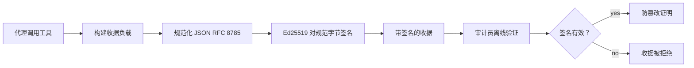
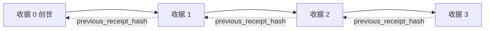

# Agent 安全

## 本章目标与前置知识（补充讲解）

先读[可信赖 Agent](./trust.md)、[工具](./tools.md)和[生产实践](./production.md)。本章学习签名收据的生成、离线验证、链式关联与授权绑定，并明确这些机制证明不了什么。

一个工具日志写着“已向账户 A 退款 100 元”。审计时，怎样发现日志被改成了账户 B？ **数字签名（Digital Signature）** 将特定私钥与一组字节绑定；持有可信公钥的检查者可以验证内容完整性。它不像加密那样隐藏内容，也不证明退款决定正确。

原课程用 **Ed25519** 和 **JSON 规范化方案（JSON Canonicalization Scheme，JCS）** 实现密码学收据。应用对 JCS 规范字节直接签名；参数摘要和链链接另行使用 SHA-256。这里已对照英文修正中文旧版“先哈希再签名”的差异。算法细节参见 [RFC 8032](https://www.rfc-editor.org/rfc/rfc8032)、[RFC 8785](https://www.rfc-editor.org/rfc/rfc8785) 与 [PyNaCl 签名文档](https://pynacl.readthedocs.io/en/latest/signing/)。

::: tip 已执行的范围
两份原始安全 Notebook 的 19 个非安装代码单元格已在本项目验证环境中离线执行。第一份调用的是模拟航班函数，第二份使用测试审批身份与固定时间，均没有连接真实退款、WebAuthn 或云模型。详细记录见[检查报告](/guide/verification.md)。
:::


## 原课程精读：利用密码学收据保障 AI Agent 安全

## 介绍

本课内容包括：

- 为什么 AI Agent 的审计追踪对合规、调试和信任至关重要。
- 什么是密码学收据，以及它与未签名日志行的区别。
- 如何使用纯 Python 生成 Agent 工具调用的签名收据。
- 如何离线验证收据并检测篡改。
- 如何链式连接收据，以便移除或重新排序其中一个会破坏整个链条。
- 收据能证明什么，明确不能证明什么。

## 学习目标

完成本课后，你将掌握：

- 识别促使 Agent 动作采用加密溯源的失败模式。
- 生成基于 Ed25519 签名的规范 JSON 负载收据。
- 仅使用签名者的公钥独立验证收据。
- 通过对修改后的收据重新进行验证检测篡改。
- 构建基于哈希链的收据序列，并解释链条的重要性。
- 识别收据能证明的界限（归属、完整性、顺序）与不能证明的界限（操作正确性、策略合理性）。

## 问题所在：Agent 的审计追踪

设想你已为 Contoso Travel 部署了一个 AI Agent。该 Agent 读取客户请求，调用航班 API 查询选项，并代表客户预订座位。上季度，该 Agent 处理了 50,000 次预订。

今天一位审计员来了。他们问了一个简单的问题：“给我看一下你的 Agent 做了什么。”

你递交了日志文件。审计员看了看又问了一个更难的问题:“我怎么知道这些日志没有被篡改过？”

这就是审计追踪问题。如今大多数 Agent 部署依赖：

- **应用日志** ：由 Agent 自身写入，任何有文件系统访问权限的人都可编辑。
- **云日志服务** ：在平台层面有防篡改功能，但前提是审计员信任平台运营商。
- **数据库事务日志** ：适合数据库变更，但不适合任意工具调用。

这些都无法在无需审计员信任某人（你、云提供商或数据库供应商）的情况下解答审计员的问题。对内部使用来说，这种信任通常可以接受，跨组织审计可能需要更强的可验证证据；具体监管要求取决于适用制度，本课程不是法律合规判断。

密码学收据通过使每个 Agent 操作都能独立验证，解决了这个问题。审计员无需信任你，只需你的公钥和收据本身。

## 什么是密码学收据？

收据是记录 Agent 所做操作的 JSON 对象，并带有数字签名。



一个最简收据示例如下：

```json
{
  "type": "agent.tool_call.v1",
  "agent_id": "contoso-travel-bot",
  "tool_name": "lookup_flights",
  "tool_args_hash": "sha256:a3f9c1...",
  "result_hash": "sha256:7b2e1d...",
  "policy_id": "contoso-travel-policy-v3",
  "timestamp": "2026-04-25T14:30:00Z",
  "sequence": 47,
  "previous_receipt_hash": "sha256:9d4e6a...",
  "signature": {
    "alg": "EdDSA",
    "sig": "c5af83...",
    "public_key": "8f3b2c..."
  }
}
```

有三个属性发挥作用：

1. **签名** 。收据由 Agent 网关使用 Ed25519 私钥签名。任何拥有对应公钥的人都可以离线验证签名。篡改已签名负载字段会使验签失败。

2. **规范编码** 。签名前，收据通过 JSON 规范化方案（JCS，RFC 8785）序列化。这确保两种实现只要逻辑上相同，其字节输出完全一致。若无规范化，不同的 JSON 序列化器会为相同内容生成不同签名。

3. **哈希链** 。`previous_receipt_hash` 字段将每个收据连接到前一个。移除或重排会让相邻链接或序号检查失败，整条链不能通过验证；未改动收据的独立数字签名仍可能有效。

这些属性综合提供三大保障：

- **归属** ：该密钥签署了该内容。
- **完整性** ：内容自签署以来未被更改。
- **顺序** ：这张收据在链中位于那张收据之后。

## 用 Python 生成收据

生成收据不需要特别的库。加密原语普遍可用，其逻辑仅几十行 Python 代码。

`code_samples/18-signed-receipts.ipynb` 中的动手练习演示了完整流程。总结如下：

```python
import json
import hashlib
import base64
from nacl import signing
from jcs import canonicalize  # RFC 8785 canonical JSON

def b64url_nopad(data: bytes) -> str:
    return base64.urlsafe_b64encode(data).decode("ascii").rstrip("=")

def sha256_canonical(obj) -> str:
    """SHA-256 of a Python object's JCS-canonical JSON form."""
    return f"sha256:{hashlib.sha256(canonicalize(obj)).hexdigest()}"

# Generate or load a signing key (in production, store in a key vault)
signing_key = signing.SigningKey.generate()
verify_key = signing_key.verify_key

# Build the receipt payload (no signature yet)
tool_args = {"origin": "SYD", "destination": "LAX"}
tool_result = [{"flight": "QF11", "price": 1850, "stops": 0}]

payload = {
    "type": "agent.tool_call.v1",
    "agent_id": "contoso-travel-bot",
    "tool_name": "lookup_flights",
    "tool_args_hash": sha256_canonical(tool_args),
    "result_hash": sha256_canonical(tool_result),
    "policy_id": "contoso-travel-policy-v3",
    "timestamp": "2026-04-25T14:30:00Z",
    "sequence": 0,
    "previous_receipt_hash": None,
}

# Canonicalize and sign the JCS bytes directly. PureEdDSA hashes internally.
canonical_bytes = canonicalize(payload)
signature_bytes = signing_key.sign(canonical_bytes).signature

# Attach a structured signature object.
receipt = {
    **payload,
    "signature": {
        "alg": "EdDSA",
        "sig": b64url_nopad(signature_bytes),
        "public_key": b64url_nopad(bytes(verify_key)),
    },
}
```

这就是全部签名流程。笔记本会带你逐步演示每个步骤。

## 验证收据与检测篡改

验证是逆向操作：

```python
import base64
import hashlib
from nacl import signing
from nacl.exceptions import BadSignatureError
from jcs import canonicalize

def b64url_decode(s: str) -> bytes:
    padding = "=" * ((4 - len(s) % 4) % 4)
    return base64.urlsafe_b64decode(s + padding)

def verify_receipt(receipt: dict) -> bool:
    # The signature is a structured object: {"alg", "sig", "public_key"}.
    sig_obj = receipt.get("signature")
    if not sig_obj or sig_obj.get("alg") != "EdDSA":
        return False

    # Reconstruct the payload that was actually signed (everything except signature).
    payload = {k: v for k, v in receipt.items() if k != "signature"}

    canonical_bytes = canonicalize(payload)

    try:
        verify_key = signing.VerifyKey(b64url_decode(sig_obj["public_key"]))
        verify_key.verify(canonical_bytes, b64url_decode(sig_obj["sig"]))
        return True
    except BadSignatureError:
        return False
```

此函数接受一个收据，如果签名有效，返回 `True`，否则返回 `False`。验签计算可离线进行，但必须从独立可信渠道确定公钥。该最小函数使用收据自带公钥，只演示数学验签，不证明真实身份。

为了演示篡改检测，笔记本演示了：

1. 生成有效收据并确认其验证通过。
2. 修改 `tool_args_hash` 字段中的一个字节。
3. 重新运行验证，验证失败。

这实际演示了收据的防篡改能力：已签名负载的修改会被验签检测到。

## 为多步骤 Agent 链式连接收据

一张签名收据保护一个动作，一串收据保护一系列动作。



每张收据记录前一张收据的哈希。要悄无声息地移除第二张收据，攻击者必须：

- 修改第 3 张收据的 `previous_receipt_hash` 字段（会破坏第 3 张收据的签名），或
- 伪造修改后第 3 张收据的新签名（需要 Agent 的私钥）。

如果私钥存储在硬件密钥库中，且你发布的每张收据都携带公钥，以上攻击均无法在不被发现的情况下实现。

笔记本演示了：

1. 构建一条包含三张收据的链。
2. 验证每张收据的 `previous_receipt_hash` 是否匹配前一张收据的实际哈希。
3. 篡改中间一张收据，链条正好在该处断裂。

这就是如何构建外部审计员无需信任你即可验证的审计追踪。

## 收据能证明什么（不能证明什么）

这是本课最重要的部分。收据很强大，但其能力有限。

 **收据能证明三件事：** 

1. **归属** ：特定密钥签署了特定负载。
2. **完整性** ：负载自签署后未被更改。
3. **顺序** ：该收据在哈希链中排在那张收据之后。

 **收据不能证明：** 

1. **正确性** ：Agent 操作是否正确。错误答案的收据签名与正确答案的签名同样完整。
2. **策略合规** ：`policy_id` 中的策略是否实际被评估，或即使检查过，是否会允许该操作。收据记录的是声明内容，而非执行结果。
3. **密钥以外的身份** ：收据说明“该密钥签署此内容”，但不说明“某人批准此操作”。将密钥与人或组织关联需另建身份基础设施（目录、公钥注册表等）。
4. **输入真实性** ：如果 Agent 接受了被篡改的提示并据此行动，收据忠实记录了该行为。收据是输入验证之后的产物，不能替代输入验证。

这个边界很重要，原因有二：

- 它告诉你收据的作用：使 Agent 行为可审计且防篡改，跨组织边界亦然。
- 它告诉你还需要哪些额外层次：输入验证（第6课）、策略执行（稍后简述）和身份基础设施（超出本课范围）。

一个常见错误是假设“有收据”即意味着“受治理”。事实并非如此。收据是基础，治理是你建立的体系。

## 证明人类批准了具体操作

上文第三点值得单独成章：一张操作收据说明“该密钥签署此内容”，但绝不表述“某人批准此操作”。对高风险操作（退款、删除、电汇），治理框架越来越要求提供这份缺失声明，且使用本课已有的原语即可实现。

后续笔记本 `code_samples/human-authorization-receipts.ipynb` 新增一种收据类型 `human.approval.v1`，其包封格式与本课收据相同（带类型的负载，通过 Ed25519 直接对 JCS 规范字节签名（参数摘要与链哈希另行使用 SHA-256），且 `signature` 对象位于签名字节之外）。被命名的审批人先签署 **完整规范操作及其摘要** ，执行前；Agent 的操作收据携带 **相同的操作摘要** 及 `parent_approval_ref`，即该批准收据的 `receipt_hash`，采用与链中 `previous_receipt_hash` 相同的约定。一个 `verify_chain` 函数将两个收据在 **分开的固定公钥注册表** （审批人和 Agent 人公钥）下验证，代码路径相同，权威方不同。

其属性经过谨慎表述：*人类批准了这确切操作，Agent 执行了完全批准的操作。* 笔记本中针对拒绝情形的测试用例使该属性真实（非口头）：

- 经典问题集：篡改、误导 Agent、重放、双方伪造密钥、格式错误输入；
- **过期权威** ：签名仍验证成功，但因策略版本变更、审批公钥从固定注册表中撤销或批准已过期而被拒绝；
- **摘要替换** ：有效签名的操作收据指向捆绑了*不同*规范操作的*真实*批准。

每种失败都有独特理由，审计员看到拒绝便知是权威过期还是执行内容变动。笔记本教你的规则是：签名的批准本身不构成权威。权威仅在执行时两个收据仍捆绑到相同规范操作时成立。本课 `human.approval.v1` 是教学组合，并非该独立 Internet-Draft 定义的收据类型；也不是已经成为标准的线协议。

## 生产环境参考

本课 Python 代码刻意精简，让你读懂每行代码完整含义。生产环境可选两种方案：

1. **直接基于加密原语搭建。** 前面展示的 50 行代码应付许多场景足够。PyNaCl（Ed25519）和 `jcs` 包（规范 JSON）都是维护良好的审计库。

2. **使用生产用收据库。** 若干开源项目实现了相同模式并加添附加功能（密钥轮换、批量验证、JWK 集分发、与策略引擎整合）：
   - 本课借鉴一份独立 IETF Internet-Draft 的规范化与签名范围约定，教学平铺结构不同于草案的 payload/signature 封装，不宣称符合其线格式；参考草案（[`draft-farley-acta-signed-receipts`](https://datatracker.ietf.org/doc/draft-farley-acta-signed-receipts/)，修订02），且有共享合规套件（[agent-governance-testvectors](https://github.com/ScopeBlind/agent-governance-testvectors)），独立实现可交叉验证字节一致的规范输出。
   - 微软 Agent 治理工具包将收据与基于 Cedar 的策略决策组合；详见该仓库教程33，涵盖端到端示例。
   - `protect-mcp` （npm）和 `@veritasacta/verify` （npm）包提供了基于 Node 的收据签名及离线验证实现，可包装任何 MCP 服务器生成防篡改审计链，包括支持的共签流程——暂停操作发出绑定操作摘要的批准收据（桌面流程中基于 WebAuthn），与上述人类授权笔记本采用的批准收据方案相同。
   - **[nobulex](https://github.com/arian-gogani/nobulex)** Python SDK（`pip install nobulex`）在 Python 中实现相同的 Ed25519 + JCS 签名模式，集成了 LangChain 和 CrewAI，包含发布的交叉验证测试向量，并通过 [OWASP PR #2210](https://github.com/OWASP/CheatSheetSeries/pull/2210) 提供合规映射。

自建或用库的选择，与写自己的 JWT 库或用成熟库的抉择一样合理；用库节省时间、降低审计风险，自写则促使彻底理解每个原语。本课教学采用自写路径，奠定两者的基础。

## 知识检测

在进入练习前检验你的理解。

 **1. 收据使用 Agent 私钥 Ed25519 签名，审计员只有公钥。审计员能否离线验证收据？** 

<details>
<summary>答案</summary>

能。Ed25519 验证只需公钥和签名字节。无网络调用，无服务依赖。此特性使收据适用于隔离环境、多组织或低信任审计。
</details>

 **2. 攻击者篡改收据的 `policy_id` 字段，声称由更宽松的策略管辖。签名仍基于原始负载。验证时会发生什么？** 

<details>
<summary>答案</summary>


验证失败。签名是针对原始负载的规范字节计算的；修改任何字段都会改变规范字节，因此直接对这些规范字节的验签失败。攻击者需要私钥才能生成新的有效签名，而他们没有私钥。
</details>

 **3. 为什么收据包含 `tool_args_hash` 和 `result_hash` 而不是原始参数和结果？** 

<details>
<summary>答复</summary>

有两个原因。首先，收据可能需要存档或在泄露原始内容（PII、业务数据）会有问题的环境中传输。哈希使收据体积有界并减少原文直接暴露，但不是加密；可枚举内容仍可能被猜测；审核员验证哈希是否与单独存储的实际内容副本匹配。其次，哈希具有固定大小；无论输入和输出多大，有哈希的收据大小都有界限。
</details>

 **4. `previous_receipt_hash` 字段将每个收据与其前一个收据链接。如果攻击者悄悄删除链中间的一个收据，会导致什么变得无效？** 

<details>
<summary>答复</summary>

链验证失败：相邻后继的前序引用与实际链不匹配。未修改收据的独立签名仍可能有效；检测尾部截断还需要外部锚点。
</details>

 **5. 一个收据验证通过。这是否证明 Agent 的行为是正确的、合理的或符合政策的？** 

<details>
<summary>答复</summary>

不是。有效的收据证明三件事：归属（此密钥签署了此内容）、完整性（内容未被修改）和排序（此收据在那收据之后）。它不证明该行为是正确的、`policy_id` 中命名的政策实际上被评估过，或 Agent 遵守了所有规则。收据使 Agent 行为可审计，但不一定正确。这是本课程最重要的界限。
</details>

## 练习题

打开 `code_samples/18-signed-receipts.ipynb` 并完成以下四个部分：

1. **第一部分** ：签署你的第一个收据，并验证它。
2. **第二部分** ：篡改收据并观察验证失败。
3. **第三部分** ：建立三份收据链并验证链的完整性。
4. **第四部分** ：将该模式应用于使用 Microsoft Agent Framework 构建的 Agent：在调用工具时进行收据签名，然后独立验证收据。

 **拓展挑战 1:** 在收据模式中添加一个你自己选择的字段（比如用于追踪的请求 ID），更新规范签名逻辑以包括它，并确认收据仍能通过验证。然后签名后修改该字段并确认验证失败。这迫使你理解规范编码的每个字节如何影响签名。

 **拓展挑战 2:** 对两份收据的规范字节进行 SHA-256 哈希（以确定顺序连接字节），将所得摘要作为新字段嵌入第三份收据中后签名。验证三份收据仍能通过验证。你刚建立了一步包含证明：该组合承诺把第三份收据绑定到前两份的指定字节，但检查匹配仍需相应原始收据；可信时间与完整的选择性披露还需额外机制。这是选择性披露收据在大规模使用的模式（默克尔承诺，RFC 6962）。

## 结论

密码学收据为 AI Agent 提供了如下审计轨迹：

- **独立验证** ：任何拥有公钥的方都可以验证，无需依赖服务。
- **防篡改** ：任何修改都会使签名无效。
- **便携** ：收据是一个小型 JSON 文件；可在任何地方存档、传输和验证。
- **符合标准** ：基于 Ed25519 (RFC 8032)、JCS (RFC 8785) 和 SHA-256，均为广泛部署的原语。

它们不能替代输入验证、政策执行或身份基础设施。它们是这些层的基础。当你将 Agent 部署到受监管的工作负载、多组织工作流或任何未来审核者不可假设信任你的环境时，收据是让审计轨迹保持诚信的方式。

最重要的结论：收据证明谁在何时说了什么。它们不能证明所说内容是正确或真实的。务必紧记这一点。这是诚实溯源系统与误导性系统的区别。

## 生产检查清单

当你准备从本课过渡到在真实环境中部署签名收据 Agent 时：

- [ ] **将签名密钥移离开发者笔记本。** 使用 Azure Key Vault、AWS KMS 或硬件安全模块。签署收据的私钥决不应存在源代码控制或应用机器的明文中。
- [ ] **发布验证公钥。** 审核人员需要离线验证。标准模式是将 JWK 集放置在知名 URL（RFC 7517），例如 `https://your-org.example.com/.well-known/agent-keys.json`。
- [ ] **外部锚定链头。** 定期将最新链头哈希写入透明日志（Sigstore Rekor、RFC 3161 时间戳机构或第二个内部系统），以便外部方确认“此链在此时间存在”。
- [ ] **不可变地存储收据。** 追加式 blob 存储（Azure Storage 配合不可变性策略、AWS S3 对象锁）防止内部人员在存储层改写历史。
- [ ] **确定保留期限。** 许多合规要求多年度保留。计划收据增长（每份收据约 500 字节；Agent 每天调用 1 万次，每年产生约 1.8 GB）。
- [ ] **记录收据未涵盖内容。** 收据证明归属、完整性和排序。你的运行手册应明确列出额外的控制措施（输入验证、政策执行、限流、身份基础设施）以配合收据构成治理态势。

## 超越本课

本课涵盖单个收据签名和哈希链序列。随着治理态势成熟，你可能遇到的高级模式基于相同原语组合而成：

- **选择性披露。** 当收据字段独立承诺时（RFC 6962 风格的默克尔树），可向特定审核员单独披露某些字段，并证明其余字段未被更改且未被暴露。适用于同一收据需同时满足全面审计（要求完整性）和数据最小化法规（如 GDPR，要求审核员仅看到必要内容）。
- **收据撤销。** 如果签名密钥泄露，需要有方法标记该密钥签署的所有收据从某时间点起不可信。标准模式是短期签名密钥加发布撤销列表，或带撤销条目的透明日志。
- **双边/分割签名收据。** 一些实现将签名负载拆分为执行前（`authorization_*`）和执行后（`result_*`）两半，并分别签名，适用于授权决策和观察结果由不同演员或不同时间产生的情况。可在本课讲授的收据格式上叠加组合。
- **负载组合。** 收据封装了放入 `result_hash` 的字节。实际负载往往比单一次工具调用结果更丰富：决策前推理（模型预测、考虑的选项、证据及其完整性、风险姿态、问责链、关卡结果）均可存于负载内，通过单个收据封存。这保持收据格式简约，同时让负载模式按领域演进。
- **跨实现兼容。** 多个独立实现（Python、TypeScript、Rust、Go）交叉验证共享测试向量。如果你自行实现，验证已发布向量确认兼容性。
- **后量子迁移。** Ed25519 现被广泛部署但不抗量子。收据格式支持算法敏捷：当需要迁移时，`signature.alg` 字段可携带 `ML-DSA-65`（NIST 后量子签名标准）。规划签名双轨过渡期。

## 其他资源

- [IETF 互联网草案：用于机器对机器访问控制的签名决策收据](https://datatracker.ietf.org/doc/draft-farley-acta-signed-receipts/)
- [负责任的 AI 概览 (Azure AI)](https://learn.microsoft.com/azure/ai-studio/responsible-use-of-ai-overview)
- [RFC 8032：爱德华兹曲线数字签名算法 (EdDSA)](https://datatracker.ietf.org/doc/html/rfc8032)
- [RFC 8785：JSON 规范化方案 (JCS)](https://datatracker.ietf.org/doc/html/rfc8785)
- [RFC 6962：证书透明度](https://datatracker.ietf.org/doc/html/rfc6962)（选择性披露收据使用的默克尔树构造）
- [Microsoft Agent Governance Toolkit，教程 33：离线可验证决策收据](https://github.com/microsoft/agent-governance-toolkit/blob/main/docs/tutorials/33-offline-verifiable-receipts.md)
- [本课使用的收据格式跨实现兼容测试向量 (Apache-2.0)](https://github.com/ScopeBlind/agent-governance-testvectors)
- [PyNaCl 文档](https://pynacl.readthedocs.io/)（Python 中的 Ed25519）

## 从签名到可审计授权（补充讲解）

原课程第一份 Notebook 用收据内携带的公钥验签。这只能说明“这个公钥能验证这些字节”；攻击者也能生成一对自己的密钥。真实身份必须通过独立信任的公钥注册表、证书或其他可信渠道绑定。第二份授权 Notebook 将审批人和 Agent 的可信公钥分开放入固定注册表，因此能检测伪造身份。

授权应绑定精确动作：工具名、目标对象、金额、接收者、策略版本、有效期与一次性标识。执行前核对这些字段，执行后把结果与该批准关联。 **有效签名不等于批准仍有效** ：政策变更、密钥轮换、过期、重放以及替换了不同动作的摘要，都必须拒绝。

Notebook 的 `alice@ops (WebAuthn)` 是测试标签，没有真正完成 WebAuthn 身份认证；固定 `NOW` 用来复现过期测试，不是可信时间服务。它验证的是教学模型里的动作绑定规则，不能单凭收据证明外部银行确实执行了转账。

### 原始代码的几个关键点

| 代码 | 作用 | 容易漏掉的边界 |
| --- | --- | --- |
| `canonicalize(payload)` | 将满足 JCS 约束的 JSON 转为确定字节 | 不是普通 `json.dumps(sort_keys=True)` 的所有情况替代品 |
| `signing_key.sign(...).signature` | 对规范字节签名 | 私钥不得随收据发布或写入前端 |
| `verify_key.verify(...)` | 校验字节与签名 | 公钥必须被独立信任 |
| `receipt_hash(receipt)` | 为完整收据生成前序引用 | 字节范围必须一致，不能有时包含签名有时不包含 |
| `verify_chain` | 验证签名、前序关联与授权关系 | 链尾截断需要外部锚点/预期长度发现 |
| `ReceiptedTool` | 在工具执行后产生记录 | 模拟工具回传不证明现实世界副作用 |

删除中间收据会破坏链验证，但不会神奇地改变剩余收据的独立签名。时间戳只是签名者写入的声明，除非另有可信时间证明。参数哈希不是加密：手机号、金额等可枚举内容仍可能被猜测。

## 可复现的离线实操（扩展实践）

从项目根目录，Python 3.12+，使用独立环境。安装依赖时需要网络，之后两份 Notebook 的核心验证无需 API：

```bash
python3 -m venv .venv-receipts
source .venv-receipts/bin/activate
python -m pip install -r examples/receipts/requirements.txt
python scripts/run_receipt_notebooks.py
```

Windows 激活用 `.venv-receipts\Scripts\Activate.ps1`。执行器只运行已检查的第 18 章两份 Notebook，跳过安装单元格。它不是任意 Notebook 安全沙箱，不要改成执行陌生下载文件。

预期摘要：

```text
upstream/18-securing-ai-agents/code_samples/18-signed-receipts.ipynb 13 cells passed
upstream/18-securing-ai-agents/code_samples/human-authorization-receipts.ipynb 6 cells passed
```

详细原输出写入 `provenance/receipt-verification.json`。正常收据通过、篡改后失败、链破坏被发现；授权样例还覆盖过期策略、密钥撤换、重放和摘要替换。随机生成的公钥与签名每次不同，不能逐字比较整份 JSON。

## 常见失败与延伸练习

| 现象 | 原因 | 解决方式 |
| --- | --- | --- |
| 双方同一个 JSON 却验签失败 | 规范编码或签名范围不同 | 逐字节比较规范化结果与编码，遵循同一约定 |
| 换了攻击者公钥仍通过 | 信任收据自带的任意公钥 | 从固定可信注册表查 signer key |
| 签名通过但审批已过期 | 只做数学验签，没有业务授权验证 | 检查有效期、策略版本、身份权限与动作摘要 |
| 删除最后一段看不出来 | 只检查当前提供的链 | 外部保存/公布预期链头、长度或时间锚点 |
| 部分字段缺失导致崩溃 | 最小演示仅捕获签名异常 | 严格验证输入结构，分类处理格式错误并拒绝 |

 **练习一：** 在 payload 中加入 `request_id`，签名后修改它。 **练习二：** 将批准中的账户改成另一个账号，但保留原动作收据。 **练习三：** 保留一条链前两张收据，删掉整个尾部，说明需要哪条外部信息才能发现。

::: details 参考答案与实现方向
一：字段必须在规范化和签名之前加入，修改后验签失败。二：批准签名或动作摘要绑定检查失败，不能执行。三：单看一个合法前缀可能无法发现删尾；需要此前可信记录的完整链头、预期序号/长度或透明日志锚点。签名、链和外部锚点解决的是不同问题。
:::

本章在输入约束、工具授权、最小权限和评估之外增加了可验证记录。现在可回到[综合实践](/guide/project.md)，检查“有证据回答、先授权执行、有限退出、可追踪结果”是否全部成立。


## 原课程代码与补充材料

以下是本章实际源文件对应的阅读页。Notebook 已分解为说明、代码及原文件输出；云端示例未进行联网端到端验证。正文中的片段用于解释，运行时使用完整 Notebook 和准备篇的固定依赖。

- [18-signed-receipts.ipynb](/labs/18-securing-ai-agents-code-samples-18-signed-receipts-notebook.md)
- [human-authorization-receipts.ipynb](/labs/18-securing-ai-agents-code-samples-human-authorization-receipts-notebook.md)
- [README.md](/labs/18-securing-ai-agents-code-samples-sample-receipts-readme-notes.md)
- [generate_fixtures.py](/labs/18-securing-ai-agents-code-samples-sample-receipts-generate-fixtures-script.md)

## 本章来源

基于 [英文原文](https://github.com/microsoft/ai-agents-for-beginners/blob/25b7985f3b2dc37a84f4a7387ccd3c9f0e5b1595/18-securing-ai-agents/README.md) 与 [简体中文翻译](https://github.com/microsoft/ai-agents-for-beginners/blob/25b7985f3b2dc37a84f4a7387ccd3c9f0e5b1595/translations/zh-CN/18-securing-ai-agents/README.md) 整理，原作者为 Microsoft 与开源贡献者，采用 MIT 许可证。本页标明“补充讲解”与“扩展实践”的内容为本项目新增。

来源提交：`25b7985f3b2d` · 获取日期：2026-09-14。参见[版本校订记录](/guide/sources.md)。
